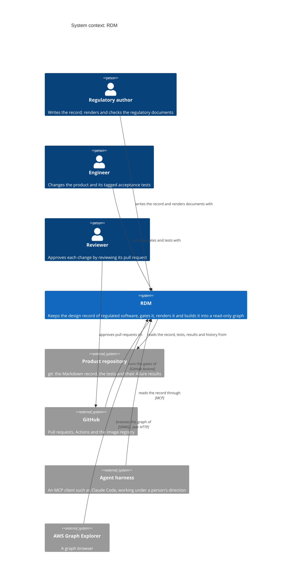
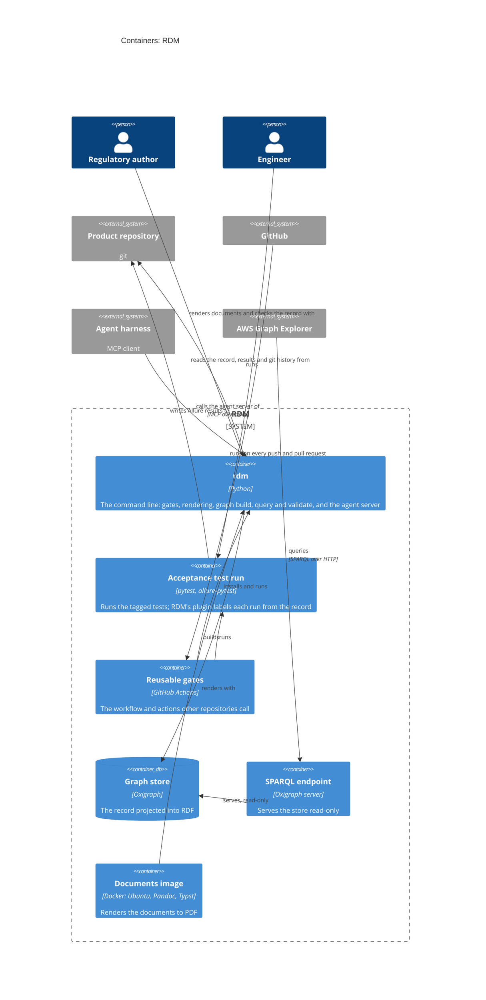

# System Architecture

RDM keeps the design record of regulated software as Markdown and tests in
git, checks it, renders regulatory documents from it, and builds it into a
read-only graph that people and agents query. This document holds **design
only** — user needs live in the V&V plan; a context serves the needs its
design inputs trace to (`traces_to`), so that is never declared twice.

## The four parts

| Part | Responsibility | Writes to the record? |
|------|----------------|-----------------------|
| **Record** | read and scaffold the record: needs, design inputs, checklists, tagged tests, results, git | scaffolding only (`init`, `adopt`, `new-input`); every other change is a reviewed commit |
| **Gates** | pass/block decisions on the record | no |
| **Graph** | the record as RDF, queried and validated; agents read it over MCP (`rdm graph mcp`) | no — rebuilt from the record, never edited |
| **Documents** | regulatory documents rendered from the record | no |

Only people and agents change the record, and only through a reviewed pull
request; the merge is the approval. Nothing RDM derives (graph, matrix,
documents, evidence bundle) is edited by hand or fed back into the record.

## System context (C1)

Who uses RDM and what it depends on. The architecture is kept as C4
diagrams: the system context and the containers here, and each bounded
context's components (C3) in its own design document. RDM reads them into
one model (DI-66) and warns where code, tests and diagrams disagree (DI-68).

## Containers (C2)

What runs or stores data. The bounded contexts are logical slices of these
containers: most of their components run in `rdm`, the pytest plugin in the
acceptance test run, and the reusable CI in GitHub Actions.

## Bounded contexts (one design document each), by part

| Part | Context | Design document | Modules |
|------|---------|-----------------|---------|
| Record | `record` | `design/record.md` | `rdm/record/` — design/V&V frontmatter, Allure results, git |
| Record | `ingestion` | `design/ingestion.md` | `rdm/collect.py`, `rdm/translate.py` — code snippets, foreign test results |
| Record | `scaffolding` | `design/scaffolding.md` | `rdm/init.py`, `rdm/adopt.py`, `rdm story new-input` |
| Record | `risk` | `design/risk.md` | `rdm/record/risk.py` — the risk register, scored from the risk matrix; its release rules |
| Gates | `gating` | `design/gating.md` | `rdm/gates/design_gate.py`, `rdm/hook_files/pre-commit` — design gate (including duplicate ids), release gate |
| Gates | `verification` | `design/verification.md` | `rdm/record/verify.py`, `rdm/gates/mutation.py` — inputs vs results, traceability matrix, mutation probe |
| Gates | `gap_analysis` | `design/gap_analysis.md` | `rdm/gaps.py`, `rdm/checklists/` — documents vs checklists |
| Gates | `validation` | `design/validation.md` | `rdm/record/persona.py`, `rdm/record/validation.py` — formative usability evidence |
| Graph | `graph` | `design/graph.md` | `rdm/graph/` — RDF projection, SHACL gate shapes, SPARQL, Graph Explorer file, read-only MCP server |
| Documents | `rendering` | `design/rendering.md` | `rdm/render.py`, `rdm/md_extensions/` — templates + data → Markdown → PDF/DOCX |

## Flow

Record → Gates decide (design gate before implementation, release gate before
release, gap analysis against checklists) → Graph and Documents are derived
from the same record. Agent skills (how to author design inputs, test-first,
risk analysis) are maintained outside RDM, in `scope-impact/agent-skills`.
RDM ships no planning tooling: tasks and issues live in their own tools,
outside the record (see `docs/plan-vs-record.md`).

## Not yet in scope

In rough order: turning a regulation into a checklist mapped to its
standard's clauses; pushing the graph to an external RDF store, with the
vocabulary and gate shapes versioned; and several projects in one graph
(clause identifiers are already project-independent). Each enters through a
user need and design inputs in this record before any code.
