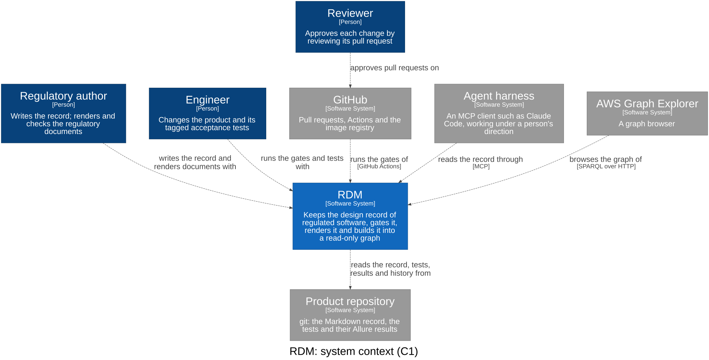
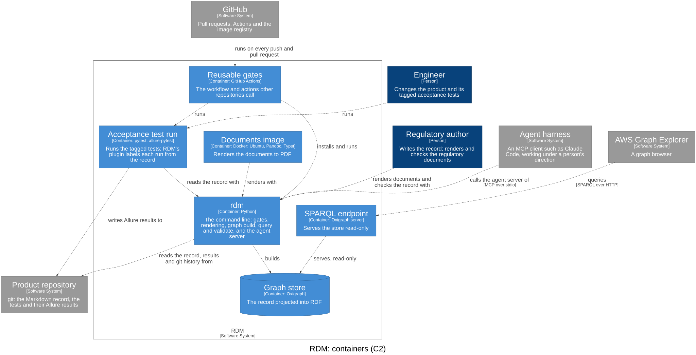

# System Architecture

RDM keeps the design record of regulated software as Markdown and tests in
git, checks it, renders regulatory documents from it, and builds it into a
read-only graph that people and agents query. This document holds **design
only** — user needs live in the V&V plan; a context serves the needs its
design inputs trace to (`traces_to`), so that is never declared twice.

## The four parts

| Part | Responsibility | Writes to the record? |
|------|----------------|-----------------------|
| **Record** | read and scaffold the record: needs, design inputs, checklists, tagged tests, results, git | scaffolding only (`init`, `adopt`, `new-input`); every other change is a reviewed commit |
| **Gates** | pass/block decisions on the record | no |
| **Graph** | the knowledge graph: the record as RDF, queried and validated; agents read it over MCP (`rdm graph mcp`) | no — rebuilt from the record, never edited |
| **Documents** | regulatory documents rendered from the record | no |

Only people and agents change the record, and only through a reviewed pull
request; the merge is the approval. Nothing RDM derives (graph, matrix,
documents, evidence bundle) is edited by hand or fed back into the record.

## System context (C1)

Who uses RDM and what it depends on. The architecture is one C4 model, the
workspace [`c4/workspace.dsl`](../c4/workspace.dsl); each view is drawn from
it (`rdm c4 draw`): the system context and the containers here, and each
bounded context's components (C3) in its own design document. RDM reads the
model (DI-66); warning where code, tests and the model disagree (DI-68) is
not built yet.



## Containers (C2)

What runs or stores data. The bounded contexts are logical slices of these
containers: most of their components run in `rdm`, the pytest plugin in the
acceptance test run, and the reusable CI in GitHub Actions. `rdm.wasm` is the
same contexts compiled as one WASI component (DI-87), composed with two
providers: `rdm-git`, which answers the record-state port with gitoxide, and
`rdm-c4`, which answers the c4 port with structurizrx, and `rdm-typst`, which
answers the typeset port with Typst's crates, natively and inside the
component alike. The component's entry is a second composition root; it
belongs to no context.



## Bounded contexts (one design document each), by part

A bounded context is drawn where the language changes, not where the workflow
does (`CONTEXT.md`): the stages of a design input's life (declared, approved,
verified, released) are not contexts. Restructured in Design Review 30 from
ten contexts named for what their code did or for a workflow stage.

| Part | Context | Design document | Its language | Package |
|------|---------|-----------------|--------------|---------|
| Record | `specification` (core) | `design/specification.md` | user need, design input, tagged test, design review, approved, design gate | `rdm/specification/`: the record reader, test tags, design gate, `new-input`, hooks, `init`, `adopt`, validation records, persona runs |
| Record | `risk` | `design/risk.md` | hazard, harm, severity, probability, control, residual | `rdm/risk/` |
| Record | `architecture` | `design/architecture.md` | person, software system, container, component, relationship, view | `rdm/architecture/`: the model reader, `rdm c4 draw` |
| Record | `test_evidence` | `design/test_evidence.md` | test run, executor, step, attachment; Allure's and xunit's words stop here | `rdm/evidence/`: Allure results, `translate`, the mutation probe; and `rdm/pytest_plugin.py` |
| Gates | `release` | `design/release.md` | verified, release gate, trace slice | `rdm/release/`: the release gate, the verification data; and the reusable CI |
| Gates | `compliance` | `design/compliance.md` | standard, checklist, checklist clause, gap, coverage | `rdm/compliance/` |
| Graph | `graph` | `design/graph.md` | knowledge graph, projection, vocabulary, gate rule, derived relation | `rdm/graph/` |
| Documents | `publishing` | `design/publishing.md` | template, data, rendered document, evidence bundle | `rdm/publishing/`: render, snippets, DMR index, the verification report, the evidence bundle; and `rdm/md_extensions/` and the PDF action |

Not contexts: the **shared kernel** (`rdm/kernel/`: YAML and file helpers,
ids, git, frontmatter, the reconcile helpers), below every context; and the
**composition root** (`rdm/main.py`), which wires the command line to every
context. Onboarding (`init`, `adopt`) is the specification's application
layer. Three paths users name stay where they are: `rdm/main.py` (the `rdm`
command), `rdm/pytest_plugin.py` (imported by a project's `conftest.py`) and
`rdm/md_extensions/` (named in a project's `config.yml`).

## Dependency rule

A context imports only contexts of a lower layer, and the shared kernel;
nothing imports a context of the top layer. The layers are in the
frontmatter, and a test fails on any import that breaks the rule, and on any
module that no component of the workspace names
(`tests/dependency_rule_test.py`).

```
 5  publishing · graph              read models: read every context, feed none back
 4  release                         decides: verified status, risk and validation → release
 3  test_evidence                   translates test results into runs of the record's tests
 2  specification                   the core: needs, inputs, tagged tests, review, design gate
 1  architecture · risk · compliance   leaves: their own languages, nothing but the kernel
 0  shared kernel                   util · ids · git · frontmatter · reconcile
```

The leaves sit below the core because the core uses them and they use
nothing: the design gate checks the architecture views are fresh, the
release gate applies the risk rules, and none of the three reads a design
input. The evidence bundle renders the matrix and the verification report,
so it is publishing's, and realises release's DI-30. The design gate's
warnings about executed results are release's: release reads results to
decide, so the composition root hands its warnings to the design gate's
output, and the specification never reads results.

## Flow

Specification → its evidence, risks and architecture → Release decides (the
design gate before implementation, the release gate before release; gap
analysis against checklists) → the knowledge graph and the documents are
derived from the same record. Agent skills (how to author design inputs, test-first,
risk analysis) are maintained outside RDM, in `scope-impact/agent-skills`.
RDM ships no planning tooling: tasks and issues live in their own tools,
outside the record (see `docs/about/plan-vs-record.md`).

## Not yet in scope

In rough order: turning a regulation into a checklist mapped to its
standard's clauses; pushing the graph to an external RDF store, with the
vocabulary and gate shapes versioned; and several projects in one graph
(clause identifiers are already project-independent). Each enters through a
user need and design inputs in this record before any code.
