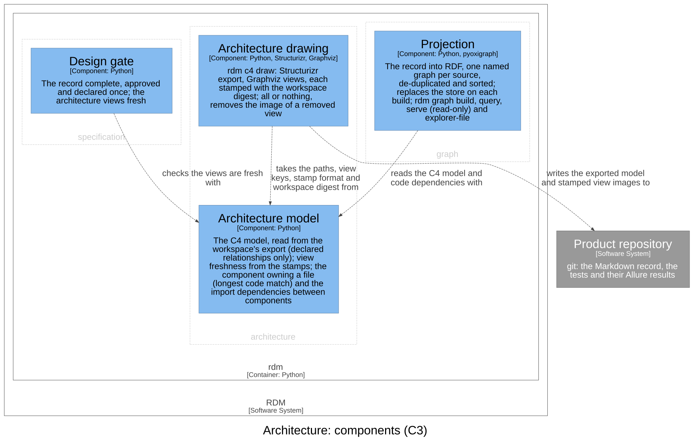

# Architecture — Software Design

## Purpose

This context owns the architecture workspace, its views, and the
conformance of the code and the record to it. It speaks the language of the
C4 model: a **person**, a **software system**, a **container** (something
that runs or stores data), a **component** (a logical building block inside
exactly one container, owned by one bounded context and naming its code), a
**relationship** (directed, labelled with what the source does to the
target), and an **architecture view** (one view of the workspace at one
level, drawn from it and stamped with it, never edited). The **architecture
workspace** (`dhf/c4/workspace.dsl`) is written by people and is the source
of every view; a bounded context is a group of components in it. The system
architecture document describes the system; this context keeps its C4 model.

## Design Outputs

The design outputs are this context's architecture, in the C4 model of the
architecture workspace: its components, what each is responsible for, and
how they relate. They name components, never source files or functions —
the workspace maps each component to its code.

| Component | Responsibility | Meets |
|-----------|----------------|-------|
| Architecture model | The C4 model, read from the workspace's export; whether the drawn files are the current workspace's; which component owns a file, and the code dependencies between components | DI-66, DI-70, DI-68 (the model and code dependencies it is checked against) |
| Architecture drawing | `rdm c4 draw`: exports the workspace and draws every view, each stamped with the workspace it was drawn from | DI-70 |

Both components sit in the `rdm` container. What the reviewer needs to
judge them:

- **The model is what the workspace declares.** It is read from the
  exported model (`dhf/c4/workspace.json`), never from the drawings. Each
  element is keyed by its identifier in the workspace; a component is
  external when tagged so, belongs to the bounded context of its group, and
  names its code by a path, a file or a directory. Only declared
  relationships count: the ones Structurizr implies from them are left out.
  A record with no exported workspace has an empty model, not an error.
- **A file belongs to one component.** The component whose code is the
  longest match for the file — the file itself, or the nearest directory
  above it — owns it, so a more specific component takes a file from a
  broader one. The code dependencies between components are found from the
  imports between their files, with one example pair of files kept for each
  pair of components.
- **Freshness is read from the stamps alone.** The workspace's digest is
  over the workspace and every local file it `!include`s, so an edit to an
  included file makes the drawn files stale too. The drawn files are stale
  when the exported model is missing, unreadable or stamped with another
  workspace's digest; when a view has no image, or its image is stamped for
  another view or another workspace; or when an image is no view's. Reading
  the stamps needs neither Structurizr nor Graphviz, so the design gate can
  check freshness on any machine.
- **Drawing is all or nothing.** The drawing exports the workspace with
  Structurizr and draws each view with Graphviz, then writes the exported
  model and one image per view (`dhf/c4/views/<view>.svg`), each stamped
  with the workspace's digest, and removes the image of a view the
  workspace no longer has. A workspace that cannot be exported or drawn is
  refused with the tool's reason, and nothing is written. Every kind of
  view is drawn, stamped and checked alike; a dynamic view is drawn as
  numbered collaboration steps, not lifelines.

The relationships, in the direction of the arrow:

- Architecture drawing → Architecture model: takes the paths, view keys,
  stamp format and workspace digest from it, so the drawing and the
  freshness check cannot disagree on them.
- Architecture drawing → Product repository: writes the exported model and
  the stamped view images to it.
- Design gate (`specification`) → Architecture model: checks the views are
  fresh with it.
- Projection (`graph`) → Architecture model: reads the C4 model and the code
  dependencies with it.

This context realises no other context's input. Parts of its own are
realised elsewhere: the design gate (`specification`) realises DI-70's
failing check, failing on every stale reason the Architecture model gives,
and on a workspace or drawn files that are uncommitted; the knowledge graph
(`graph`) realises DI-68 through its gate shapes, warnings only, over the
architecture and code it projects from the Architecture model for DI-67,
which `graph` owns, and two facts it projects for them: a component's code
path that does not exist, and the views each design document shows.

DI-66, DI-68 and DI-70 are each verified by their tagged acceptance test,
which also checks RDM's own record: DI-66's reads its workspace whole,
DI-70's, with stand-ins for Structurizr and Graphviz, checks that its views
are current, and DI-68's that its own C4 model and record agree.

Assumptions and open questions:

- Structurizr's command line, Java and Graphviz are tools on the drawing
  machine, not elements of the model, and the view does not show them.
- Every module is named by some component's code; a test fails on a module
  no component names (the dependency rule).
- Code dependencies are found for Python only, relative imports included.

## Commands and events

Each row: the actor issues the command, resulting in its success event or a
fail event (the rule broken, after the slash), which affects the entity.

| Actor | Command | Success event | Fail events | Entity |
|-------|---------|---------------|-------------|--------|
| Contributor | Draw architecture views | Views Drawn | Not Drawn / No Workspace · Tool Missing | Architecture workspace |
| The design gate | Check views current | Views Current | Views Stale / Not Current · Image Missing | Architecture workspace |

## Dependencies

Layer 1 of the dependency rule, a leaf: the Architecture model uses nothing
but the language's standard library, and the Architecture drawing only the
Architecture model. Depended on by `specification` (the design gate checks
the views are fresh), `graph` (the projection of the C4 model and its code
dependencies) and the composition root (`rdm c4 draw`). No dependency
breaks the rule.
