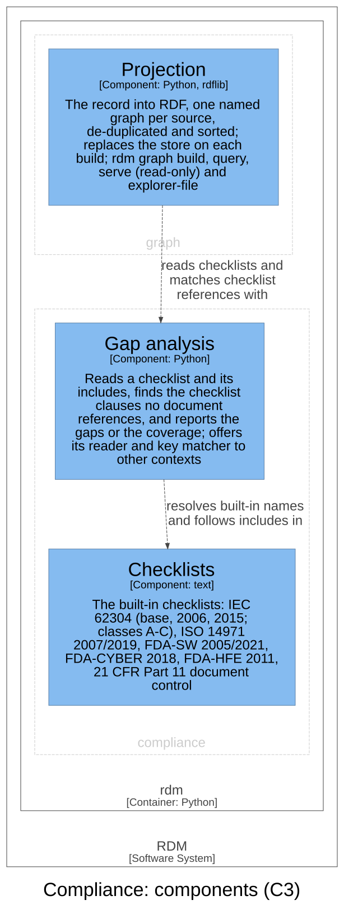

# Compliance — Software Design

## Purpose

Compliance holds standards as checklists and checks the controlled documents
against them. A **checklist** is a selection of a standard's clauses, in a
plain-text file, that may include other checklists; a **checklist clause** is
one line of it, named by its key; a controlled document references a clause
by writing its key inside a `[[ … ]]` block. A **gap** is a checklist clause
that no document in the set references, and **coverage** is the share of a
checklist's clauses that are referenced. Gap analysis is the activity this
context performs (`rdm gap`); the context itself is named for its domain,
compliance with a standard. It knows nothing of design inputs, tests or risks:
its only inputs are checklists and documents.

## Design Outputs

**Gap analysis** (`rdm/compliance/gaps.py`), run as `rdm gap` from the composition root
`rdm/main.py`:

- `audit_for_gaps(checklist, sources, …)` reads a checklist (a built-in name
  or a path), follows its `include` lines, scans the source documents for
  each clause key, and prints the missing clauses in checklist format, sorted
  in section order (`62304:5.1.2` before `62304:5.1.11`). It returns 3 when
  any clause is missing, 0 when none is, and 1 when no checklist is given
  (DI-10).
- The reader: a line's first word is its key and the rest its description;
  `#` lines are comments; `include <name>` names a built-in checklist or a
  file relative to the including file. Each file is read once, so an include
  cycle ends (DI-11).
- The key matcher (`find_keys`) joins the text of every `[[ … ]]` block and
  matches each key with key-alphabet boundaries: the two allowances of DI-10
  hold, and no other longer key satisfies a shorter one (DI-10).
- `coverage_report(checklists, sources, verbose)` (`rdm gap --coverage`)
  prints one table row per checklist — total, missing, covered, percent — and
  an overall row; in verbose mode it lists each checklist's missing clauses,
  the first ten and a count of the rest (DI-12).
- `rdm gap --list` lists the built-in checklists by name (DI-11, DI-25).
- A small public API — `builtin_checklists`, `parse_checklist`,
  `include_path`, `find_keys`, `missing_references` — that the knowledge
  graph uses instead of the private helpers, so the graph's clauses and
  reference links (DI-37, DI-48) cannot drift from what `rdm gap` reports.

**Checklists** (`rdm/compliance/checklists/`): seventeen built-in text checklists —
IEC 62304 (base lists for class A/B/C, each including the class below,
and the 2006 and 2015 editions of each class, each including that edition's
class below and the class's base list), ISO 14971 2007 and
2019, FDA-SW 2005 and 2021 (basic, and enhanced including basic), FDA-CYBER
2018, FDA-HFE 2011 (DI-11), and `part11_document_control` (DI-25).

**DC-001** (`dhf/documents/document_control.md`) is RDM's own
document-control statement: git and GitHub as this repository's document
control system, each Part 11 clause cited inline. It is a controlled
document, not a component; the DI-25 test audits it against the built-in
checklist.

This context realises no other context's input, and no other context
realises part of its inputs. The knowledge graph's DI-37 and DI-48 reuse its
reader and key matcher; they are the graph's inputs, not parts of these.

Each input is verified by its `@allure.story` test in
`tests/acceptance/test_gap_analysis.py`; `tests/gaps_test.py` keeps
lower-level unit tests of the matcher and the sort order.

## Components (C3)

| Component | Responsibility | Technology | Code |
|-----------|----------------|------------|------|
| Gap analysis | Documents against checklists | Python | `rdm/compliance/gaps.py` |
| Checklists | The built-in checklists | text | `rdm/compliance/checklists/` |

Gap analysis **reads** the Checklists: it resolves a built-in name to its
file and follows the includes between them. The view also shows the graph's
Projection, which **matches checklist references with** Gap analysis: it
reads checklists through the same public API and links each document to the
clauses its tags reference. No component of this context uses another
context's.

Assumptions and open questions:

- The ISO 14971 2019 checklist holds only its header comments, so it has no
  clauses; `--coverage` skips it, and an audit against it reports success.
  DI-11 names ISO 14971; the 2007 edition is the usable one today.
- An audit against a checklist with no clauses prints a warning and still
  exits 0; a checklist path that does not exist is skipped silently by
  `--coverage` but raises an error in an audit. Whether either should fail
  is open.
- Verbose coverage names at most ten missing clauses per checklist and counts
  the rest; the plain audit names them all.

## Dependencies

Compliance is a leaf: `rdm/compliance/gaps.py` imports only the Python standard library,
and no other context. It sits beside test evidence, risk and architecture
above the specification in the dependency rule, and needs nothing from the
specification either, since it works on any documents, not on design inputs.

Two parts depend on it, both as the rule allows: the composition root
`rdm/main.py` (`rdm gap`), and the knowledge graph (`rdm/graph/checklists.py`,
for DI-37 and DI-48), a read model above it. No import breaks the rule.
