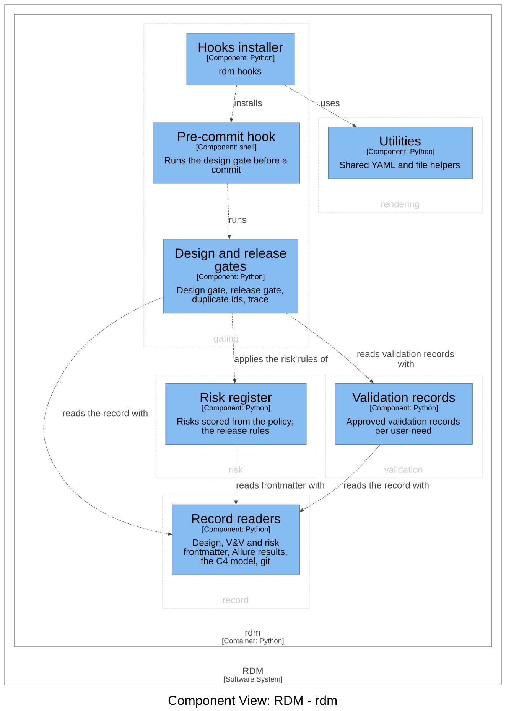

# Gating — Software Design

## Design Inputs

This context owns:

- **DI-2 (design gate)** — block the transition into implementation until the
  per-context design documents and the design review are present, complete, and
  approved (committed) in git; a later edit re-opens the gate. Refines UN-002.
- **DI-3 (release gate)** — block release unless every declared design input is
  verified by a passing test. Refines UN-003.
- **DI-26 (design-gate-only hooks default)** — `rdm hooks` installs only the
  design-gate pre-commit hook by default; the legacy issue-reference hooks
  (commit-msg / prepare-commit-msg) are installed only with
  `--with-issue-hooks`. RDM's own repo deleted them; downstream defaults
  should match. Refines UN-002.
- **DI-46 (duplicate ids)** — a user need or design input declared twice
  is two requirements wearing one name: the record reader keeps the first,
  so the second silently drops out of every gate and the graph. The design
  gate now fails on it, naming each declaring document, and the graph
  carries each id's declaration count so `rdm graph validate` reports the
  same thing. This replaces the retired `rdm story audit` ID-conflict scan
  (DI-13, DI-14), which searched every file for id-shaped strings rather
  than reading the record. Refines UN-007.

Retired (Design Review 4): DI-19, DI-20, DI-21, DI-27 and DI-28 — the
faithfulness gate, verdict recorder, mutation probe, replayable probes and
verdict hash scope. Independent confirmation that a test means something is
the human-reviewed pull request, not a per-input verdict. These ids are not
reused.

Retired (Design Review 11), with the planning tooling and the story-audit
context: DI-6 (planning outputs marked non-record — RDM ships no planning
tooling), DI-13 and DI-14 (repo-wide ID-conflict scan — replaced by DI-46),
DI-23 (design inputs in the repo audit — the graph and its shapes report
untagged inputs and stray tags) and DI-32 (deprecation notices on the legacy
YAML workflow, now removed). These ids are not reused.

## Design Outputs

Enforces design controls and verified coverage.

- **Design gate** (`rdm/gates/design_gate.py`) — the per-context design
  documents and the review must be present, free of placeholders, and approved
  (committed clean) in git; an edit to an approved document re-opens the gate.
- **Pre-commit hook** (`rdm/hook_files/pre-commit`) — blocks committing
  implementation work until the design gate passes; commits of the design docs
  themselves are allowed (that commit is the approval).
- **Release gate** (`run_release_gate`) — blocks release unless every design
  input is verified by a passing test and every user need is addressed.

Acceptance criteria are verified by `@allure.story("DI-2" / "DI-3" / "DI-26" / "DI-46")`
tests.

## Components (C3)

The components of the `gating` context, drawn from the architecture
workspace; a component of another context is shown where this one depends
on it. Each component names its code in the workspace.

