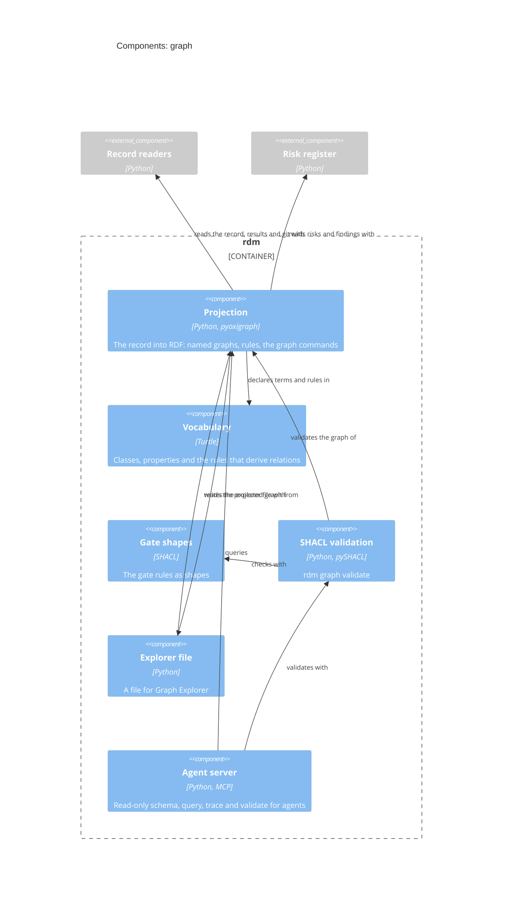

# Graph — Software Design

## Design Inputs

This context owns the projection of the design record into a linked-data
graph, refining UN-014. The Markdown design record stays the only authored
source: the graph is derived, rebuilt on demand, and never edited.

- **DI-35 (projection)** — `rdm graph build` reads what RDM already reads
  (design-doc frontmatter, the V&V plan's user-need registry, controlled
  documents' frontmatter, test-source tags, Allure results, `git log`) and
  emits quads into named graphs, one per source, so a query can always tell
  where a fact came from:
  `…graph/record`, `…graph/tests`, `…graph/executions`, `…graph/git`, and
  `…graph/ontology` (RDM's vocabulary, so a browser can label classes and
  properties). Open world: the graph states only what the record states —
  a missing `verifies` edge means *no tag was found*, never *unverified*;
  closed-world judgments stay in the gates. Every node carries an
  `rdfs:label` (its id, or a readable name) for graph browsers. Output is
  N-Quads sorted line by line — deterministic, diffable, loadable by any
  RDF tool. Refines UN-014.
- **DI-36 (store, query, serve)** — served read-only (`oxigraph
  serve-read-only`, Design Review 12): a read-write endpoint with open CORS let
  any web page clear or forge the graph a browser shows. `--store DIR` loads the dataset into an
  embedded Oxigraph store, cleared first so a removed design input never
  lingers. `rdm graph query '<SPARQL>'` answers SELECT / ASK / CONSTRUCT
  over the store, or over an in-memory projection when no store is given.
  `rdm graph serve` runs `oxigraph serve` on the store with the union default
  graph and CORS enabled — the SPARQL 1.1 endpoint AWS Graph Explorer (and
  any SPARQL client) connects to. Graph Explorer browses; it never writes:
  changes are made in the Markdown and re-projected. Refines UN-014.
- **DI-37 (checklists and reference tags)** — the other half of RDM's record:
  gap analysis, modelled so checklists stay **data**. A standard is a
  `skos:ConceptScheme` named by its key prefix (`62304`, `P11`, `FDA-SW`,
  `14971`, …); a checklist item is an `rdm:Clause` (`rdfs:subClassOf
  skos:Concept`) with `skos:notation` = its key, `skos:definition` = its
  description, `skos:inScheme` = its standard, and `skos:broader` = its
  nearest listed dotted parent (`62304:5.6.2.a` → `62304:5.6.2`); a checklist
  is an `rdm:Checklist` (`rdfs:subClassOf skos:Collection`) whose
  `skos:member`s are its own items and which `rdm:includes` the checklists it
  includes — its effective contents are `rdm:includes*/skos:member`, so
  includes are never flattened away. A key shared by several checklists (the
  62304 class A/B/C lists) is one clause in several collections. Adding a
  standard is adding a file: `rdm graph build --checklist NAME|FILE`
  (repeatable) takes a built-in name, a `.txt` checklist in `rdm gap`'s format
  (read by `rdm gap`'s own reader), or an RDF file (`.ttl`, `.nt`, `.jsonld`,
  …) loaded as-is for richer metadata such as a standard's title or edition
  — the shapes (DI-38) check checklist data too. Each controlled document's
  `[[…]]` tags become `dcterms:references` links in `…graph/references`,
  matched with `rdm gap`'s own key matcher, so "a clause nothing references"
  and "a missing item" in `rdm gap` are the same set by construction.
  Refines UN-014 and UN-006.
- **DI-38 (SHACL shapes for the gates)** — `rdm/graph/shapes.ttl` states the
  gate rules as SHACL, closed-world checks over the open-world graph:
  violations (release-blocking) — a user need no design input traces to; a
  design input with no passing test run, or with a failed/broken one; a
  checklist clause no document references; warnings — a design input with no
  tagged test file, a `tracesTo` / `realises` naming an
  undeclared user need or design input, a test tag naming no declared design
  input. `rdm graph validate` runs them (and any `--shapes FILE`, so a team can
  add its own rules as data) and prints severity, focus node and message per
  result, exiting 1 on a violation. The shapes sit beside the Python gates,
  not instead of them: an acceptance test holds them to agreement with
  `rdm story release-gate` and `rdm gap`. Whether shapes eventually replace
  the coded gates is RDM-004.06's question. Refines UN-014 and UN-003.
- **DI-39 (Graph Explorer file)** — Graph Explorer loads a saved graph from
  a small JSON file (`meta.kind = "graph-export"`, `data.vertices` = node
  IRIs, `data.edges` = `subject-[predicate]->object`, `data.connection` = the
  endpoint) and fetches everything else itself. `rdm graph explorer-file -o
  rdm.graph.json` writes that file for the whole record — every instance
  node and every link between two of them, without the vocabulary or
  `rdf:type` statements — so the full traceability graph opens with *Load
  graph from file* instead of a hundred manual expansions. `--exclude
  TestRun` (repeatable) leaves out a class's nodes and their links to
  declutter, and the details that hang only from them (a run's steps,
  attachments and parameters), which would
  otherwise float as islands; `--endpoint` names the served endpoint (default
  `http://localhost:7878`). Refines UN-014.
- **DI-41 (agent server)** — `rdm graph mcp` is a Model Context Protocol
  server over stdio, the interface agent harnesses already speak. Four tools:
  `schema` (vocabulary and prefixes, so an agent can write queries),
  `query` (SPARQL), `trace` (one need or input with its contexts, documents,
  tests and runs, as JSON) and `validate` (the gate shapes' results). Each call
  projects the record afresh (about a third of a second for RDM's own), so an
  agent working on a branch never reads a stale graph. Refines UN-015.
- **DI-42 (read-only)** — amended in Design Review 12: `query` also refuses
  `SERVICE` (pyoxigraph would otherwise make the HTTP request), and `trace`
  takes only id-shaped input. The graph is the source of truth agents consult,
  never one they write. The server has no write tool; `query` rejects SPARQL
  Update and anything other than SELECT, ASK, CONSTRUCT and DESCRIBE; results
  are capped (default 200 rows) and say when they were cut, so one query
  cannot flood an agent's context. Changing the record stays a reviewed pull
  request. Refines UN-015.

- **DI-45 (risks in the graph)** — a risks graph: each `rdm:Risk` with its
  category and STRIDE category, `rdm:linkedTo` other risks, its chain, scores
  and evaluated levels, its **residual decision** — `acceptable`,
  `accepted`, `needs acceptance`, `unacceptable`, or `not evaluated` while a
  controlling design input has no passing test — its status and acceptance,
  and `rdm:controlledBy` to the design inputs that control it. The risk rules
  are written once, in `rdm/record/risk.py`: the release gate reports their
  findings, and the projection carries the same findings on each risk
  (`rdm:finding` blocks, `rdm:riskWarning` warns; a finding about the whole
  register goes on every risk), so the risk shapes block exactly what the
  gate blocks, in the gate's words. `trace` takes a `RISK-…` id, and a
  design input's trace lists the risks it controls. Refines UN-016 and
  UN-015.

- **DI-48 (reference links)** — split from DI-37: each controlled
  document's `[[…]]` tags become `dcterms:references` to the clauses they
  name, matched by `rdm gap`'s own code. Refines UN-014 and UN-006.
- **DI-49 (`rdm graph validate`)** — split from DI-38: the command that runs
  the shapes (and user shape files) and exits on a violation. Refines UN-014
  and UN-003.
- **DI-51 (who landed a change)** — git records who *landed* a change on the
  default branch, not who *reviewed* it (only the forge knows reviewers).
  For each design document the graph records the first-parent commit of the
  default branch that brought its latest change in — a merge, squash or
  direct commit — as `rdm:landedIn`, with its author as `rdm:landedBy`. A
  change not yet on the default branch has neither, and a shape warns.
  Refines UN-014 and UN-015.
- **DI-52 (no island documents)** — user needs link to the document that
  declares them (`rdm:declaredIn`), risks to the policy document they were
  evaluated against (`rdm:evaluatedAgainst`). Design documents are not linked
  to the design review: nothing in the record says which review covered which
  document, and a constant edge to the one review would claim it did. Refines
  UN-014 and UN-015.
- **DI-58 (no island documents, second pass)** — browsing RDM's own graph in
  Graph Explorer left three documents unlinked: the architecture, the
  traceability matrix and the document-control procedure. The architecture
  now declares the bounded contexts in frontmatter (`contexts:`, each with its
  part), and each context links to it (`rdm:declaredIn`, `rdm:part`); a shape
  warns on a context with a design document but no declaration, once any
  document declares contexts, so the architecture cannot silently fall behind
  the design documents. A document names the controlled documents it relies
  on in `references:` (`dcterms:references`, document to document), and a
  reference to a document the record does not hold fails validation. The
  traceability matrix template is not projected: it is an output, rendered
  from what the graph already holds. Refines UN-014
  and UN-015.

- **DI-53 (evidence in the graph)** — a passed run says nothing about what
  was checked. Each test run carries its Allure steps (`rdm:step`, in order,
  nested under their parent) and attachments (`rdm:attachment`: name, media
  type, the file in the results), and `trace` lists them, so a reviewer or
  agent goes from a design input to the evidence itself. Refines UN-014,
  UN-015 and UN-004.

- **DI-54 (Allure results, what counts)** — each run carries its uuid, full
  name, start and end times (PROV-O `startedAtTime` / `endedAtTime`), failure
  message and trace, and parameters, besides its status, steps and
  attachments. Deliberately not projected (Design Review 18): labels as
  nodes — `story` and `output` become `rdm:exercises` / `rdm:exercisesOutput`,
  epic and feature come from the record itself (DI-57), and the rest
  (`host`, `thread`, `framework`, `suite`…) is runner metadata; links, which
  repeat the record's own `declaredIn` chain; and a test case per history id,
  one-to-one with runs while one execution is loaded. The raw results stay
  in the evidence bundle (DI-30). Refines UN-014, UN-004.
- **DI-56 (runs to code)** — a test's `@allure.label("output", "rdm/…")`
  already names the code it exercises. Each run links to those files
  (`rdm:exercisesOutput` → `rdm:SourceFile`), and `trace` lists a design
  input's source files: design input → test → run → code, with nothing new
  to author. Refines UN-014, UN-015.
- **DI-60 (evidence tied to a version)** — a passing run is evidence for the
  build it ran against, and nothing said which. Each run now links to the
  commit its `commit` label names (`rdm:testedAt`, written by the plugin,
  DI-59), with `rdm:uncommittedChanges` when the working tree was not clean;
  the record node carries the commit the graph was built at
  (`rdm:atCommit`). A shape warns on a run tied to no commit (its version is
  unknown) and on a run that tested a different commit than the record's —
  stale results presented as current. Refines UN-014 and UN-003.
- **DI-61 (the claim and the evidence meet)** — the source scan said "this
  file verifies DI-n" and the results said "this run exercised DI-n", and
  nothing joined them. Each tagged test is now an `rdm:Test`: a Python test
  function or method (`tests/x.py::TestClass::test_y`, including the tests a
  module-level `pytestmark` tags), or the whole file where a language's tags
  are read by pattern, `rdm:definedIn` its `rdm:TestFile` and
  `rdm:verifies` its design inputs. A run links to the test it ran
  (`rdm:runOf`) through Allure's full name. Once runs link to tests, a shape
  warns on a tagged test with no run while other tests of its file ran (the
  claim was never executed — a file never matched, as in a language whose
  results carry no Python full name, is not reported) and on a run exercising
  a design input its test does not claim (the source and the results
  disagree). Refines UN-014 and UN-004.
- **DI-62 (derived, not stored — and the consumer is told how)** — the graph
  stores only what the record states; a fact that follows from others is not
  also stored (Design Review 17 removed `satisfies` for that reason). But a
  consumer that does not know the rule gets nothing back and, the world being
  open, no hint why. So each derived relation is declared in the vocabulary
  with the rule that derives it, as a SPARQL CONSTRUCT (`rdm:Rule`,
  `rdm:derives`, `rdm:construct`) — the first, `rdm:serves`: a bounded
  context serves the user needs its owned and realised design inputs trace
  to. The agent server's `schema` lists the rules, and its queries see their
  results. `--infer` adds the derived facts to a separate
  `…graph/inferred` named graph, so a fact the record states and a fact a
  rule derived are never confused. Refines UN-014 and UN-015.

Retired (Design Review 18): DI-55 — container fixtures (`tmp_path`,
`capsys`…) say nothing about a design input, and Allure's set-up and
tear-down halves became two fixtures each. The containers stay in the
evidence bundle (DI-30).

- **DI-67 (the C4 model in the graph)** — the elements become typed nodes
  (person, software system, container, component) with what the diagrams say
  of them, contained in their boundary; each component belongs to the
  bounded context whose design document declares it; relationships are nodes
  with source, target, label and technology. Each projected source file
  belongs to the component whose code path is its longest match (a file or a
  directory), and a Python import from one component's code into another's is
  projected as a dependency: the coupling the code actually has, beside the
  coupling the diagrams claim. Refines UN-017, UN-014.
- **DI-68 (conformance, as warnings)** — the gate shapes compare the model
  with the record and the code: code a test exercises that no component
  names; a test that exercises another context's component than the one that
  owns or realises its input; a dependency in the code with no relationship
  declared for it; a component outside any container, or inside a boundary
  the container view does not have; a context with no component; a code path
  that does not exist; an unlabelled relationship; an element declared by two
  documents. Every one is a warning: an architecture disagreement is a
  question for the reviewer, never a release block. Refines UN-017.
- **DI-69 (a design input's components)** — `trace` of a design input names
  the components its tests exercise, with their container and owning
  context, so an agent sees where an input is built without reading the code.
  Refines UN-017, UN-015.

## Design Outputs

`rdm/graph/` (optional extra `graph`: `pyoxigraph`, plus the `oxigraph` CLI
for serving):

- `rdm/graph/project.py` — `project(dhf, allure_results=None)` → quads;
  `write_nquads`; `build_store`.
- `rdm/graph/ontology.ttl` — the vocabulary. Reuses standards where they
  exist: `rdm:DesignInput rdfs:subClassOf oslc_rm:Requirement` (OSLC
  Requirements Management), `dcterms:identifier` / `dcterms:title`, PROV-O for
  commits (`prov:Activity`, `prov:wasGeneratedBy`, `prov:wasAssociatedWith`,
  `prov:endedAtTime`). RDM-specific terms only where no standard term fits:
  `rdm:UserNeed`, `rdm:BoundedContext`, `rdm:Test`, `rdm:TestFile`, `rdm:TestRun`,
  `rdm:tracesTo`, `rdm:ownedBy`, `rdm:realises`,
  `rdm:declaredIn`, `rdm:verifies`, `rdm:exercises`, `rdm:status`,
  `rdm:revision`, `rdm:text`.
- IRIs: vocabulary `https://github.com/scope-impact/rdm/ns#`; instances
  `urn:dhf:<project>:<kind>/<id>` (project defaults to the DHF's repository
  name, `--project` overrides), so graphs from several repositories merge
  without collisions.
- `rdm/graph/checklists.py` — checklist clauses and reference links (DI-37),
  reusing `rdm/gaps.py`'s reader and matcher.
- `rdm/graph/shapes.ttl` + `rdm/graph/validate.py` — the gate shapes and the
  pySHACL runner (DI-38).
- `rdm/graph/explorer.py` — the Graph Explorer graph file (DI-39).
- risks: projected from `rdm/record/risk.py` into the `risks` named graph (DI-45).
- `rdm/graph/allure.py` — Allure results, containers and attachments → RDF (DI-53, DI-54, DI-56).
- `rdm/graph/agent.py` — the read-only agent tools and the MCP server (DI-41, DI-42; `mcp` SDK in the `graph` extra).
- `rdm/graph/cli.py` — `rdm graph build | query | serve | validate | explorer-file | mcp`.

Acceptance criteria are verified by `@allure.story("DI-35" / "DI-36" / "DI-37" / "DI-38" / "DI-39" / "DI-41" / "DI-42" / "DI-45")` tests.

## Components (C3)

The components of the `graph` context, each naming the code that
implements it; a component of another context is shown external, where this
one depends on it.

