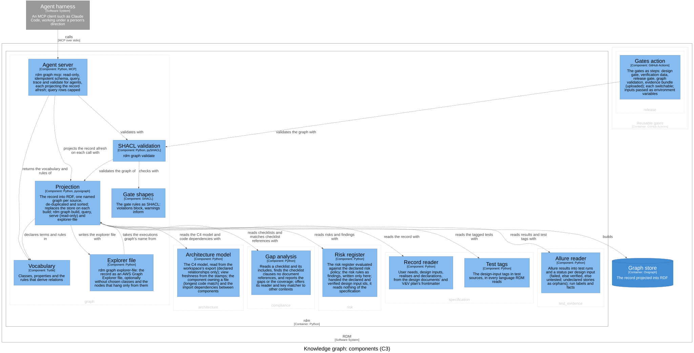

# Knowledge graph — Software Design

## Purpose

This context owns the knowledge graph: the design record, with its test
runs, git history, risks, checklists and architecture, projected into RDF
for people and agents to query, browse and validate. It speaks of
*projection* (one source of the record turned into facts, one named graph
per source), the *vocabulary* (the classes and properties queries and agents
rely on), *gate rules* (shapes whose violations block and whose warnings
inform), and *derived relations* (facts a rule infers, kept apart from what
the record states). The graph is a read model: the Markdown record and the
tests stay the only authored source; the graph is rebuilt from them on
demand, never edited, and never the source of a fact. It is open world: it
states only what the record states, so a missing `rdm:verifies` link means
*no tag was found*, never *unverified*; closed-world judgments are the gate
rules' and the coded gates'. `graph` names it in commands and code.

## Design Inputs

- **DI-35 (projection)** — `rdm graph build` reads what RDM already reads
  (design documents' frontmatter, the V&V plan's user-need registry,
  controlled documents' frontmatter, test-source tags, Allure results,
  `git log`) and emits quads into named graphs, one per source, so a query
  can always tell where a fact came from: `…graph/record`, `…graph/tests`,
  `…graph/executions`, `…graph/git`, and `…graph/ontology` (RDM's
  vocabulary, so a browser can label classes and properties). Every node
  carries an `rdfs:label` (its id, or a readable name) for graph browsers.
  The output is N-Quads sorted line by line: deterministic, diffable, and
  loadable by any RDF tool. Refines UN-014.
- **DI-36 (store, query, serve)** — `rdm graph build --store DIR` loads the
  dataset into an embedded Oxigraph store, cleared first, so a removed design
  input never lingers. `rdm graph query '<SPARQL>'` answers SELECT, ASK,
  CONSTRUCT and DESCRIBE over a store, or over an in-memory projection when
  no store is given. `rdm graph serve` serves the store as a SPARQL 1.1
  endpoint with the union of the named graphs as its default graph and CORS
  enabled, for AWS Graph Explorer and any SPARQL client. Amended (Design
  Review 12): the endpoint is read-only (`oxigraph serve-read-only`), because
  a writable endpoint with open CORS let any web page clear or forge the
  graph a browser shows. Graph Explorer browses; it never writes. Refines
  UN-014.
- **DI-37 (checklists)** — checklists stay **data**. A standard is a
  `skos:ConceptScheme` named by its key prefix (`62304`, `P11`, `FDA-SW`,
  `14971`, …); a checklist item is an `rdm:Clause` (`rdfs:subClassOf
  skos:Concept`) with `skos:notation` its key, `skos:definition` its
  description, `skos:inScheme` its standard, and `skos:broader` its nearest
  listed dotted parent (`62304:5.6.2.a` → `62304:5.6.2`); a checklist is an
  `rdm:Checklist` (`rdfs:subClassOf skos:Collection`) whose `skos:member`s
  are its own items and which `rdm:includes` the checklists it includes, so
  its effective contents are `rdm:includes*/skos:member` and includes are
  never flattened away. A key shared by several checklists (the 62304 class
  A/B/C lists) is one clause in several collections. Adding a standard is
  adding a file: `--checklist NAME|FILE` (repeatable) takes a built-in name,
  a `.txt` checklist read by `rdm gap`'s own reader, or an RDF file (`.ttl`,
  `.nt`, `.jsonld`, …) loaded as-is for richer metadata such as a standard's
  edition. Checklists come on request, because which standards apply is the
  project's choice. Refines UN-014 and UN-006.
- **DI-38 (gate shapes)** — `rdm/graph/shapes.ttl` states the gate rules as
  SHACL, closed-world checks over the open-world graph. Violations
  (release-blocking): a user need no design input traces to; a design input
  with no passing test run, or with a failed or broken one; a checklist
  clause no document references. Warnings: a design input with no tagged
  test, a `tracesTo` or `realises` naming an undeclared user need or design
  input, a test tag naming no declared design input. The shapes sit beside
  the coded gates, not instead of them: an acceptance test holds them to
  agreement with `rdm story release-gate` and `rdm gap`. Refines UN-014 and
  UN-003.
- **DI-39 (Graph Explorer file)** — Graph Explorer loads a saved graph from
  a small JSON file (`meta.kind = "graph-export"`, `data.vertices` the node
  IRIs, `data.edges` written `subject-[predicate]->object`,
  `data.connection` the endpoint) and fetches everything else itself.
  `rdm graph explorer-file -o rdm.graph.json` writes it for the whole
  record, without the vocabulary or `rdf:type` statements, so the full
  traceability graph opens with *Load graph from file* instead of a hundred
  manual expansions. `--exclude TestRun` (repeatable) leaves out a class's
  nodes and links, and the nodes that hang only from them (a run's steps,
  attachments and parameters), which would otherwise float as islands;
  `--endpoint` names the served endpoint (default `http://localhost:7878`).
  Refines UN-014.
- **DI-41 (agent server)** — `rdm graph mcp` is a Model Context Protocol
  server over stdio, the interface agent harnesses already speak, with four
  tools: `schema` (vocabulary and prefixes, so an agent can write queries),
  `query` (SPARQL), `trace` (one user need or design input with its
  contexts, documents, tests and runs, as JSON) and `validate` (the gate
  shapes' results). Each call projects the record afresh (about a third of a
  second for RDM's own record), so an agent on a branch never reads a stale
  graph. Refines UN-015.
- **DI-42 (read-only agent server)** — agents consult the knowledge graph;
  they never write it. There is no write tool; `query` rejects SPARQL Update
  and anything but SELECT, ASK, CONSTRUCT and DESCRIBE; results are capped
  (default 200 rows) and say when they were cut, so one query cannot flood
  an agent's context. Changing the record stays a reviewed pull request.
  Amended (Design Review 12): `query` also refuses `SERVICE` (pyoxigraph
  would otherwise make the HTTP request), and `trace` takes only id-shaped
  input. Refines UN-015.
- **DI-45 (risks in the graph)** — each `rdm:Risk` with its category and
  STRIDE category, `rdm:linkedTo` other risks, hazard, situation and harm,
  scores and levels, its **residual decision** (`acceptable`, `accepted`,
  `needs acceptance`, `unacceptable`, or `not evaluated` while a controlling
  design input has no passing test), status, acceptance, and
  `rdm:controlledBy` its design inputs. The risk rules are written once, in
  the risk context: the projection carries the release gate's own findings
  on each risk (`rdm:finding` blocks, `rdm:riskWarning` warns; a blocking
  finding about the whole register goes on every risk), so the risk shapes
  block exactly what the gate blocks, in its words. `trace` takes a risk id,
  and a design input's trace lists the risks it controls. Refines UN-016 and
  UN-015.
- **DI-48 (reference links)** — split from DI-37: each controlled
  document's `[[…]]` tags become `dcterms:references` to the clauses they
  name, in `…graph/references`, matched by `rdm gap`'s own key matcher, so
  "a clause nothing references" here and "a missing item" in `rdm gap` are
  the same set by construction. Refines UN-014 and UN-006.
- **DI-49 (`rdm graph validate`)** — split from DI-38: runs the shipped
  shapes and any `--shapes FILE` (a team's own rules, as data), prints
  severity, focus node and message per result, and exits 1 on a violation.
  Refines UN-014 and UN-003.
- **DI-51 (who landed a change)** — git records who *landed* a change on the
  default branch, not who *reviewed* it (only the forge knows reviewers).
  For each controlled document the graph records the first-parent commit of
  the default branch that brought its latest change in (a merge, squash or
  direct commit) as `rdm:landedIn`, with its author as `rdm:landedBy`. A
  change not yet on the default branch has neither, and a shape warns.
  Refines UN-014 and UN-015.
- **DI-52 (no island documents)** — user needs link to the document that
  declares them (`rdm:declaredIn`), risks to the policy document they were
  evaluated against (`rdm:evaluatedAgainst`). Design documents are not
  linked to the design review: nothing in the record says which review
  covered which document. Refines UN-014 and UN-015.
- **DI-53 (evidence in the graph)** — a passed run says nothing about what
  was checked. Each test run carries its Allure steps (`rdm:step`, in order,
  nested under their parent) and attachments (`rdm:attachment`: name, media
  type, the file in the results), and `trace` lists them, so a reviewer or
  agent goes from a design input to the evidence itself. Refines UN-014,
  UN-015 and UN-004.
- **DI-54 (Allure results, what counts)** — each run carries its uuid, full
  name, start and end times (PROV-O `startedAtTime` / `endedAtTime`), status
  message and trace, and parameters, besides status, steps and attachments.
  Deliberately not projected (Design Review 18): labels as nodes (`story`
  and `output` become `rdm:exercises` / `rdm:exercisesOutput`, epic and
  feature come from the record, DI-57, and the rest is runner metadata);
  links, which repeat the record's `declaredIn` chain; and a test case per
  history id, one-to-one with runs while one execution is loaded. The raw
  results stay in the evidence bundle (DI-30). Refines UN-014 and UN-004.
- Retired (Design Review 18): DI-55 — container fixtures (`tmp_path`,
  `capsys`…) say nothing about a design input, and Allure's set-up and
  tear-down halves became two fixtures each. The containers stay in the
  evidence bundle (DI-30).
- **DI-56 (runs to code)** — a test's `@allure.label("output", "rdm/…")`
  already names the code it exercises. Each run links to those files
  (`rdm:exercisesOutput` → `rdm:SourceFile`), and `trace` lists a design
  input's source files: design input → test → run → code, with nothing new
  to author. Refines UN-014 and UN-015.
- **DI-58 (no island documents, second pass)** — the architecture declares
  the bounded contexts in frontmatter (`contexts:`, each with its part), and
  each context links to it (`rdm:declaredIn`, `rdm:part`); once any document
  declares contexts, a shape warns on a context with a design document but no
  declaration, so the architecture cannot fall behind the design documents.
  A document names the controlled documents it relies on in `references:`
  (`dcterms:references`), and a reference to a document the record does not
  hold fails validation. The traceability matrix template is not projected:
  it is an output, rendered from what the graph already holds. Refines
  UN-014 and UN-015.
- **DI-60 (evidence tied to a version)** — each run links to the commit its
  `commit` label names (`rdm:testedAt`, written by the pytest plugin,
  DI-59), with `rdm:uncommittedChanges` when the working tree was not clean;
  the record node carries the commit the graph was built at
  (`rdm:atCommit`). A shape warns on a run tied to no commit and on a run
  that tested another commit than the record's: stale results presented as
  current. Refines UN-014 and UN-003.
- **DI-61 (the claim and the evidence meet)** — each tagged test is an
  `rdm:Test`: a Python test function or method
  (`tests/x.py::TestClass::test_y`, including those a module-level
  `pytestmark` tags), or the whole file where a language's tags are read by
  pattern, `rdm:definedIn` its `rdm:TestFile` and `rdm:verifies` its design
  inputs. A run links to its test (`rdm:runOf`) through Allure's full name.
  Once runs link to tests, a shape warns on a tagged test with no run while
  other tests of its file ran (a file never matched, as in a language whose
  results carry no Python full name, is not reported) and on a run
  exercising a design input its test does not claim. Refines UN-014 and
  UN-004.
- **DI-62 (derived relations)** — the graph stores only what the record
  states (Design Review 17 removed the stored `satisfies` for that reason),
  but a consumer that does not know a rule gets nothing back and, the world
  being open, no hint why. So each derived relation is declared in the
  vocabulary with its rule, a SPARQL CONSTRUCT (`rdm:Rule`, `rdm:derives`,
  `rdm:construct`); the first is `rdm:serves`: a bounded context serves the
  user needs its owned and realised design inputs trace to. `schema` lists
  the rules and the agent server's queries see their results; `--infer` adds
  the derived facts in a separate `…graph/inferred`, so a stated fact and a
  derived one are never confused. Refines UN-014 and UN-015.
- **DI-67 (the C4 model in the graph)** — the workspace's elements become
  typed nodes (person, software system, container, component) with their
  name, technology, description and external flag, contained in their
  parent; each component is in the bounded context of its group, with its
  code; relationships are nodes with source, target, label and technology.
  Each projected source file is in the component whose code path is its
  longest match, and a Python import from one component's code into
  another's is a dependency: the coupling the code has, beside the one the
  workspace claims. Reading the workspace is the architecture context's
  (DI-66); stating it as facts to query is this one's. Refines UN-017 and
  UN-014.
- **DI-69 (a design input's components)** — `trace` of a design input names
  the components its tests exercise, with their container and owning
  bounded context, so an agent sees where an input is built without reading
  the code. Not implemented yet: its tagged test is a stub that fails, and
  `trace` lists a design input's source files (DI-56) but not their
  components. Refines UN-017 and UN-015.

## Design Outputs

The context is the optional extra `graph` (`pyoxigraph`, the `oxigraph` CLI,
`pyshacl`, the `mcp` SDK); without it every `rdm graph` command exits 2 and
names the extra. Each design input is verified by a test tagged with it in
`tests/acceptance/test_graph*.py`.

- **Projection** (`rdm/graph/`) — `project()` returns the record as
  de-duplicated quads in a stable order, `nquads` writes them sorted, and
  `build_store` clears and fills a store (DI-35, DI-36). One function per
  named graph: record (DI-35, DI-52, DI-58), tests (DI-61), executions
  (`allure.py`: DI-53, DI-54, DI-56, DI-60, DI-61), git (DI-51, DI-60),
  risks (DI-45), architecture and code (`c4.py`: DI-67), checklists and
  references on request (`checklists.py`: DI-37, DI-48), ontology, and
  inferred on request (`rules.py`: DI-62). The architecture is projected
  after the runs, because the source files it places in components
  (`rdm:inComponent`) are the ones the runs' `output` labels created; the
  code graph holds one `rdm:Dependency` per importing pair of components,
  with one example importing and imported file, beside their
  `rdm:dependsOn` link. Instance IRIs are `urn:dhf:<project>:<kind>/<id>`
  (the repository name unless `--project` is given), so graphs from several
  repositories merge without collisions; clause, standard and checklist
  IRIs (`urn:rdm:clause:62304:5.6.2`) are project-independent. `cli.py`
  holds `build | query | serve | explorer-file`; `serve` runs `oxigraph
  serve-read-only` on `.rdm/graph` at `localhost:7878` by default. `ns.py`
  prepends the prefixes a query does not declare.
- **Vocabulary** (`rdm/graph/ontology.ttl`) — reuses standard terms where
  they exist: `rdm:DesignInput rdfs:subClassOf oslc_rm:Requirement` (OSLC
  Requirements Management), Dublin Core for identifiers, titles,
  descriptions and references, PROV-O for commits, authors and run times,
  SKOS for checklists. RDM terms (`rdm:UserNeed`, `rdm:BoundedContext`,
  `rdm:Test`, `rdm:TestRun`, `rdm:Risk`, the C4 classes, `rdm:tracesTo`,
  `rdm:ownedBy`, `rdm:realises`, `rdm:verifies`, `rdm:exercises`, …) are
  minted only where none fits. It declares the derived relations with their
  rules (DI-62) and is projected as the ontology graph (DI-35).
- **Gate shapes** (`rdm/graph/shapes.ttl`) — the gate rules of DI-38, plus
  the checklist data's own shapes (one key and a standard per clause; a
  checklist's members are clauses, its includes checklists) and the shapes
  of DI-45, DI-51, DI-58, DI-60 and DI-61.
- **SHACL validation** (`rdm/graph/validate.py`) — `rdm graph validate`
  (DI-49) runs the shapes with pySHACL over the union of the named graphs
  and reports most severe first; exit 1 on a violation, 2 on a missing DHF
  or shapes file.
- **Explorer file** (`rdm/graph/explorer.py`) — the Graph Explorer file
  (DI-39); with `--exclude`, only nodes still connected to a node typed
  outside the executions graph are kept.
- **Agent server** (`rdm/graph/agent.py`) — the four tools and `rdm graph
  mcp` (DI-41, DI-42), each annotated read-only and idempotent; every call
  projects afresh with the derived relations (DI-62). `query` refuses
  `SERVICE` outside literals, IRIs and comments and anything that does not
  parse as a query; `limit` is capped at 5000. `trace` answers a user need,
  a design input (with its risks, runs, steps, attachments and source files:
  DI-45, DI-53, DI-56) or a risk. RDM's repository registers the server in
  `.mcp.json`.

Realised for other contexts (no `realises` is declared): the Projection and
Gate shapes implement the graph's part of DI-46 (specification) — each user
need's and design input's declaration count and a shape on a repeated
declaration. DI-68 (architecture) is to be met by gate shapes here; none
exists yet. Realised by others: the specification realises part of DI-61
(the test-source scan), and the pytest plugin writes the commit labels
DI-60 projects (DI-59).

## Components (C3)

| Component | Responsibility | Technology | Code |
|-----------|----------------|------------|------|
| Projection | The record into RDF: named graphs, rules, the graph commands | Python, pyoxigraph | `rdm/graph/` |
| Vocabulary | Classes, properties and the rules that derive relations | Turtle | `rdm/graph/ontology.ttl` |
| Gate shapes | The gate rules as shapes | SHACL | `rdm/graph/shapes.ttl` |
| SHACL validation | `rdm graph validate` | Python, pySHACL | `rdm/graph/validate.py` |
| Explorer file | A file for Graph Explorer | Python | `rdm/graph/explorer.py` |
| Agent server | Read-only schema, query, trace and validate for agents | Python, MCP | `rdm/graph/agent.py` |

All six are in the `rdm` container; the view also shows the other contexts'
components the Projection reads (see Dependencies).

- The Projection declares its terms and rules in the Vocabulary and writes
  the explorer file with the Explorer file, which in turn imports only the
  executions graph's name from the Projection, not a second read.
- SHACL validation validates the Projection's graph and checks it with the
  Gate shapes.
- The Agent server queries the Projection, validates with SHACL validation,
  and checks `trace` input is an id with the Record kernel.
- At the container level, the Projection builds the graph store that the
  SPARQL endpoint serves to AWS Graph Explorer; the agent harness calls the
  Agent server over MCP stdio. The Agent server never uses that store: it
  projects into memory on each call.

Open questions:

- Whether the shapes replace the coded gates (RDM-004.06); until then
  acceptance tests hold the two to agreement.
- The Agent server reads `ontology.ttl` for `schema`, but the workspace
  draws no relationship to the Vocabulary.
- `schema`'s list of named graphs and the server's instructions do not name
  the architecture and code graphs (DI-67), though queries see them.

## Dependencies

A read model at the top of the dependency rule: it depends on the contexts
below it, and nothing but the composition root (`rdm/main.py`) imports it.
It projects:

- **specification**, through the Record kernel (`rdm/record/sdd.py`,
  `ids.py`, `git.py`): needs, inputs, contexts, documents, declarations, ids,
  git history;
- **test evidence**, through the Allure reader (`rdm/record/allure.py`):
  test tags, results and labels, and the verified set (`reconcile`);
- **risk**, through the Risk register (`rdm/record/risk.py`): the register,
  the policy, the residual decision and the release gate's findings;
- **architecture**, through the Architecture model (`rdm/record/c4.py`):
  the C4 model, each file's component, the imports between components;
- **compliance**, through Gap analysis (`rdm/gaps.py`): the checklist
  reader, the built-in checklists and the key matcher.

It reads neither release nor publishing. No import breaks the rule; when
the planned moves split `allure.py` and move the reconcile helpers to the
shared kernel, only the Projection's import paths change.

## Out of scope

Writing back: nothing the graph holds or derives changes the record.
Pushing the graph to an external RDF store, versioning the vocabulary and
gate shapes, and several projects in one graph are not yet in scope (see
the system architecture).
