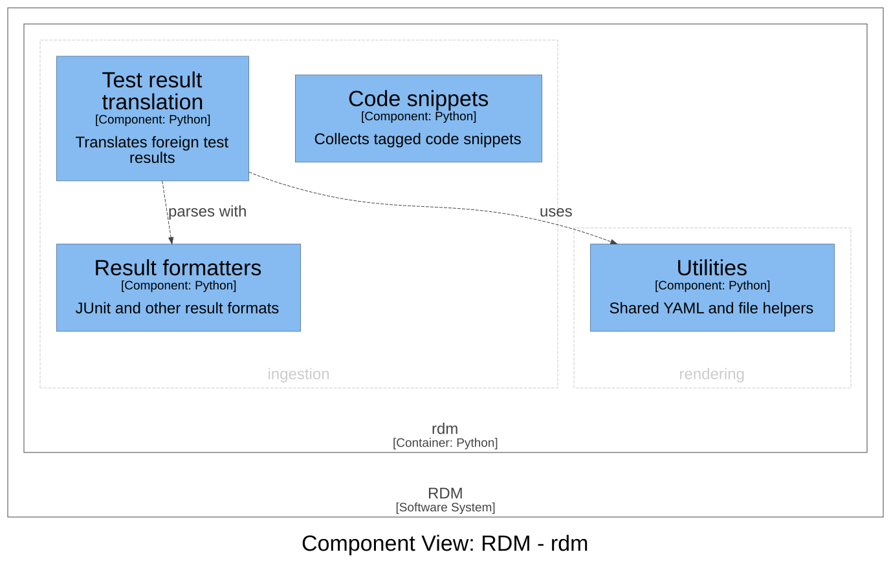

# Source/evidence ingestion — Software Design

## Design Inputs

This context owns the requirements for pulling *external source artifacts* into
the documentation pipeline (distinct from the `record` context, which ingests the
DHF's own frontmatter/Allure/git). Both refine UN-001 (compile the DHF from the
system of record — code and executed tests are part of that record):

- **DI-16 (code-snippet collection)** — extract `RDOC … ENDRDOC` delimited
  snippets from source files, keyed by name, so live code is embedded in docs.
- **DI-17 (foreign test-result translation)** — translate gtest/xunit/qttest XML
  into RDM's result data; reject an unknown format.

## Design Outputs

`rdm collect` (`rdm/collect.py`) and `rdm translate` (`rdm/translate.py`):

- `collect_from_lines` / `collect_from_files` — snippet extraction keyed by the
  `RDOC` marker.
- `translate_test_results(format, input, output)` — dispatch over
  `XML_TRANSLATORS` (gtest, xunit, qttest, auto) → flattened results → YAML;
  unknown format raises `ValueError`.

Acceptance criteria are verified by `@allure.story("DI-16" / "DI-17")` tests;
`collect_test.py` and `test_xml_util.py` remain as lower-level coverage.

## Out of scope

Planning data (issues, pull requests, task boards) is not part of the
controlled record, and RDM no longer pulls it (Design Review 11).

## Components (C3)

The components of the `ingestion` context, drawn from the architecture
workspace; a component of another context is shown where this one depends
on it. Each component names its code in the workspace.

