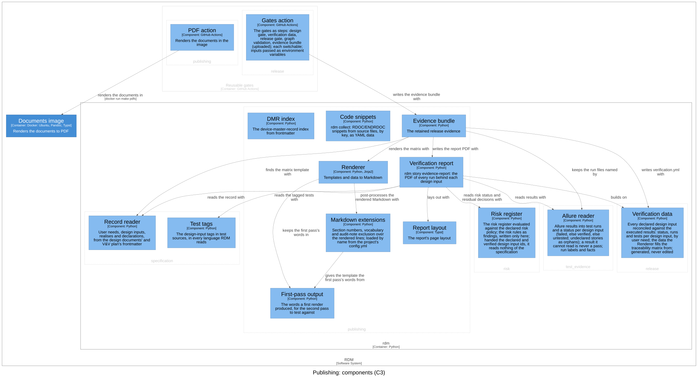
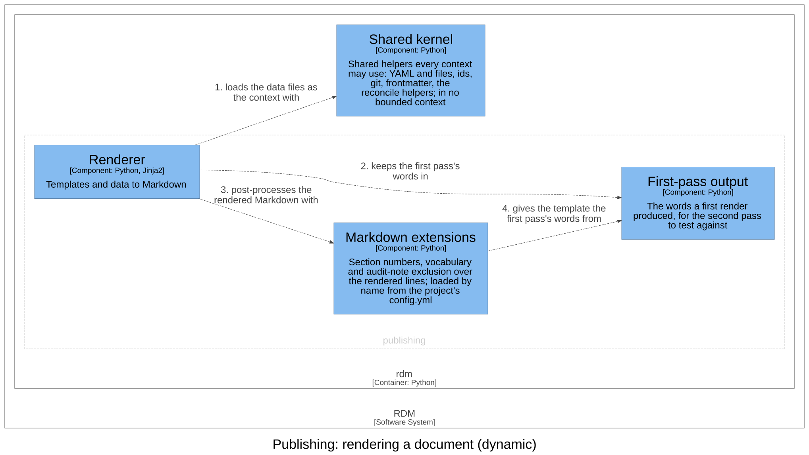

# Publishing — Software Design

## Purpose

Publishing renders the design record into controlled documents: a
*template* (a controlled document's source, with placeholders) filled with
*data* generated from the record, then post-processed Markdown, and from it
PDF and DOCX. It owns the template engine and its filters, the Markdown
post-processing, the code snippets a document embeds, the device-master-record
(DMR) index data, the verification report and the evidence bundle. Its
language is template, data, rendered document and evidence bundle; a rendered
document is output, never source. It is a read model: it reads the record
through the contexts below it, never changes it, and nothing it renders is
fed back into it.

## Design Outputs

The design outputs are this context's architecture, in the C4 model of the
architecture workspace: its components, what each is responsible for, and
how they relate. They name components, never source code: the workspace maps
each component to its code.



| Component | Responsibility | Meets |
|-----------|----------------|-------|
| Renderer | Fills a template with the data files as its context, each under its file name, in one or two passes, and post-processes the result; refuses a value the data does not supply, and `join_to` an id its table lacks | DI-7, DI-8 |
| Markdown extensions | Number the sections, give the template the vocabulary the document uses, and remove auditor-only notes | DI-9 |
| First-pass output | Holds the words a first render produced, for the second pass to test against | DI-9 |
| Code snippets | Collects the delimited snippets of source files, by key, as a data file, refusing a key used twice, in one file or two | DI-16 |
| DMR index | Writes one index entry per controlled document from its frontmatter | DI-29 |
| Verification report | Builds the report's data from the record and the results it is given, and has it laid out as a PDF | DI-64 |
| Report layout | Sets the report's pages, every value as text | DI-64 |
| Evidence bundle | Writes the retained release evidence, the verification report among it, and, given the unit tests' coverage report, carries it as verify does and keeps it; refuses a record with no matrix template before writing anything | DI-64; realises DI-30 |
| PDF action | Renders a repository's documents in the RDM image of the release it is pinned to | realises part of DI-63 |
| User manual | The documentation site's pages (`docs/`), listed by the controlled document `IFU-001` (`dhf/documents/user_manual.md`) and so in the DMR index; each tagged-test example names its component by key | DI-79 |

The PDF action is in the Reusable gates container; the others are in `rdm`.

The rules a reviewer needs to judge the design:

- **Rendering.** A placeholder with no data fails the render rather than
  rendering empty, with a message naming it (exit 2), as does a template
  that does not exist; an empty configuration loads no extensions. Each data file is one entry of the template's context,
  named by the file's name without its extension; two data files with one
  name are an error. Only when a template asks for the first pass's output
  is it rendered a second time with that output available; otherwise one
  pass is the whole render. The filters that build traceability tables are
  always available to a template.
- **Post-processing.** The project's configuration names the Markdown
  extensions to load, and each runs over the rendered lines in turn. Section
  numbering prefixes each heading with its number. The vocabulary extension
  gives the template the words of the first pass, so a glossary or acronym
  list includes only the terms the document uses. Audit-note exclusion
  removes each `[[…]]` note, and the space before it, from the output; a
  note may run over several lines of one paragraph, and one left open at the
  paragraph's end is kept as text. Neither extension touches code: fenced
  blocks (``` or ~~~, also inside a blockquote or a list item) and inline
  code are left as written, and only an ATX
  heading (`#` to `######`, then a space) is numbered. A
  project laid down by `rdm init` enables only the vocabulary extension.
- **Snippets.** A snippet runs from its opening marker to the closing marker
  in the same column (each a whole word, never part of a longer one), its lines kept from that column. An empty or repeated
  key in one file, a closing marker in another column, or a missing closing
  marker is refused, naming the file and line. The snippets are a data file
  the Renderer reads like any other.
- **DMR index.** One entry per Markdown document in the given directory with
  a frontmatter id (a blank one is none), sorted by id, marked as generated. A document with no id
  is skipped with a warning; a directory with no controlled document is an
  error.
- **Verification report.** The status of each design input is the release
  context's verification data; the report never decides it again. The
  evidence is release-grade only when no reason is found, and each reason is
  named: a design input not verified; a result file that cannot be read; a
  test that failed or broke; a test run with uncommitted changes, or with no
  commit; runs of another commit than the record's; a record with
  uncommitted changes; or a record whose commit is unknown. Every run
  counts, tagged with a declared input or not. The anomalies are a design
  input with no run, a run that did not pass, an unreadable result file, a
  missing attachment and an orphan tag. With no Typst available the report is refused, and the
  command says so, rather than written without its layout. Because the
  layout sets every value as text, never markup, nothing a test printed can
  change the document.
- **Evidence bundle.** It holds the verification data, the rendered
  traceability matrix (when the record has its template), every plain file
  of the results directory (the results, their attachments, the run's
  executor and environment; never a symbolic link or anything outside it),
  so the report's digest over them can be checked after CI's retention
  ends, the verification report or the reason it was not rendered, and a
  manifest of the counts, the files this bundle wrote, and each attachment
  a result names that is missing. A bundle written where one was before
  replaces the earlier results, never mixes them, and an output that would
  hold the results directory, or sit inside it, is refused. Neither the bundle nor the
  report reads a symbolic link in the results directory. It lives here because it renders:
  the matrix with the Renderer, the report with the Verification report.

The relationships that matter, in the direction of the arrow:

- The Renderer *keeps the first pass's words in* the First-pass output and
  *post-processes the rendered Markdown with* the Markdown extensions, which
  *give the template the first pass's words from* the First-pass output.
- The Verification report *builds on* the Verification data (release),
  *reads results with* the Allure reader (test evidence), *reads the record
  with* the record reader and *reads the tagged tests with* the test tags
  (specification), *reads risk status and residual decisions with* the Risk
  register (risk), and *lays out with* the Report layout.
- The DMR index takes each document's frontmatter from the shared kernel.
- The Evidence bundle *writes verification.yml with* the Verification data
  (release), *finds the matrix template with* the record reader
  (specification), *renders the matrix with* the Renderer and *writes the
  report PDF with* the Verification report.
- The Gates action (release) *writes the evidence bundle with* the Evidence
  bundle: the one arrow into publishing from another context.
- The PDF action *renders the documents in* the Documents image.

**Realised here:** the rendering side of **DI-1** (specification) — the
needs and design inputs read from frontmatter are what the documents
render — and of **DI-4** (release) — the traceability matrix is the Renderer
filling its template with the verification data; **DI-30** (release), by the
Evidence bundle; and the part of **DI-63** (release) that renders the
documents with the image of the same revision, by the PDF action.

**Realised elsewhere:** of DI-64's last clause, the reusable gates workflow
(release) includes the report by having the Gates action write the evidence
bundle. The project build that runs Pandoc and Typst over the rendered
Markdown is a template the specification's `rdm init` lays down.

Assumptions and open questions:

- The PDF action realises part of DI-63, but the frontmatter's `realises`
  does not list it.
- A snippet key repeated across two files is not an error: the later file's
  snippet silently replaces the earlier one.
- The DMR index reads only the documents directly in the given directory,
  not those in its subdirectories (such as the design documents).

### Dynamic view

The two passes of a render: the Renderer loads the data files as the
template's context, keeps the words of the first pass, and post-processes the
Markdown with the extensions, which give the second pass the first pass's
words (so a glossary includes only the terms a document uses).



## Commands and events

Each row: the actor issues the command, resulting in its success event or a
fail event (the rule broken, after the slash), which affects the entity.

| Actor | Command | Success event | Fail events | Entity |
|-------|---------|---------------|-------------|--------|
| CI | Build evidence bundle | Evidence Bundle Built | Not Built / Results Missing | Evidence bundle |
| CI | Write verification report | Report Written | Not Written / Typst Missing | Verification report |

Everything this context writes is a read model.

## Dependencies

Layer 5 of the dependency rule, a read model: it depends on every context it
publishes from — `release` (the verification data), `test_evidence` (the
Allure reader), `specification` (the record reader and test tags), `risk`
(the risk register) — and the shared kernel. Within the code, nothing
depends on it but the composition root; in the architecture, the release
context's Gates action calls the Evidence bundle from the Reusable gates
container, as a command, not an import. No dependency breaks the rule.
