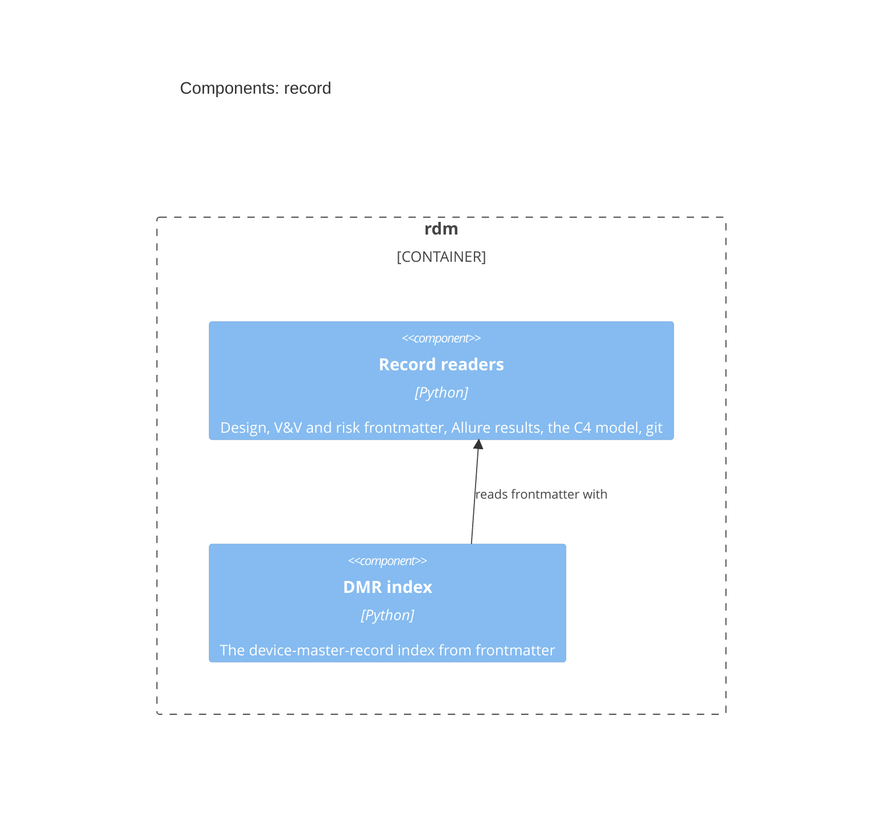

# Record — Software Design

## Design Inputs

This context owns the design inputs declared in the frontmatter:

- **DI-1 (record ingest)** — read the user-need registry and the design
  inputs (`design_inputs`, each with the needs it `traces_to`) from
  frontmatter, and ingest executed Allure results,
  without depending on any project-management tool. Refines UN-001 and UN-004.

- **DI-29 (DMR index data)** — `rdm story dmr` generates device-master-record
  index data from the controlled documents' own frontmatter (one entry per
  document: id, title, path, revision), so the DMR index is derived from the
  record rather than hand-maintained — the same generated-not-transcribed rule
  the traceability matrix follows. Refines UN-012.
- **DI-31 (polyglot tag discovery)** — executed verification (Allure results)
  was always language-agnostic; source-tag scanning was Python-only, so a
  TypeScript or Java product got no authoring-time linkage warnings and no
  audit coverage. Tag discovery now also reads
  JavaScript/TypeScript `allure.story(...)`/`allure.feature(...)` calls and
  Java `@Story(...)`/`@Feature(...)` annotations across conventional test-file
  names (`*.test.*` / `*.spec.*` / `*Test.java` / `*_test.go` …). Refines
  UN-004.
- **DI-40 (Python tags from decorators only)** — Python tags were read with a
  text pattern, so a test that writes a fixture file containing
  `@allure.story("DI-1")` was counted as verifying DI-1 — ten such false links
  in RDM's own suite. Python tags are now read from the syntax tree: allure
  `story`/`feature` decorators on functions and classes, and a module-level
  `pytestmark`. A file that does not parse falls back to the pattern. Refines
  UN-004. Amended (Design Review 15): only `story` names a design input;
  `feature` and `epic` carry the context and the user needs (DI-57).

- **DI-66 (the C4 model, read from the record's diagrams)** — the
  architecture is kept where the design is: the system context (C1) and the
  containers (C2) in the architecture document, each bounded context's
  components (C3, with dynamic and deployment views where useful) in its own
  design document, all as Mermaid C4 blocks. The code level (C4) is the code a
  component names with `$link`: Mermaid has no code diagram, and the code is
  the authority on itself. RDM reads them into one model: people, software
  systems, containers and components (alias, name, technology, description,
  external or not), the boundary each sits in, the document and context that
  declare it, every relationship (direction, label, technology), and the code
  a component names with `$link`. One alias is one element across views; an
  element drawn `_Ext` in a view is shown, not declared, there. Mermaid is
  the notation, not the model: the model is what the views declare together.
  Refines UN-017.

## Design Outputs

Ingests the system of record so the rest of RDM can compile and gate the DHF.

- `rdm/record/sdd.py` — discover per-context design documents (`kind: design`);
  read the user-need registry (`user_needs`) and the design inputs
  (`design_inputs`) from frontmatter. Which needs a context serves follows
  from its design inputs' `traces_to`; it is not declared separately.
- `rdm/record/allure.py` — parse an Allure results directory into per-design-input
  executed status; scan test sources for the tags they claim (Python from the
  syntax tree, other languages by pattern).
- `rdm/record/verify.py` — build the verification data the DHF renders from.

The layer is dependency-light: no pydantic, DuckDB or RDF dependency.
Retired (Design Review 11): DI-6 — RDM ships no planning tooling, so there
are no planning outputs to mark. Acceptance criteria are verified by
`@allure.story("DI-1")` tests.

## Components (C3)

The components of the `record` context, each naming the code that
implements it; a component of another context is shown external, where this
one depends on it.

