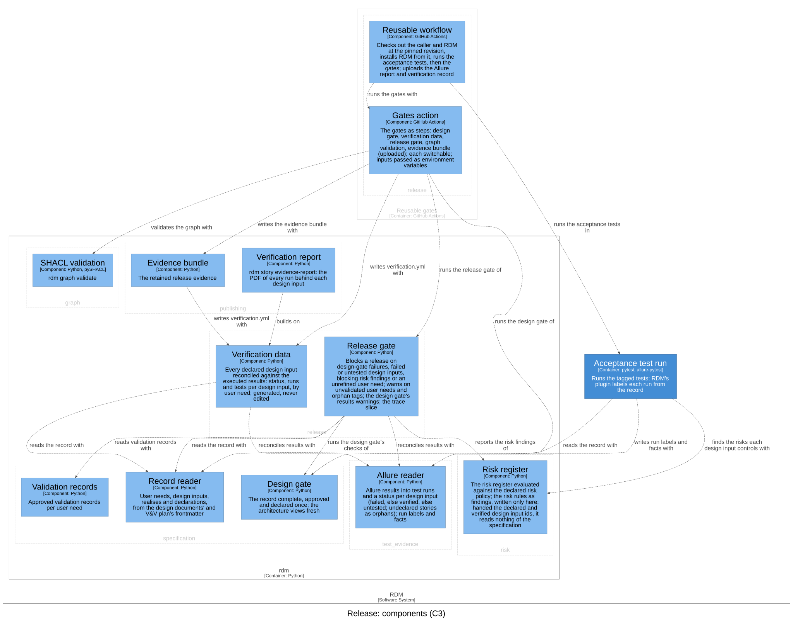
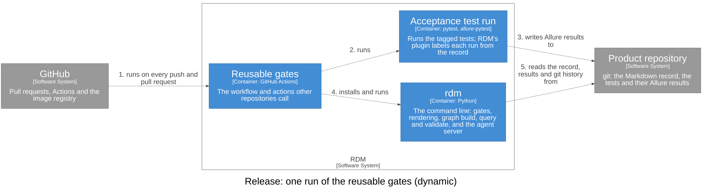

# Release — Software Design

## Purpose

`release` decides whether a release may go ahead and keeps the evidence it
went ahead on: the release gate over the record's verified status, its risks
and its user needs; the verification data and trace slice the gate and its
reviewers read; the evidence bundle a release retains; and the reusable gates
that run all of it in another repository's pipeline. Its language: a design
input is *verified* (a passing run of a tagged test, no failed one); the
*release gate* blocks a release; *release-grade evidence* is what a release
needs; the *traceability matrix* is generated, never edited; the *evidence
bundle* is what a release keeps. It reads the specification, test evidence
and risk; none of them reads it.

## Design Inputs

- **DI-3 (release gate)** — block release unless every declared design input
  is verified by a passing test. Whether the test proves its input is left to
  the independent review of the pull request; no verdict is recorded.
  Refines UN-003.
- **DI-4 (traceability)** — reconcile against Allure tags and render a
  traceability matrix from executed results, not hand-maintained tables.
  Owned here for the verification data the gate and the bundle read; reading
  the results (`test_evidence`) and rendering the template (`publishing`) are
  realised elsewhere. Refines UN-004.
- **DI-18 (trace query)** — report the traceability slice for a given user
  need (→ its design inputs) or design input (→ its need(s), owner/realisers,
  verifying tests, and status), via `rdm story trace`. Read-only. Refines
  UN-004.
- **DI-30 (release evidence bundle)** — `rdm story evidence-bundle` writes the
  release's retained evidence set to an output directory: the verification
  data, the rendered traceability matrix, and a manifest describing the
  bundle — the DHR-shaped set a team attaches to a release tag. Refines
  UN-012.
  Amended (Design Review 13): the bundle also keeps the executed Allure
  results themselves — every result, the attachments and containers they
  reference — so the evidence behind each verdict outlives CI. Integrity is
  the pipeline's: GitHub's artifact upload records the artifact's digest.
- **DI-63 (the gates, reusable from another repository)** — the CI `rdm
  adopt` used to lay down ran `pip install rdm`, which fetches an unrelated
  package of the same name, and every team copied steps that then drifted
  from RDM's own. Now RDM's CI is the reusable unit:
  `scope-impact/rdm/.github/workflows/gates.yml@<ref>` runs the caller's
  acceptance tests, then the design gate, `verify`, the release gate
  (optional while a record has no design input yet), `rdm graph validate`
  (with any checklists) and the evidence bundle, uploaded as an artifact;
  `scope-impact/rdm/actions/gates@<ref>` runs the same gates inside a
  workflow of one's own; `scope-impact/rdm@<ref>` renders the documents in
  the image published for that revision. RDM is installed from the pinned
  revision itself — never by name from a package index — so the gates that
  ran are exactly the ones pinned. The workflow `rdm adopt` lays down calls
  the reusable workflow at `v<installed RDM version>`; RDM's own CI calls
  it too, so every push to RDM exercises it. Refines UN-011 and UN-003.

## Design Outputs

- **Release gate** (`run_release_gate`, `rdm story release-gate`) — DI-3.
  Still in `rdm/gates/design_gate.py`, the specification's *Design and
  release gates* component (see Dependencies). It blocks when the design
  gate's pass/fail checks fail, when no design input is declared, when a
  design input failed or is untested in the given Allure results, when the
  risk register's release rules report a finding (DI-44, owned by `risk`),
  and when a user need is addressed by no design input. A user need with no
  approved validation record and an Allure tag matching no design input are
  warnings. It does not check the commit or worktree a run recorded; the
  verification report (`publishing`) and, as a warning, the graph's gate
  shapes do.
- **Trace** (`build_trace`, `rdm story trace <id>`) — DI-18, in the same
  module: a user need's design inputs, or a design input's text, user needs,
  owner, realisers (from `realises`) and, with results, status and tests.
- **Verification data** (`rdm/record/verify.py`, `rdm story verify`) — DI-4:
  reconciles every declared design input against the Allure results into
  `verification.yml` (status, run counts, tests and outputs per design
  input, grouped by user need, with a summary and the orphan tags), the data
  the traceability matrix template renders.
- **Evidence bundle** (`rdm/record/bundle.py`, `rdm story evidence-bundle`)
  — DI-30: writes `verification.yml`, the rendered matrix (when the record
  has the template), `allure-results/` (every result and container and each
  attachment they name, plain files of the results directory only), the
  verification report PDF or the reason it was not rendered, and
  `manifest.json` listing the counts and files.
- **Reusable workflow** (`.github/workflows/gates.yml`) — DI-63: checks out
  the caller and RDM at the required `rdm-ref` (a reusable workflow cannot
  see the ref it was called at, so the caller writes it twice), installs
  `rdm[graph,report]`, `pytest` and `allure-pytest` from that checkout, runs
  the caller's tests, then the Gates action, and uploads the Allure report
  and the verification record.
- **Gates action** (`actions/gates/`) — DI-63: the gate steps, written once:
  installs `rdm[graph,report]` from its own revision unless told not to,
  then the design gate, `verify`, the release gate, graph validation and the
  evidence bundle (uploaded), each switchable by an input; `verify` and the
  bundle run only when there are Allure results. Inputs reach the scripts
  as environment variables, never spliced into the script text.

This context realises no other context's input. Parts of its own are
realised elsewhere: DI-3 and DI-18 by `specification` (where the gate and
trace live today), DI-4 by `test_evidence` and `publishing`. The rest of
DI-63 is in components of other contexts that do not declare it: the PDF
action (`action.yml`, `publishing`) and the adopted `design-controls.yml`
(`rdm/adopt.py`, `specification`).

The verification report (DI-64) and the matrix rendering are in
[publishing](publishing.md); the mutation probe and the pytest plugin in
[test evidence](test_evidence.md).

Verified by the tests tagged DI-3 and DI-4 in
`tests/acceptance/test_user_needs.py`, DI-18 in `test_trace.py`, DI-30 in
`test_verification.py` and DI-63 in `test_reusable_ci.py`.

## Components (C3)

| Component | Responsibility | Technology | Code |
|-----------|----------------|------------|------|
| Verification data | Design inputs against results: `verification.yml` | Python | `rdm/record/verify.py` |
| Evidence bundle | The retained release evidence | Python | `rdm/record/bundle.py` |
| Reusable workflow | Tests, then the gates, for any repository | GitHub Actions | `.github/workflows/gates.yml` |
| Gates action | The gates as steps | GitHub Actions | `actions/gates/` |

- Verification data reconciles results with the Allure reader
  (`test_evidence`) and reads the record with the Record kernel.
- Evidence bundle writes the verification data with Verification data and
  the report with the Verification report (`publishing`), finds the matrix
  template with the Record kernel, renders it with the Renderer
  (`publishing`), and uses Utilities.
- The Reusable workflow runs the gates with the Gates action, which runs the
  `rdm` command line (drawn only at container level).

Open questions:

- The release gate is in the specification's component, so this view does
  not show the release decision until it moves to `rdm/release/`.
- The glossary's release gate requires release-grade evidence and every user
  need validated; the code blocks on neither (a missing validation record is
  a warning). Whether it should is open.

### Dynamic view

The order of a pipeline run matters: the acceptance tests write the Allure
results; the design gate runs; `verify` writes the verification data; the
release gate decides; graph validation runs; the evidence bundle is written
last, from the same results, and uploaded. The component view shows what
uses what, not this order. The view below draws it at the container level,
where the order is decided (a dynamic view's steps cannot cross from the
Reusable gates container into `rdm`'s components):

## Dependencies

- **Depends on** `specification` (Record kernel), `test_evidence` (Allure
  reader) and the shared kernel (Utilities), all below it; through the
  release gate, also `risk` and the specification's validation records.
- **Depended on by** `publishing` (the Verification report builds on the
  verification data). Nothing else imports it.

Two imports break the rule:

- The release gate and the trace live in `rdm/gates/design_gate.py`, a
  `specification` component, so the specification imports `test_evidence`
  and `risk` upward: the two cycles named in the system architecture.
  Moving `run_release_gate`, `build_trace` and their commands to
  `rdm/release/` removes them.
- The Evidence bundle imports `publishing` (`rdm.render` for the matrix,
  `rdm.record.report` for the report), a read model above it. Having the
  composition root (`rdm/main.py`) pass the bundle its renderers removes it.
