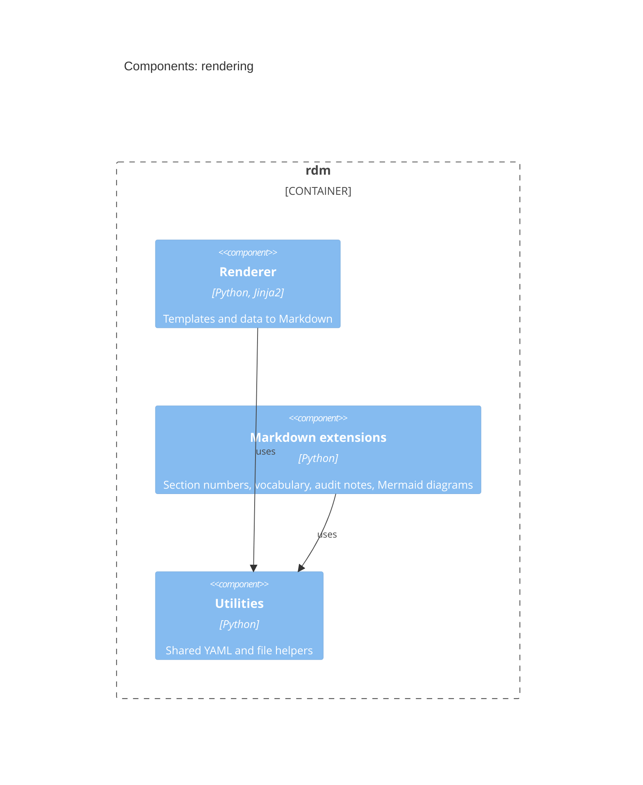

# Rendering — Software Design

## Design Inputs

This context owns the rendering requirements (the engine that compiles the DHF
from data + templates), all refining UN-001:

- **DI-7 (template rendering)** — render a Markdown template against a supplied
  data context with Jinja2, so a generated data file (e.g. `verification.yml`)
  populates the document.
- **DI-8 (traceability filters)** — provide `invert_dependencies`, `join_to`,
  and `md_indent`, the filters that build traceability tables.
- **DI-9 (markdown post-processing)** — auto-number sections, expand declared
  vocabulary/acronyms, and exclude auditor-only `[[…]]` notes from released
  output.
- **DI-70 (architecture views as images)** — `rdm c4 draw` exports the
  workspace (`dhf/c4/workspace.dsl`) with Structurizr's CLI: its model as
  `dhf/c4/workspace.json`, and each view as DOT, drawn by Graphviz to
  `dhf/c4/views/<view>.svg`. Each design document shows its view as an
  ordinary image, so GitHub, the docs site and a rendered PDF show the same
  picture, and no browser draws it. The drawn files are committed, each
  stamped with the SHA-256 of the workspace; the design gate fails when a
  stamp is not the current workspace's, when a view has no image, or when an
  image has no view, so a stale diagram cannot be committed. Checking needs
  only the stamps: Java and Graphviz are needed only to draw. Amended (Design
  Review 29): DI-70 rendered Mermaid diagrams with Mermaid's renderer.

It also **realises** the rendering side of inputs owned elsewhere (via
`realises`): **DI-1** (record ingest, owned by `record`) and **DI-4**
(traceability, owned by `verification`).

## Design Outputs

Compiles the DHF from data and templates.

- `rdm/render.py` — two-pass Jinja2 engine; the `invert_dependencies`, `join_to`,
  `md_indent` filters; context keyed by data-file basename, so a generated
  `verification.yml` renders into a traceability matrix.
- `rdm/md_extensions/` — section numbering, vocabulary expansion, auditor-note
  exclusion.
- `rdm/c4.py` — `rdm c4 draw`: the workspace's model and its views, drawn
  and stamped (DI-70).
- Output: Markdown → PDF/DOCX via Pandoc/Typst.

Contributes to **UN-001** (compile the DHF from the system of record). The owned
inputs are verified by `@allure.story("DI-7" / "DI-8" / "DI-9" / "DI-70")` acceptance tests;
the realised inputs by their owners' tests plus RDM's existing render unit tests.

## Components (C3)

The components of the `rendering` context, each naming the code that
implements it; a component of another context is shown external, where this
one depends on it.

