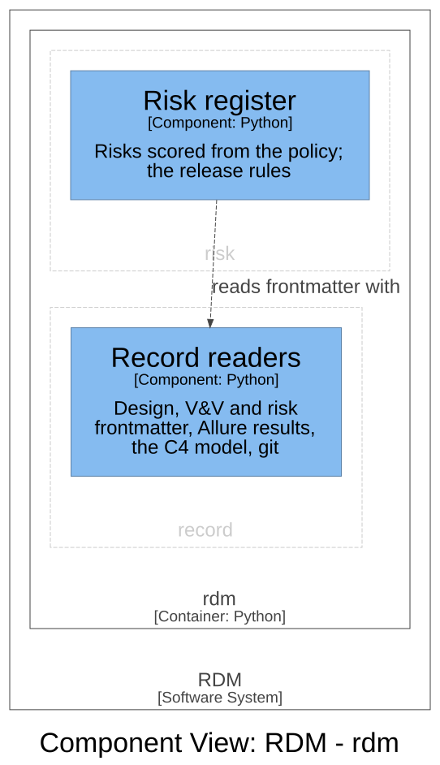

# Risk — Software Design

## Purpose

This context owns the risk register as part of the design record, and the
risk acceptability criteria the register is evaluated against. Its language
is risk analysis and risk evaluation: a risk is a hazard, the hazardous
situation it leads to and the harm that situation can cause — one harm
pathway per risk — with a severity from the harm and a probability from the
situation; a safety risk or a STRIDE threat; the risk controls that reduce
it, each a design input; the initial risk and the residual risk, the same
estimate before and after the controls; and a proposal, a rating or a policy
no person has approved yet. The method is the requirements and risk-analysis
skills' (user need → safety and STRIDE branches; hazard → situation → harm;
evaluate, control, verify, evaluate again). This context keeps the register
and checks what a machine can check.

## Design Outputs

The design outputs are this context's architecture in the C4 model of the
architecture workspace: its one component, what it is responsible for, and
how the components of other contexts use it. They name components, never
the code: the workspace maps each component to its code.



| Component | Responsibility | Meets |
|-----------|----------------|-------|
| Risk register | Reads the declared risk policy and the register, evaluates each risk's initial and residual risk against the policy, gives each risk its residual decision, and writes the risk rules as findings, each blocking or a warning and tied to the risk it is about | DI-43, DI-44, DI-50 |

The register is the frontmatter of `kind: risk` documents — the record
interface authors write, with one entry per risk:

```yaml
risks:
  - id: RISK-TOOL-001
    category: safety             # or security, with stride:
    linked: [RISK-TOOL-002]      # optional: risks it bears on
    hazard: "What could go wrong, and the sequence of events"
    situation: "The hazardous situation"
    harm: "Who is hurt, and how"
    severity: Serious            # from the harm
    probability: Possible        # from the situation
    level: Medium                # optional; must be the policy's level
    controls: [DI-40]            # each control is a design input
    residual: {probability: Rare}  # severity optional: the initial's
    acceptance: {by: "...", rationale: "..."}
    status: proposed             # until a person approves the rating
```

The rules the Risk register applies, which a reviewer needs to judge it:

- **The policy.** The project declares at most one risk policy (a
  `risk_policy` in the frontmatter of a record document; the first by path
  is the one read). A policy that does not give a level for every pair, or
  an acceptability for every level, is one blocking finding naming its
  document, and the register is not checked further until it is fixed. The
  policy's status is its document's; an unapproved policy is a warning.
- **Evaluation.** With no policy no risk is evaluated, and a register with
  risks blocks. A risk with no controls and no residual score keeps its
  initial risk as its residual risk. A risk's status is its own, else its
  document's.
- **The residual decision** is one of: *not evaluated* (no policy, no
  residual level, or a control without a passing test), *acceptable*,
  *accepted* (a level the policy accepts only with justification, with who
  accepted it and why), *needs acceptance*, or *unacceptable*. Only
  acceptable and accepted let a release through.
- **The findings** are every refusal of DI-44 and DI-50, and also a risk
  whose status is neither proposed nor approved, which blocks. A proposed
  risk or policy is a warning. The Risk register is the one place these
  rules are written.

Relationships, in the direction of the arrow:

- The **Release gate** (`release`) reports the risk findings of the Risk
  register: it adds the blocking findings to its blocking list and the
  warnings to its warnings. That is the part of DI-44 and DI-50 the release
  context realises (`realises` in its design document).
- The **Projection** (`graph`) reads risks and findings with the Risk
  register — the policy, the register, each residual decision and the
  findings — into the risks named graph for its gate shapes (DI-45, owned by
  `graph`), so the release gate and the shapes cannot disagree.
- The **Verification report** (`publishing`) reads risk status and residual
  decisions with the Risk register, beside the design inputs that control
  each risk.
- The **pytest plugin** (`test_evidence`) finds the risks each design input
  controls with the Risk register, to label its test runs.

The Risk register is handed the declared design input ids and the verified
ones; it reads nothing of the specification. It parses frontmatter with the
shared kernel, which the specification's design document draws.

This context realises no input another context owns; the release context
realises part of DI-44 and DI-50, as above.

Assumption: one harm pathway per risk, with one probability; no control
effect is recorded apart — the residual is all the controls folded
together. Design Review 9 kept the register this small; each can grow later
without changing a register written to this format.

## Commands and events

Each row reads: the actor issues the command, resulting in its success
event or one of its fail events (the business rule it broke, after the
slash), which affects the entity. A gate concludes every event its rules
produce. The names are the vocabulary of the record (`CONTEXT.md`,
"Domain model"); the tools print them as prose today.

| Actor | Command | Success event | Fail events | Entity |
|-------|---------|---------------|-------------|--------|
| The release gate | Assess risks | Risk Evaluated (residual acceptable, or accepted) | Risk Not Evaluated / No Policy · Policy Malformed · Id Missing · Duplicate Id · Hazard, Situation Or Harm Missing · Category Missing · STRIDE Missing · Unknown Link · Score Not In Policy · Level Mismatch · Unknown Control · Residual Unscored · Control Unverified · Residual Unacceptable · Acceptance Missing · Unknown Status; warned / Policy Not Approved · Risk Proposed | Risk register |

## Dependencies

Layer 1 of the dependency rule, a leaf: it depends only on the shared
kernel, and on no other context. The contexts that use it sit above it:
`test_evidence` (the pytest plugin), `release` (the release gate),
`publishing` (the verification report) and `graph` (the projection).

## Out of scope

Whether a risk control is effective is shown in the record only as far as a
machine can see it: the control is verified and the risk, evaluated again,
has an acceptable or accepted residual. Whether the control does what it
claims in the code, whether the rating is right, and whether a residual is
as low as reasonably practicable stay human judgements, made in review and
recorded by approving the rating (`status: approved`).
