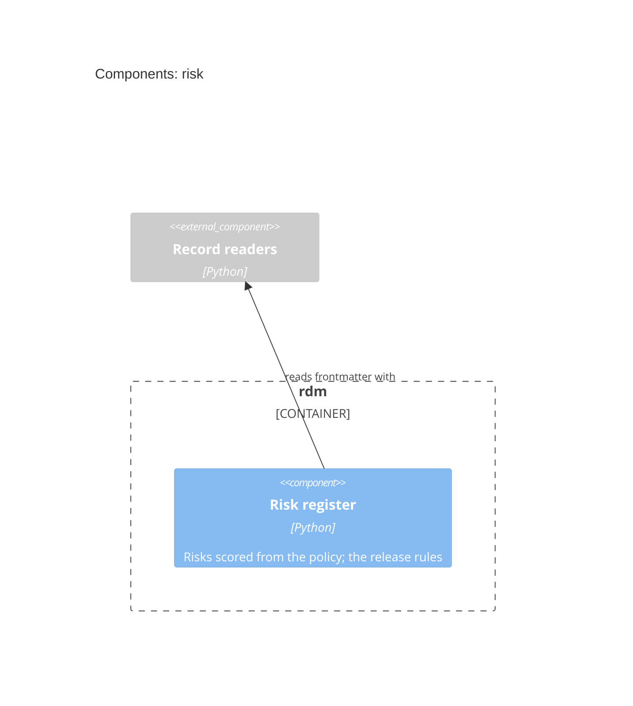

# Risk — Software Design

## Design Inputs

This context owns the risk register as part of the record. The method is the
requirements and risk-analysis skills' (user need → safety and STRIDE
branches; hazard → situation → harm; evaluate, control, verify, re-evaluate).
This context keeps the register and checks what a machine can check.
Whether a control is effective, and whether a residual is as low as
reasonably practicable, stay human judgements.

- **DI-43 (read and evaluate the register)** — risks are frontmatter in
  `kind: risk` documents anywhere under the DHF, like design inputs:

  ```yaml
  risks:
    - id: RISK-TOOL-001
      category: safety             # or security, with stride:
      hazard: "What could go wrong, and the sequence of events"
      situation: "The hazardous situation"
      harm: "Who is hurt, and how"
      severity: Serious            # from the harm
      probability: Possible        # from the situation
      controls: [DI-40]            # each control is a design input
      residual: {probability: Rare}          # severity: optional, defaults to the initial
      acceptance: {by: "...", rationale: "..."}
      status: proposed             # until a person approves the rating
  ```

  Evaluation needs criteria set before the decision, so there is **no
  default**: a project declares one `risk_policy` (severities,
  probabilities, a level for each pair, and per level `acceptable`,
  `justify` or `unacceptable`) in a DHF document's frontmatter. Level names
  are the project's own. A control is a design input, so the chain is risk →
  design input → tagged test → result. A residual may record a severity
  where a control limits the harm itself (ISO 14971 allows it); without one
  the initial severity carries over. Refines UN-016.
- **DI-44 (release gate)** — the mechanical half of a risk review:
  criteria present; ids unique; chain, category and STRIDE complete; scores
  defined by the policy; controls declared and **verified** — a control
  whose design input has no passing test leaves the residual *not
  evaluated*, never assumed; the residual (or the initial risk, when nothing
  controls it) acceptable, or accepted with who and why where the policy
  asks for a justification. `status: proposed` on a risk or on the policy
  is a warning, as a missing validation record is: a person has not yet
  approved those ratings. Refines UN-016 and UN-003.

- **DI-50 (residual rules)** — split from DI-44: a residual is not
  evaluated until every control has a passing test; an unacceptable residual
  blocks; a `justify` residual needs an acceptance naming who and why; a
  proposed risk or policy warns. Refines UN-016 and UN-003.

## Design Outputs

- `rdm/record/risk.py` — `read_policy`, `risks(dhf)` (each risk with its
  evaluated levels), `residual_decision` and `findings(dhf, …)` (DI-44's
  blocking findings and warnings), dependency-light like the rest of
  `rdm/record/`.
- `run_release_gate` (`rdm/gates/design_gate.py`) adds those findings
  to its blocking list and warnings.

Acceptance criteria are verified by `@allure.story("DI-43" / "DI-44")` tests.

## Components (C3)

The components of the `risk` context, each naming the code that
implements it; a component of another context is shown external, where this
one depends on it.


