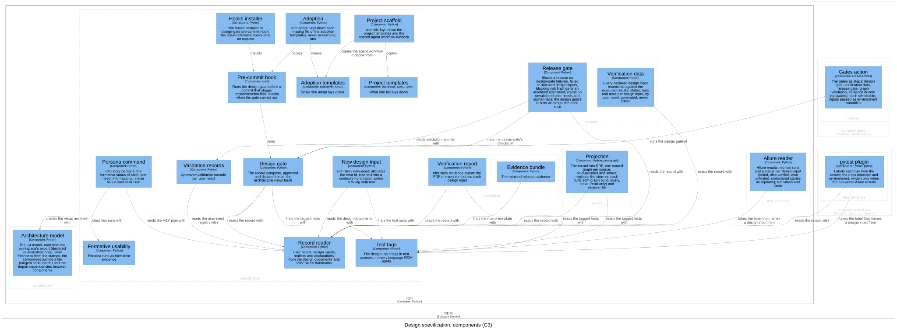
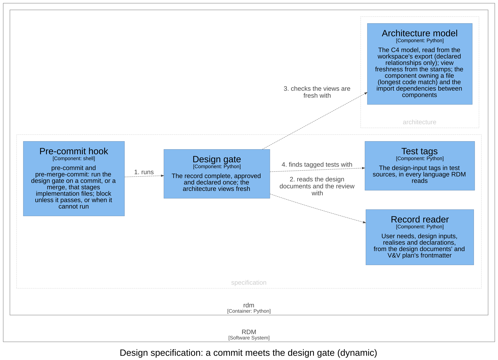

# Design specification — Software Design

## Purpose

The core bounded context: the user needs, the design inputs that refine them
(each owned by one context and naming the needs it traces to), the tagged
tests that claim to verify them, the design review, and the design gate that
blocks implementation until the record is complete, approved and declares
every id once. It speaks the glossary's user need, design input, design
document, tagged test, design review, approved and design gate, and, for
validation, validated (validation records, formative persona evidence).
Every other context conforms to its ids. Onboarding (`rdm init`, `rdm
adopt`), the commands that create the record, is not a context: it is this
context's application layer.

## Design Outputs

The design outputs are this context's architecture, in the C4 model of the
architecture workspace: its components, what each is responsible for, and how
they relate. They name components, never code: the workspace maps each
component to its code.

| Component | Responsibility | Meets |
|-----------|----------------|-------|
| Record reader | Reads the user needs, the design inputs (a user need traced as one value, not a list, is that one need), what each context realises, and every declaration of an id, from the frontmatter of the design documents and the V&V plan. Finds a design document by its `kind: design` marker, never by its name; an id declared more than once keeps its first declaration, and every declaration is listed. Lists every declaration it cannot read (design inputs that are not a list of entries each with one id, a user need with no id, design inputs outside a design document), so none is dropped unseen. | DI-1, DI-46 |
| Test tags | Finds the test suite (no higher than the DHF's repository root) and the design input each test claims to verify: in Python from the syntax tree, on tests only (never a helper) and under any name the file imports the story decorator as, never from strings or comments, falling back to the decorator pattern when a file does not parse; in JavaScript, TypeScript and Java by pattern, across the conventional test-file names; and in a YAML task's own tags. Only the story names a design input. Lists each tagged test by name for the knowledge graph. | DI-1, DI-31, DI-40 |
| Design gate | Fails unless at least one design document and the design review exist, hold no placeholder markers (each a whole word), and are committed clean, as must every document that declares user needs and every risk document (the register and the policy); while a merge is being made, a document staged exactly as a commit holds it at its path is committed: tracked, with no uncommitted edit and none hidden from git, and, for a link, its target too; an edit re-opens it, and outside git approval is reported as unverifiable and the verdict says so. Fails on an id declared more than once, naming every document that declares it, on a declaration the record reader cannot read, on a Markdown document of the DHF whose frontmatter cannot be read (not UTF-8, not YAML, a repeated key, not a mapping, or no closing fence), and on stale or uncommitted architecture views. Warns on a user need nothing traces to, an unknown traced or realised id, a design input no test is tagged with, and a context with more than one design document. | DI-2, DI-46 |
| Pre-commit hook | Blocks a commit that stages implementation files (source in any common language, template or configuration outside the DHF and the planning directory, whatever characters their names hold and whatever the case of their extension, added, changed, renamed, copied or changed in type) unless the design gate passes; its pre-merge-commit twin blocks a merge the same way. A commit of only the design documents passes: that commit is the approval. When the gate cannot be run, the commit is blocked; an explicit, discouraged override bypasses it. | DI-71 |
| Hooks installer | `rdm hooks`: installs the pre-commit hook into the repository's git hooks (or a given directory), and the issue-reference hooks only when explicitly asked. | DI-26 |
| New design input | `rdm story new-input`: allocates the next unused id (one no design input declares and no test is tagged with), inserts the entry into the chosen context's frontmatter by a targeted edit that keeps its comments and line endings (and refuses, leaving the document as it was, when the edit would not read back as the same inputs plus the new one), writes a stub acceptance test tagged with the id that fails until implemented (in `test_<context>.py`, or `test_<context>_acceptance.py` when a test module of that name exists elsewhere in the suite), and prints the remaining traceability checklist. Refuses an unknown context or user need, and a context with more than one design document. It can also list the contexts, the taken ids, the next id and the user needs. | DI-22 |
| Project scaffold | `rdm init`: copies the project templates into a new directory, and the agent workflow runbook from the adoption templates, so both scaffolds share one runbook; refuses a directory that exists (exit 2), and on success names what it laid down and the next steps. | DI-15 |
| Project templates | What `rdm init` lays down: the document templates (including the design-controls set), the build Makefile (a Word document is rebuilt when its reference document changes), the render configuration, the container build (installing the RDM release from git when no wheel is given), and the Pandoc and Typst configuration. Templates use only local images. | DI-15 |
| Adoption | `rdm adopt`: creates each missing file of the adoption templates and skips, never overwrites, one that exists (a symbolic link exists, dangling or not); when a `.gitignore` exists, names the lines of RDM's generated files to add to it; keeps the hook and the bootstrap executable; stamps the installed version as its release tag (a pre-release such as 2.0.0a0 as 2.0.0-alpha, the tag the release and its image carry); reports what it skipped and prints the next steps. It copies the pre-commit hook rather than holding its own, so the gate has one source. | DI-24 |
| Adoption templates | What `rdm adopt` lays down: the DHF skeleton (V&V plan, the per-context design template, design review, traceability matrix, render configuration), the agent workflow runbook, a session bootstrap, a CI gate workflow and a `.gitignore` of RDM's generated files (Allure results, verification data, the graph store, bytecode). | DI-24 |
| Validation records | Reads the per-user-need validation records from the DHF's validation directory; only an approved disposition with a named reviewer counts. Gives the user needs without one. | DI-33 |
| Formative usability | Reconciles persona runs against the user-need registry into a formative status per need: failed if any run could not finish (a run that does not say it completed did not), else issues if problems were seen, else clean; not run when none tried. A run file it cannot read as a run is listed as unreadable, never counted clean; a run naming an unknown need is listed as an orphan. Clean is not validated. | DI-5 |
| Persona command | `rdm story persona`: prints the formative status of each user need in the V&V plan's registry; informational, so a successful run always passes. | DI-5 |

The shared kernel is drawn in this view but is not this context's: every
context may use it, and the arrows into it are left out of the other views.
The view also draws the architecture model (`architecture`), which the design
gate uses, and the components of other contexts that use this one's.

- The pre-commit hook runs the design gate; the hooks installer installs the
  hook.
- The design gate reads the record with the record reader, finds the tagged
  tests with the test tags, and checks the views are fresh with the
  architecture model.
- New design input reads the design documents with the record reader, so it
  and the gates share one view of the record, and finds the test suite with
  the test tags.
- Project scaffold and adoption copy their templates; the scaffold also copies
  the runbook from the adoption templates, and adoption the pre-commit hook.
- The persona command classifies runs with formative usability and reads the
  V&V plan with the record reader; validation records read the registry with
  it.

Realised here for other contexts: the test tags' list of tagged tests by name
is this context's part of `graph`'s DI-61, and the design gate's view check
is its part of `architecture`'s DI-70. The CI workflow that adoption lays
down calls `release`'s reusable workflow (DI-63).

Realised elsewhere: `release` reports, at the release gate, the user needs
the validation records give (DI-33); `publishing` renders the needs and
design inputs the record reader reads (DI-1); and the knowledge graph records
each id's declaration count and reports a repeated declaration with its
shapes (DI-46). With results, the design gate's warnings about executed
results are `release`'s, handed to the gate's output by the composition root:
this context never reads results.

Assumption: persona runs are produced by the usability-persona agent skill,
outside RDM's package; this context only reads them.

### Dynamic view

The order matters for a contributor: git runs the pre-commit hook, which runs
the design gate; the gate reads the design documents and the review, checks
the architecture views are fresh, and finds the tagged tests. Any one failing
stops the commit.

## Commands and events

Each row: the actor issues the command, resulting in its success event or a
fail event (the rule broken, after the slash), which affects the entity.

| Actor | Command | Success event | Fail events | Entity |
|-------|---------|---------------|-------------|--------|
| Contributor | Declare design input | Design Input Declared | Not Declared / Unknown Context · Unknown User Need | Design document |
| Contributor, or the commit hook | Check design controls | Design Controls Approved | Not Approved / Uncommitted · Placeholders · Duplicate Id · Malformed Declaration · Unreadable Frontmatter · Views Stale | The record |
| Persona (an agent) | Reconcile persona runs | Formative Runs Reconciled | — | User need |

Reactions: whenever a design input is declared, a failing stub test is
written; whenever a commit is made, the design controls are checked.

## Dependencies

Layer 2 of the dependency rule. Depends on the shared kernel and on one leaf
below it: `architecture` (the design gate's view check). Depended on by
`test_evidence` (the pytest plugin reads the design inputs), `release` (the
release gate, the verification data), `publishing` (the DMR index, the
verification report, the evidence bundle) and `graph` (the projection). The
composition root wires its commands and hands the design gate `release`'s
results warnings. It reads no results and no risk register.

## Out of scope

- Summative validation. Persona evidence is formative only, not summative
  IEC 62366 validation, and never gates release: the release gate does not
  read persona runs (a structural property, not mutation-testable). The
  human summative study is the validation record.
- Planning. RDM ships no planning tooling; tasks live outside the record.
