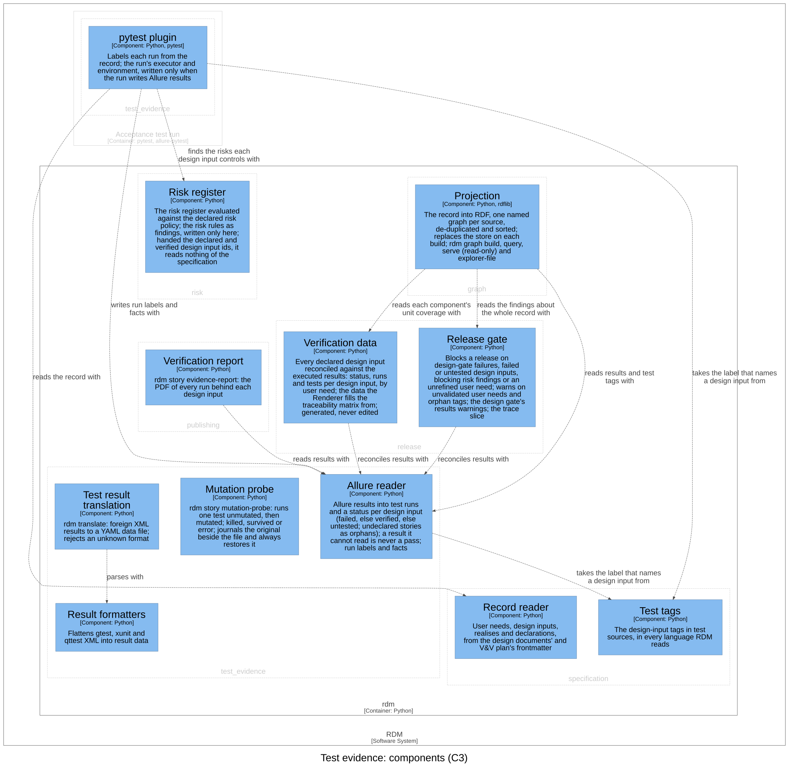

# Test evidence — Software Design

## Purpose

This context takes test results in the formats tools write them and turns
them into evidence about the record's tests. Its language is the **test
run** (one execution of a test, at one commit, by one executor), the
**executor** (the CI job or the machine that ran it), the **step** (a
verification step, with its own result) and the **attachment** (what a run
kept, such as its copy of the requirement). It is a translation layer:
Allure's words (result, label, epic, feature, story) and xunit's (test
suite, test case) are read and written here and stop at its boundary. It
labels each run of a tagged test from the record at test time, reads the
results back into a status per design input, translates foreign XML
results into result data, and gives the reviewer the mutation probe.

## Design Outputs

The design outputs are this context's components in the C4 model of the
architecture workspace, what each is responsible for and how they relate.
They name components, never code: the workspace maps each component to
its code.

| Component | Responsibility | Meets |
|-----------|----------------|-------|
| pytest plugin | Labels each run of a tagged test from the record at test time; records the run's commit, worktree state, executor and environment | DI-57, DI-59, DI-65 |
| Allure reader | The labels and run facts in Allure's terms, written for the plugin and read back as test runs; a status per design input | DI-57, DI-59, DI-65; realises DI-4 |
| Mutation probe | Runs one test unmutated, then with one line mutated, reports killed or survived, and always restores the file | DI-34, DI-47 |
| Test result translation | Translates a foreign XML result file into result data; refuses an unknown format | DI-17 |
| Result formatters | Flattens gtest, xunit and qttest XML into one result per test | DI-17 |

**pytest plugin.** It runs inside the acceptance test run, not in `rdm`.
It acts only on a test whose story tag is a design input the record
declares; a tag that names no declared input gets nothing. For such a test
it labels the run with what the record says at that moment: the input's
user needs, its bounded context, links to the documents that declare it
pinned to the tested commit (given only when the repository has a web
remote and there is a commit), critical severity when a risk controls it,
a copy of the input's text, and the commit and worktree state. It records
the executor and environment once per session, and only when the run
writes Allure results; a CI run is named with its run and URL, a local run
with its user and host.

**Allure reader.** It holds the one vocabulary of labels and result files
that the plugin writes and every reader reads back, so the tools' words
stop here. It reads each result as a test run (its name, result, the
design inputs it names, and the outputs it labels) and matches a run to
the test it came from. Its reconciliation gives each declared design
input *failed* when any of its runs failed or broke, else *verified* when
any passed, else *untested*; a story that names no declared input is an
orphan. What a test *claims* to verify (its tags) is the specification's;
this reader handles only what a run *did*.

**Mutation probe.** A reviewer runs it (`rdm story mutation-probe`) to see
whether one test catches a deliberate break; it never gates a release. It
refuses a mutation site that does not occur exactly once, and refuses to
mutate when the unmutated test does not pass. Only a genuine test failure
is a kill; a run that errors or matches no test is an error, never a
kill. The restore is defended in depth: the original is journaled beside
the file before the mutation, so a probe killed outright is recovered on
the next probe of that file; a termination signal unwinds through the
restore; and every write makes the file look newer to Python's bytecode
cache, so a same-size mutant is never served stale.

**Test result translation** (`rdm translate`) chooses a format, or detects
it, and writes each test's name, result and failure message as result
data; the gtest flattener also reads xunit. The data feeds document
templates; nothing reconciles it against design inputs.

The relationships that matter, in the direction of the arrow: the pytest
plugin *reads the record with* the record reader, *finds the risks each
design input controls with* the risk register and *writes run labels and
facts with* the Allure reader. The Allure reader *takes the label that
names a design input from* the test tags. Test result translation *parses
with* the result formatters. The mutation probe uses nothing of RDM: it
*runs one test, unmutated then mutated, in* the acceptance test run, as a
pytest subprocess. Inward, the release gate, the verification data, the
verification report and the projection read results with the Allure
reader.

Realised here: the Allure reader's reconciliation is this context's part
of **DI-4** (owned by `release`), which builds the verification data on
it. The labels and run facts written here are read back for DI-60 (graph)
and DI-64 (verification report). No other context realises part of this
context's inputs.

Assumption: the acceptance suite enables the plugin, either as a pytest
plugin or through its configuration; a run without it is unlabelled and
counts for no design input.

## Commands and events

Each row: the actor issues the command, resulting in its success event or a
fail event (the rule broken, after the slash), which affects the entity.

| Actor | Command | Success event | Fail events | Entity |
|-------|---------|---------------|-------------|--------|
| Reviewer | Probe mutation | Mutant Killed | Mutant Survived · Probe Refused / Baseline Failing | Tagged test |
| Contributor | Translate results | Results Translated | Not Translated / Unknown Format | Test result |

Reactions: whenever a tagged acceptance test runs, its result is labelled
from the record.

## Dependencies

Layer 3 of the dependency rule. Depends on `specification` (the pytest
plugin reads the design inputs and declarations; the Allure reader takes
the story label from the test tags), `risk` (the plugin labels each run
with the risks its design input controls) and the shared kernel, all
below it. Depended on by `release` (the release gate, the verification
data), `publishing` (the verification report) and `graph` (the
projection). No import breaks the rule.

## Out of scope

Planning data (issues, pull requests, task boards) is not part of the
controlled record, and RDM no longer pulls it (Design Review 11).
