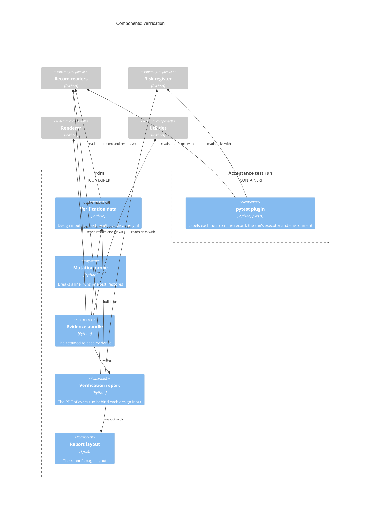

# Verification — Software Design

## Design Inputs

This context owns:

- **DI-4 (traceability)** — reconcile against Allure tags and render a
  traceability matrix from executed results, not hand-maintained tables.
  Refines UN-004.
- **DI-18 (trace query)** — report the traceability slice for a given user need
  (→ its design inputs) or design input (→ its need(s), owner/realisers,
  verifying tests, and status), via `rdm story trace`. Refines UN-004.
- **DI-30 (release evidence bundle)** — `rdm story evidence-bundle` writes the
  release's retained evidence set to an output directory: the verification
  data, the rendered traceability matrix, and a manifest describing the bundle — the DHR-shaped artifact set a team
  attaches to a release tag. Refines UN-012.
  Amended (Design Review 13): the bundle also keeps the executed Allure
  results themselves — every result, the attachments and containers they
  reference — so the evidence behind each verdict outlives CI. Integrity is
  the pipeline's: GitHub's artifact upload records the artifact's digest.
- **DI-64 (verification report, PDF)** — the matrix says *that* a design
  input is verified; the report shows *what was run* to say so, written for
  the person who has to judge it without having run anything: an auditor, a
  notified body, the pull-request reviewer. It speaks the record's language
  (`CONTEXT.md`): a design input is an acceptance criterion, baseline or
  risk-based; a test verifies it through its verification steps; a design input
  allocated to a risk is a *control for* it, never shown as making the risk
  controlled until the risk's residual is evaluated acceptable. `rdm story evidence-report`
  renders it from the record and the Allure results it is given. Its order is
  the order of their questions:
  - **what is this, and can I rely on it** — the repository, the record's
    commit, the commits tested, who or what ran the tests and where (DI-65),
    the RDM version, one SHA-256 over the result files; and an *evidence
    status*: release-grade only when every design input has a passing run,
    none failed, and every run tested the record's commit with a clean
    worktree. Otherwise it is not, and each reason is named. Beside it, the
    state of the risk register: how many ratings are still proposals, and how
    many risks have no evaluated residual;
  - **what went wrong** — failed, broken or skipped runs, and design inputs
    with no run, up front;
  - **what traces to what** — one table: user need, design input, the risks
    it is a control for (from the risk register), its tests, their result;
  - **the evidence** — per design input, then per run: the test's file and
    function, the result, date and duration, each step as a verification
    step with its own result, failure message and trace, and the
    attachments the test made (text inline up to a limit, images embedded,
    other files by SHA-256). The commit and worktree appear on a run only
    where they differ from the header;
  - **how to check it** — an appendix of every result file and its SHA-256,
    against the retained bundle.
  What would only repeat the report or bury it is left out: labels the report
  already shows (story, epic, feature, output, commit, worktree) and runner
  internals (host, thread, framework, language, suite, package), and the
  Allure severity label, which reads as a harm's severity and is not one; pytest's
  captured stdout and stderr, and the plugin's copy of the requirement, are
  listed by name and SHA-256, not printed. The data reaches the Typst layout
  as a JSON file, never spliced into markup, so no text from a test can change
  the document. It compiles with the `typst` package (extra `report`) or a
  `typst` executable (the RDM image has one). The evidence bundle and the
  reusable gates workflow include it. Refines UN-012.
- **DI-65 (who ran the tests, and where)** — IEC 62304 §9.8 asks a test
  record for the configuration, the tools and the identity of the tester.
  `rdm.pytest_plugin` writes Allure's own `executor.json` (on GitHub Actions:
  the workflow run, its number and URL; locally: the user and host) and
  `environment.properties` (operating system; Python, pytest, allure-pytest
  and RDM versions; the commit under test and the worktree state; the CI actor
  and workflow) into the results directory once per run, so the Allure report
  shows them and the verification report reads them. Refines UN-004 and
  UN-012.
- **DI-34 (mutation probe, reviewer tool)** — `rdm story mutation-probe
  --file F --find A --replace B --test T` breaks one line on purpose, runs one
  test, and reports KILLED (the test caught it) or SURVIVED (it did not). It is
  how a pull-request reviewer turns "this test would catch a broken X" from a
  claim into an executed check. Only a genuine test failure is a kill; a run
  that errors or collects nothing is an error, so a typo'd selector cannot
  manufacture evidence. The file is always restored, defended in depth: the
  original is journaled to a sidecar first (recovered on the next probe of the
  file, even after SIGKILL), SIGTERM restores in-process, and every write
  advances the mtime to a fresh whole second so CPython never runs stale
  bytecode for a same-size mutant. It records nothing and gates nothing — the
  reviewer's judgment, on the pull request, is the record. Restored from the
  retired DI-21 without its verdict coupling. Refines UN-013.

- **DI-47 (the probe always restores)** — split from DI-34 (Design Review
  12) so the restore guarantees have their own test: the original is
  journaled beside the file, an interrupted probe is recovered on the next
  probe of that file, a termination signal restores, and every write
  invalidates the bytecode cache. Refines UN-013.

- **DI-57 (the Allure hierarchy, from the record)** — Allure organises
  results as epic → feature → story; RDM's record is user need → bounded
  context → design input. A test carries one hand-written tag,
  `@allure.story("DI-n")`; `rdm.pytest_plugin` (enabled with
  `-p rdm.pytest_plugin`, or its hook imported in the acceptance conftest;
  record at `--rdm-dhf`, default `dhf`) adds the rest at run time with Allure's dynamic API — epics,
  feature, links to the Markdown that declares it at the tested commit (the
  design document, the V&V plan for its user needs, the risk document of each
  risk it controls), critical severity for an input that controls a risk, and the requirement text as an
  attachment — so the labels cannot drift from the record. Refines UN-004
  and UN-010.

- **DI-59 (the commit under test)** — the plugin labels each run of a tagged
  test with the commit under test (`commit`) and, when the working tree had
  uncommitted changes, `worktree=dirty`, so the evidence says which version
  it is evidence for (the graph side is DI-60). Refines UN-004 and UN-003.

## Design Outputs

Turns executed test results into verification status and a traceable matrix.

- `rdm/record/allure.py` `reconcile()` — map Allure story/feature tags to design
  inputs; classify each as verified / failed / untested; flag orphan tags.
- `rdm/record/verify.py` + `rdm story verify` — write a `verification.yml` the
  DHF renders into a traceability matrix (design inputs grouped under the user
  need they trace to; generated, not hand-maintained).
- `rdm/gates/mutation.py` + `rdm story mutation-probe` — DI-34.
- `rdm/record/report.py` + `rdm story evidence-report` — DI-64: `build_report()`
  gathers the report data from the record and the results;
  `rdm/record/verification_report.typ` lays it out; `render_pdf()` compiles it
  with the `typst` package (extra `report`) or a `typst` executable.
- `rdm/pytest_plugin.py` — DI-65: writes `executor.json` and
  `environment.properties` into the Allure results once per session. `evidence_bundle()` writes
  `verification_report.pdf` next to the matrix when the extra is installed,
  and records in the manifest why not otherwise.
- `build_trace` + `rdm story trace <id>` — the read-only audit query: forward
  (user need → design inputs) and backward (design input → need, owner,
  realisers, verifying tests, status).

Contributes to **UN-003** (the release gate consumes this output) and **UN-004**.
Acceptance criteria are verified by `@allure.story("DI-4" / "DI-18")` tests; DI-64 by
`tests/acceptance/test_verification_report.py`; DI-65 by `tests/acceptance/test_run_environment.py`.

## Components (C3)

The components of the `verification` context, each naming the code that
implements it; a component of another context is shown external, where this
one depends on it.

