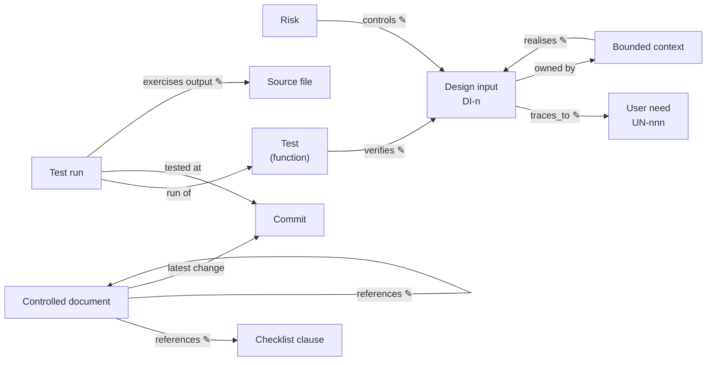
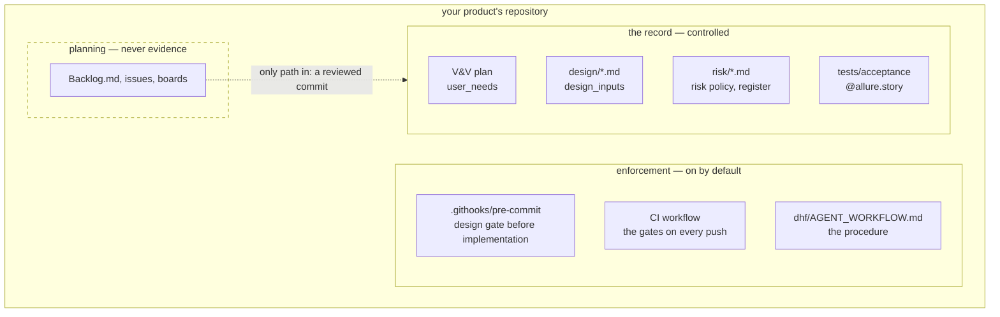

# How RDM works

## One idea

**The record is the only thing anyone writes.** Everything else — gate
verdicts, the graph, the rendered documents, the traceability matrix, the
release evidence bundle — is derived from it by a tool, and none of it is ever
edited by hand or fed back in.

The record is Markdown frontmatter and tests in git. It changes only through
a pull request that someone other than the author reviews; that review is the
approval, and the merge records it. That holds for people and for agents alike: an agent that wants to
change the record edits the Markdown and the tests and opens a pull request,
the same as a person.

| Written (the record) | Derived (by RDM) |
| --- | --- |
| user needs, in the V&V plan | gate verdicts (design gate, release gate, gap analysis) |
| design inputs, in one design document per bounded context | the RDF graph, its SHACL validation, the agent server's answers |
| the risk policy and risk register | the traceability matrix and verification data |
| checklists, and `[[KEY]]` references in documents | rendered regulatory documents (PDF / DOCX) |
| acceptance tests tagged `@allure.story("DI-n")` | the evidence bundle kept with a release |
| — | test results (Allure), recorded by running the tests |
| — | approval and change history, recorded by git and the forge |

The two rows without a written side are facts a tool records: what ran and
what passed, and who changed what, when. RDM reads them; nobody writes them.

## The data model

Every entity is declared **once**, in one place, with one id. Every link is
either **written** in a reviewed pull request or **derived** by RDM; a fact
that can be derived is never also written, because two copies of one fact
drift. The words are the [glossary](../reference/glossary.md)'s.

✎ marks a written link; every other link is derived.

| Entity | Declared in | Id | Written there |
| --- | --- | --- | --- |
| **User need** | the V&V plan, `user_needs:` | `UN-nnn` | its text |
| **Bounded context** | its design document (`kind: design`, `context:`); listed with its part in the architecture's `contexts:` | the context name | — |
| **Design input** | the design document of the context that owns it, `design_inputs:` | `DI-n` | its text, and the needs it `traces_to` |
| **Controlled document** | any Markdown file in the DHF with a frontmatter `id` | its `id` | `title`, `revision`, `references:` (documents it relies on), checklist references (`[[KEY]]`) |
| **Risk** | a `kind: risk` document, `risks:` | its `id` | hazard, situation, harm, category, scores, `controls:` (design inputs), residual, acceptance |
| **Risk policy** | a document's `risk_policy:` | — | severities, probabilities, levels, acceptability |
| **Checklist, clause** | a checklist file (text or RDF) | the clause key, e.g. `62304:5.2.2` | each clause's description; includes |
| **Test** | an acceptance test function, `@allure.story("DI-n")` | `tests/x.py::test_y` | the design inputs it verifies; `@allure.label("component", …)` for the C4 component it exercises; optionally `@allure.label("output", …)`, a file path |
| **Test run** | an Allure result, written by running the tests | its uuid | nothing — it is recorded |
| **Commit** | git | its sha | nothing — it is recorded |

Derived, never declared:

| Fact | Derived from |
| --- | --- |
| a design input's owning context | the design document that declares it |
| the user needs a context serves (`rdm:serves`) | its design inputs' `traces_to`, and those it `realises` |
| the components a run reaches (`rdm:reaches`) | the components it names, and the C4 model's declared relationships |
| the tests a file defines | the tagged functions in it |
| which test a run ran | the run's full name, matched to the test function |
| the commit a run tested | the `commit` label `rdm.pytest_plugin` writes at run time |
| epic, feature and links in the Allure report | the record, at run time (`rdm.pytest_plugin`) |
| a document's latest commit, and the commit that landed it | git history |
| whether a design input is verified | the results of its tests' runs |
| a risk's level and residual decision | its scores against the risk policy, and whether its controls are verified |
| the traceability matrix | design inputs, user needs and test results |

The order of a change (design input, approval, implementation, test, review)
is the runbook: [Changing the record](../use/changing-the-record.md).

## A record-first repository

`rdm adopt` lays down the record skeleton and the enforcement without
touching existing files ([get started](../install/getting-started.md)). Planning tools stay
outside the record: [Plan vs. record](plan-vs-record.md).

## What RDM depends on

1. a git repository;
2. a design history file (`dhf/`) with the V&V plan and the design documents;
3. Allure results from running the acceptance tests.

Nothing about how the work was planned, which tracker is used, or who (or
what) wrote the change. How RDM's own code is laid out, one package per
bounded context, is its [system architecture](../dhf/documents/architecture.md).
