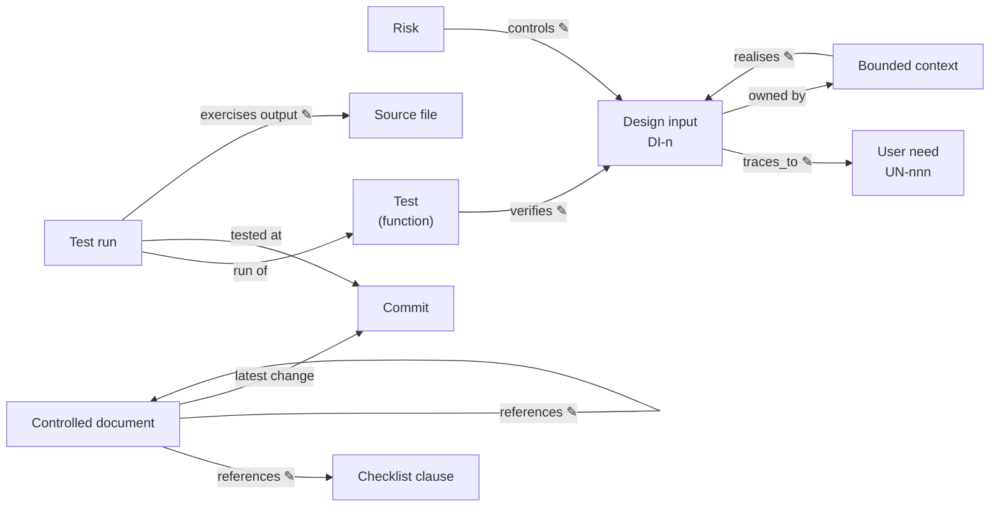

# The data model

Every entity in the record is declared **once**, in one place, with one id.
Every link is either **written** — a field someone types in a reviewed pull
request — or **derived** by RDM from what is written or recorded. A fact that
can be derived is never also written: two copies of one fact drift.

✎ marks a written link; every other link is derived.

## Entities

| Entity | Declared in | Id | Written there |
| --- | --- | --- | --- |
| **User need** | the V&V plan, `user_needs:` | `UN-nnn` | its text |
| **Bounded context** | its design document (`kind: design`, `context:`); listed with its part in the architecture's `contexts:` | the context name | — |
| **Design input** | the design document of the context that owns it, `design_inputs:` | `DI-n` | its text, and the needs it `traces_to` |
| **Controlled document** | any Markdown file in the DHF with a frontmatter `id` | its `id` | `title`, `revision`, `references:` (documents it relies on), `[[KEY]]` clause tags |
| **Risk** | a `kind: risk` document, `risks:` | its `id` | hazard, situation, harm, category, scores, `controls:` (design inputs), residual, acceptance |
| **Risk policy** | a document's `risk_policy:` | — | severities, probabilities, levels, acceptability |
| **Checklist, clause** | a checklist file (text or RDF) | the clause key, e.g. `62304:5.2.2` | each clause's description; includes |
| **Test** | an acceptance test function, `@allure.story("DI-n")` | `tests/x.py::test_y` | the design inputs it verifies; `@allure.label("output", …)` for the code it exercises |
| **Test run** | an Allure result, written by running the tests | its uuid | nothing — it is recorded |
| **Commit** | git | its sha | nothing — it is recorded |

## Derived, never declared

Where a derived fact is a relation in the graph, the vocabulary declares it
with the rule that derives it, and `--infer` adds it in a separate graph
([derived relations](graph.md#derived-relations-rules-not-facts)).

| Fact | Derived from |
| --- | --- |
| a design input's owning context | the design document that declares it |
| the user needs a context serves (`rdm:serves`) | its design inputs' `traces_to`, and those it `realises` — `rdm:ServesRule` |
| the tests a file defines | the tagged functions in it |
| which test a run ran | the run's full name, matched to the test function |
| the commit a run tested | the `commit` label `rdm.pytest_plugin` writes at run time |
| epic, feature and links in the Allure report | the record, at run time (`rdm.pytest_plugin`) |
| a document's latest commit, and the commit that landed it | git history |
| whether a design input is verified | the results of its tests' runs (the graph warns when a run tested another commit than the record's) |
| a risk's level and residual decision | its scores against the risk policy, and whether its controls are verified |
| the traceability matrix | design inputs, user needs and test results |

## Rules

- **Defined once.** A user-need or design-input id declared twice fails the
  design gate. A user need is *referenced* by many design inputs; a design
  input is *owned* by one context and may be *realised* by others.
- **The design input is the acceptance criterion; the test verifies it.** A
  design input is verified, as a whole, by a passing run of a test tagged with
  its id — "live BDD", with no separate Gherkin layer. The test's verification
  steps are its own checks, never criteria.
  Only the `story` tag names a design input. A design input a risk allocates as
  a control is a *risk-based* criterion; it counts once it is verified and the
  risk's residual is acceptable. The words are the [glossary](glossary.md)'s.
- **Approval is the merge.** No sign-off table is kept in the documents; the
  reviewed pull request is the approval record.
- **Absent is unknown, not false.** The graph states only what the record
  states: a design input with no tagged test has *no tag found*, not *failed*.
  Pass and fail are the gates' to decide.

The decision behind needs and contexts is
[ADR 0001](adr-0001-bounded-context-user-needs.md); a worked example is
[VitalView](example-vitalview-decomposition.md). How each entity and link
appears in RDF is in [The record as a graph](graph.md).
