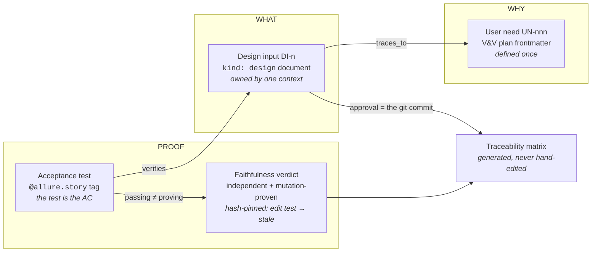
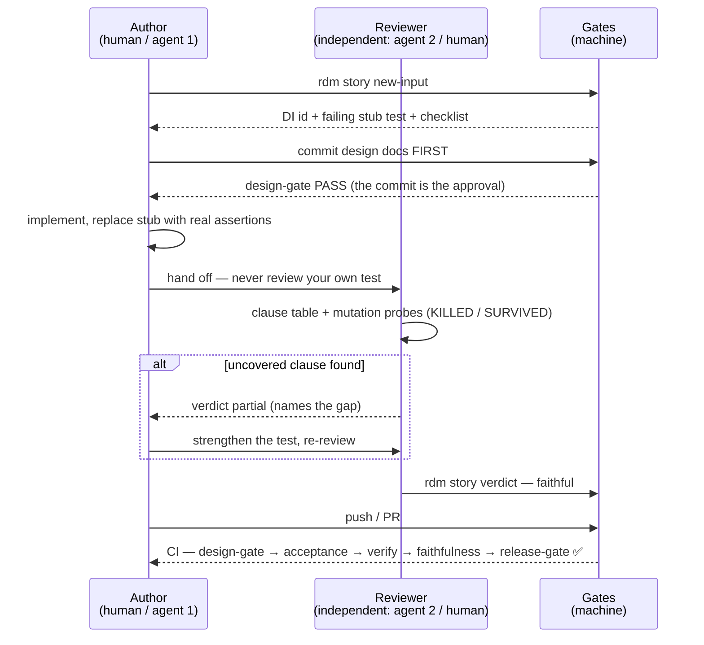
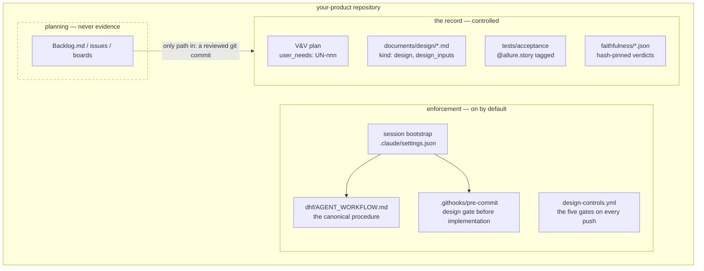

# RDM — Regulatory Documentation Manager

RDM is a documentation-as-code CLI for **IEC 62304** medical-device software. It
generates regulatory documents from Markdown templates + YAML data files, and —
record-first — **compiles and gates a Design History File** from the system of
record: per-context design documents + executed Allure results + git.

```
YAML data + Jinja2 templates → Markdown → PDF/DOCX (via Pandoc/Typst)
```

## Where to start

- **[Agent workflow](agent-workflow.md)** — the canonical procedure for changing
  a record-first project (human or AI agent): the loop the diagrams below draw.
- **[Record-first architecture](record-first-architecture.md)** — how RDM treats
  the SDD + Allure + git as the system of record and compiles the DHF from it.
- **[Plan vs. record](plan-vs-record.md)** — why the planning layer (Backlog.md /
  GitHub) is an optional, detachable extra, fenced off from the record.
- **[ADR 0001](adr-0001-bounded-context-user-needs.md)** — user needs across
  bounded contexts; verification anchored on design inputs ("live BDD").
- **[Worked example — VitalView](example-vitalview-decomposition.md)** — a
  decomposition of user needs across contexts on a realistic device.

## The evidence chain

A change is **complete** when every link below exists, is current, and is
machine-checked — not just when the code works:



A user need is **met** when it is validated **and** every design input that
`traces_to` it is verified by a passing, independently-confirmed-faithful test.

## The change lifecycle



## A record-first repository



See the **[API reference](reference.md)** for the modules that implement this.
