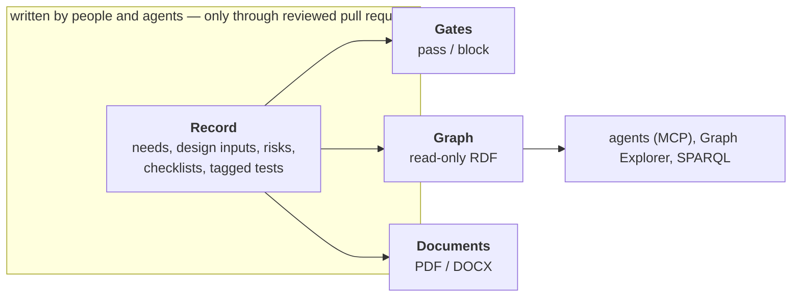

# RDM

RDM keeps the design record of regulated software — medical-device software
under IEC 62304 first — as Markdown and tests in git. It checks the record,
renders regulatory documents from it, and builds it into one read-only graph
that people and agents query.

```
regulation → checklist → clause ← document
user need → design input → test → run (at a commit) → source file
risk → control (a design input) → test → run
document → the commit that landed it
```

Every link is a line someone wrote in a reviewed pull request, or a fact a
tool recorded. Nothing is typed into a database, and nothing derived is ever
edited.

## One record, three things derived from it


```mermaid
flowchart LR
    subgraph write["written by people and agents — only through reviewed pull requests"]
        R["<b>Record</b><br>needs, design inputs, risks,<br>checklists, tagged tests"]
    end
    R --> G["<b>Gates</b><br>pass / block"]
    R --> K["<b>Graph</b><br>read-only RDF"]
    R --> D["<b>Documents</b><br>PDF / DOCX"]
    K --> A["agents (MCP), Graph Explorer, SPARQL"]
```

| Part | What it is | Read |
| --- | --- | --- |
| **Record** | User needs, design inputs (one design document per bounded context), the risk register, checklists, tagged acceptance tests. Markdown and git. | [Design inputs and tests](design-controls.md), [changing the record](agent-workflow.md), [risk register](risk.md) |
| **Gates** | Machine checks: design approved before implementation; before release, every design input verified, every need addressed, every risk controlled; every required clause referenced. | [The gates](gates.md), [gap analysis](gap-analysis.md) |
| **Graph** | The record as RDF, rebuilt on every run and never edited. Agents read it over MCP; people browse it in Graph Explorer. | [The record as a graph](graph.md), [for agents](agents.md) |
| **Documents** | Regulatory documents rendered from the record. | [Authoring and rendering](authoring.md) |

How the parts fit, and why the record is the only thing anyone writes:
[How RDM works](record-first-architecture.md) and
[the data model](data-model.md).

## What it does not do

- It does not make a device compliant. It keeps the evidence straight; a
  regulator judges the evidence, not the tool.
- A green release gate means every design input has a passing tagged test,
  not that the test proves the input. The pull-request reviewer judges that.
- Checklists are written by hand. Nothing turns a regulation into a checklist.
- The risk gate checks a register's form, not its truth: whether a control
  works, and whether a residual is as low as practicable, are the reviewer's.
  It ships no risk matrix; acceptability is the project's to declare.
- Git shows who *landed* a change, not who *approved* it; the approval is the
  pull-request review on the forge.

## Start

1. [Install](installation.md).
2. [Start a new project](quickstart-new-project.md) (`rdm init`) or
   [adopt an existing repository](quickstart-existing-repo.md) (`rdm adopt`).
3. Make your first change the record-first way:
   [changing the record](agent-workflow.md).

RDM is developed with RDM: see [how RDM controls itself](dogfood.md), and the
[traceability matrix](traceability-matrix.md) this site generates from a live
test run on every build. Agent skills for working with RDM live in
[scope-impact/agent-skills](https://github.com/scope-impact/agent-skills).
