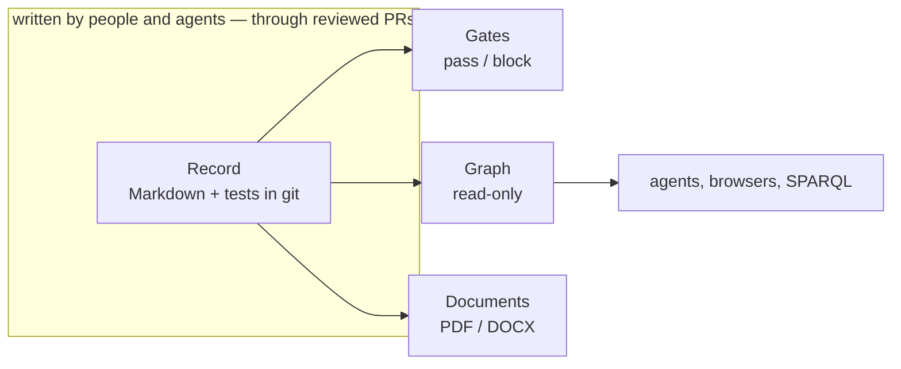
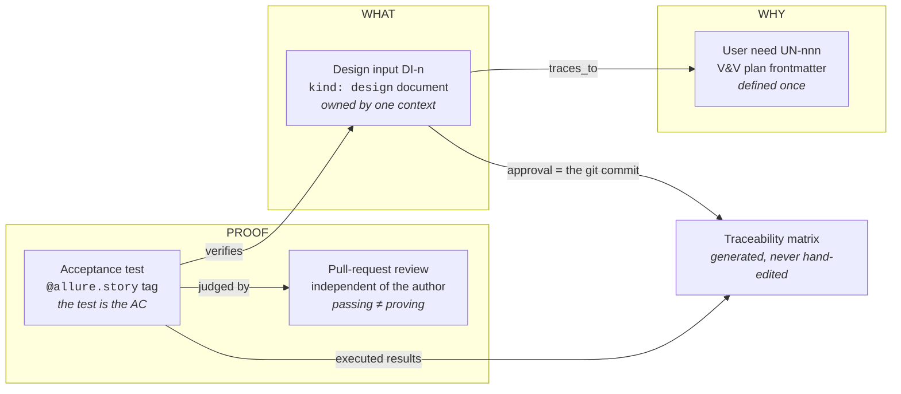
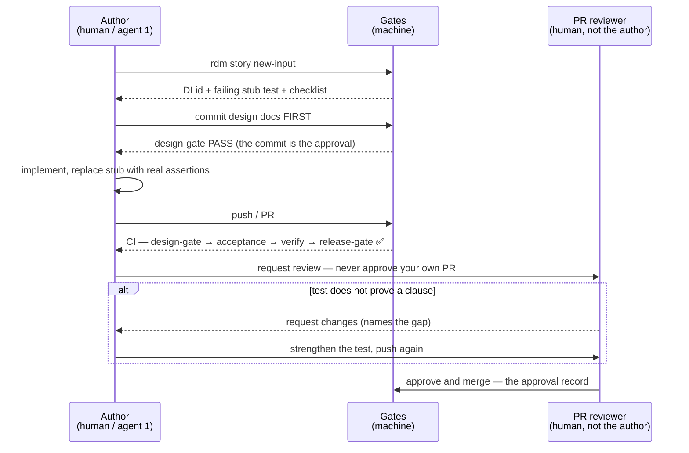
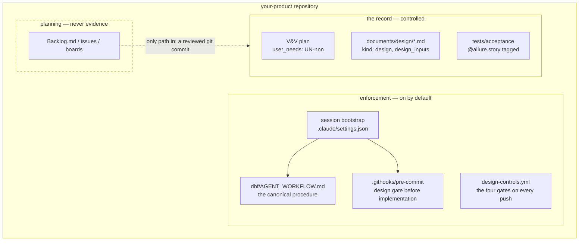

# RDM

RDM keeps the design record of regulated software — medical-device software
under IEC 62304 first — as Markdown and tests in git, checks it, and makes it
one queryable graph that people and agents read from.

```
regulation → checklist → clause ← document
user need → design input → tagged test → result → commit
```

Every link is a file you write or a fact a tool records. Nothing in the chain
is typed into a database by hand.

## The four parts

| Part | What it is | Start here |
| --- | --- | --- |
| **Record** | User needs, design inputs (one design document per bounded context), checklists, tagged tests. Markdown + git, changed only by a reviewed pull request. | [Design controls](design-controls.md), [agent workflow](agent-workflow.md) |
| **Gates** | Machine checks on the record: design approved before implementation, every input verified and every need addressed before release, every required clause referenced. | [The gates](design-controls.md#the-gates), [gap analysis](gap-analysis.md) |
| **Graph** | The record built into a read-only RDF graph — the interface for agents and for exploring. Rebuilt from the record, never edited. | [The record as a graph](graph.md) |
| **Documents** | Regulatory documents rendered from the record (PDF/DOCX). | [Authoring and rendering](authoring.md) |


```mermaid
flowchart LR
    subgraph write["written by people and agents — through reviewed PRs"]
        R["Record<br>Markdown + tests in git"]
    end
    R --> G["Gates<br>pass / block"]
    R --> K["Graph<br>read-only"]
    R --> D["Documents<br>PDF / DOCX"]
    K --> A["agents, browsers, SPARQL"]
```

Agent skills for working with RDM — writing design inputs, test-first, risk
analysis — live in
[scope-impact/agent-skills](https://github.com/scope-impact/agent-skills).

## What it does not do

- It does not make a device compliant. It keeps the evidence straight; a
  regulator judges the evidence, not the tool.
- A green release gate means every design input has a passing tagged test, not
  that the test proves the input. The pull-request reviewer judges that.
- Checklists are written by hand. Nothing turns a regulation into a checklist.
- No risk management (ISO 14971) yet.
- Agents reach the graph through the CLI and SPARQL only; there is no
  dedicated agent interface yet.
- The graph is as current as its last build.

## Where to start

[Install](installation.md), then [start a new project](quickstart-new-project.md)
(`rdm init`) or [adopt an existing repository](quickstart-existing-repo.md)
(`rdm adopt`). RDM's own [document control](document-control.md) and this site's
[traceability matrix](traceability-matrix.md) are generated evidence from RDM's
own record.

## The evidence chain

A change is **complete** when every link below exists, is current, and is
machine-checked — not just when the code works:


```mermaid
flowchart LR
    subgraph why["WHY"]
        UN["User need UN-nnn<br>V&V plan frontmatter<br><i>defined once</i>"]
    end
    subgraph what["WHAT"]
        DI["Design input DI-n<br><code>kind: design</code> document<br><i>owned by one context</i>"]
    end
    subgraph proof["PROOF"]
        TEST["Acceptance test<br><code>@allure.story</code> tag<br><i>the test is the AC</i>"]
        PR["Pull-request review<br>independent of the author<br><i>passing ≠ proving</i>"]
    end
    DI -- "traces_to" --> UN
    TEST -- "verifies" --> DI
    TEST -- "judged by" --> PR
    DI -- "approval = the git commit" --> MATRIX["Traceability matrix<br><i>generated, never hand-edited</i>"]
    TEST -- "executed results" --> MATRIX
```

A user need is **met** when it is validated **and** every design input that
`traces_to` it is verified by a passing tagged test, reviewed independently in
the pull request.

## The change lifecycle


```mermaid
sequenceDiagram
    participant A as Author<br>(human / agent 1)
    participant G as Gates<br>(machine)
    participant R as PR reviewer<br>(human, not the author)
    A->>G: rdm story new-input
    G-->>A: DI id + failing stub test + checklist
    A->>G: commit design docs FIRST
    G-->>A: design-gate PASS (the commit is the approval)
    A->>A: implement, replace stub with real assertions
    A->>G: push / PR
    G-->>A: CI — design-gate → acceptance → verify → release-gate ✅
    A->>R: request review — never approve your own PR
    alt test does not prove a clause
        R-->>A: request changes (names the gap)
        A->>R: strengthen the test, push again
    end
    R->>G: approve and merge — the approval record
```

## A record-first repository


```mermaid
flowchart TD
    subgraph repo["your-product repository"]
        subgraph record["the record — controlled"]
            VVP["V&V plan<br>user_needs: UN-nnn"]
            DESIGN["documents/design/*.md<br>kind: design, design_inputs"]
            TESTS["tests/acceptance<br>@allure.story tagged"]
        end
        subgraph enforce["enforcement — on by default"]
            BOOT["session bootstrap<br>.claude/settings.json"]
            RUNBOOK["dhf/AGENT_WORKFLOW.md<br>the canonical procedure"]
            HOOK[".githooks/pre-commit<br>design gate before implementation"]
            CI["design-controls.yml<br>the four gates on every push"]
        end
        subgraph plan["planning — never evidence"]
            PM["Backlog.md / issues / boards"]
        end
    end
    BOOT --> RUNBOOK
    BOOT --> HOOK
    PM -. "only path in: a reviewed git commit" .-> record

    style plan stroke-dasharray: 5 5
```

