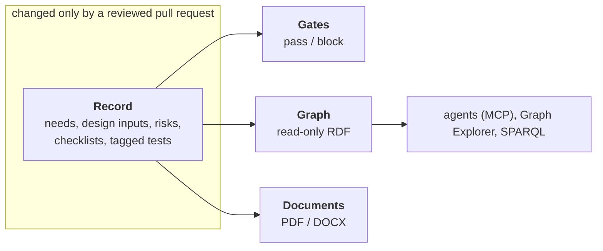

# RDM

--8<-- "README.md:intro"

## One record, three things derived from it

```mermaid
flowchart LR
    subgraph write["changed only by a reviewed pull request"]
        R["<b>Record</b><br>needs, design inputs, risks,<br>checklists, tagged tests"]
    end
    R --> G["<b>Gates</b><br>pass / block"]
    R --> K["<b>Graph</b><br>read-only RDF"]
    R --> D["<b>Documents</b><br>PDF / DOCX"]
    K --> A["agents (MCP), Graph Explorer, SPARQL"]
```

| Part | What it is | Read |
| --- | --- | --- |
| **Record** | User needs, design inputs (one design document per bounded context), the risk register, checklists, tagged acceptance tests. Markdown and git. | [Design inputs and tests](design-controls.md), [changing the record](agent-workflow.md), [risk register](risk.md) |
| **Gates** | Machine checks: design approved before implementation; before release, every design input verified, every need addressed, every risk controlled; every required clause referenced. | [The gates](gates.md), [gap analysis](gap-analysis.md) |
| **Graph** | The record as RDF, rebuilt on every run and never edited. Agents read it over MCP; people browse it in Graph Explorer. | [The record as a graph](graph.md), [for agents](agents.md) |
| **Documents** | Regulatory documents rendered from the record. | [Authoring and rendering](authoring.md) |

How the parts fit, and why the record is the only thing anyone writes:
[How RDM works](record-first-architecture.md).

## What it does not do

--8<-- "README.md:limits"

## Start

1. [Install, and start a project or adopt a repository](get-started.md).
2. Make your first change the record-first way:
   [changing the record](agent-workflow.md).

RDM is developed with RDM: its own [design history file](dhf/README.md) is
on this site, with its [traceability](traceability-map.md) drawn from its
graph after a live test run on every build, and so is the
[Part 11 worked example's](example-traceability-map.md).
Agent skills for working with RDM live in
[scope-impact/agent-skills](https://github.com/scope-impact/agent-skills).
