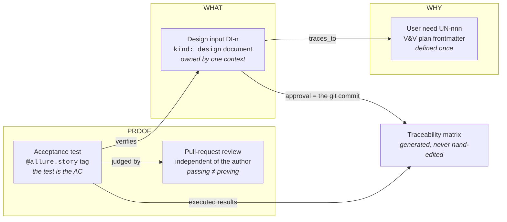
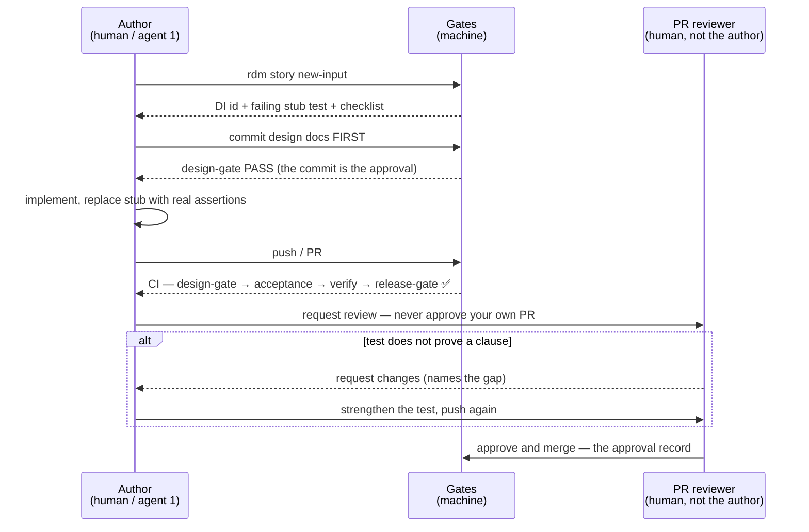
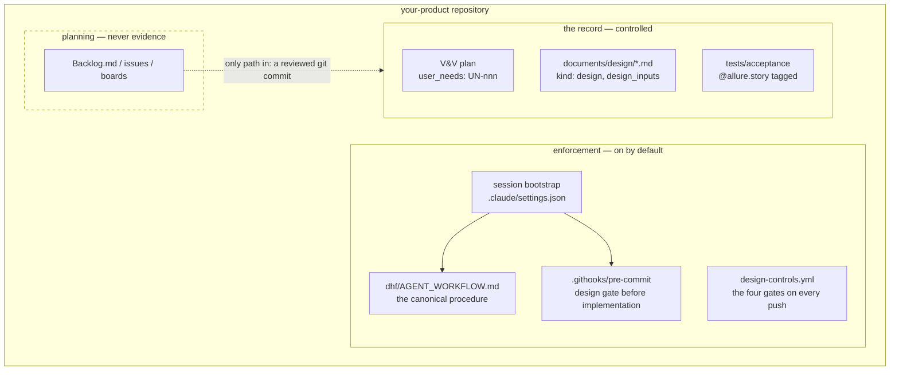

# RDM — Regulatory Documentation Manager

RDM is a documentation-as-code CLI for **IEC 62304** medical-device software. It
generates regulatory documents from Markdown templates + YAML data files, and —
record-first — **compiles and gates a Design History File** from the system of
record: per-context design documents + executed Allure results + git.

```
YAML data + Jinja2 templates → Markdown → PDF/DOCX (via Pandoc/Typst)
```

## Where to start

- **New here?** [Install](installation.md), then follow a quickstart:
  [a new documentation project](quickstart-new-project.md) (`rdm init`) or
  [an existing repository](quickstart-existing-repo.md) (`rdm adopt`). The
  **User guide** covers [authoring](authoring.md),
  [gap analysis](gap-analysis.md), [design controls](design-controls.md), the
  [agent workflow](agent-workflow.md), and the [CLI reference](cli.md).
- **Why it works this way**: [record-first architecture](record-first-architecture.md),
  [plan vs. record](plan-vs-record.md), and
  [ADR 0001](adr-0001-bounded-context-user-needs.md); worked examples for
  [a realistic device (VitalView)](example-vitalview-decomposition.md) and
  [git as a document control system](https://github.com/scope-impact/rdm/tree/main/examples/github-document-control).
- **Proof, not promises**: [RDM's own document control](document-control.md)
  is held to the shipped Part 11 checklist, and this site's
  [traceability matrix](traceability-matrix.md) is generated from a live
  acceptance run at every build.

## The evidence chain

A change is **complete** when every link below exists, is current, and is
machine-checked — not just when the code works:


```mermaid
flowchart LR
    subgraph why["WHY"]
        UN["User need UN-nnn<br>V&V plan frontmatter<br><i>defined once</i>"]
    end
    subgraph what["WHAT"]
        DI["Design input DI-n<br><code>kind: design</code> document<br><i>owned by one context</i>"]
    end
    subgraph proof["PROOF"]
        TEST["Acceptance test<br><code>@allure.story</code> tag<br><i>the test is the AC</i>"]
        PR["Pull-request review<br>independent of the author<br><i>passing ≠ proving</i>"]
    end
    DI -- "traces_to" --> UN
    TEST -- "verifies" --> DI
    TEST -- "judged by" --> PR
    DI -- "approval = the git commit" --> MATRIX["Traceability matrix<br><i>generated, never hand-edited</i>"]
    TEST -- "executed results" --> MATRIX
```

A user need is **met** when it is validated **and** every design input that
`traces_to` it is verified by a passing tagged test, reviewed independently in
the pull request.

## The change lifecycle


```mermaid
sequenceDiagram
    participant A as Author<br>(human / agent 1)
    participant G as Gates<br>(machine)
    participant R as PR reviewer<br>(human, not the author)
    A->>G: rdm story new-input
    G-->>A: DI id + failing stub test + checklist
    A->>G: commit design docs FIRST
    G-->>A: design-gate PASS (the commit is the approval)
    A->>A: implement, replace stub with real assertions
    A->>G: push / PR
    G-->>A: CI — design-gate → acceptance → verify → release-gate ✅
    A->>R: request review — never approve your own PR
    alt test does not prove a clause
        R-->>A: request changes (names the gap)
        A->>R: strengthen the test, push again
    end
    R->>G: approve and merge — the approval record
```

## A record-first repository


```mermaid
flowchart TD
    subgraph repo["your-product repository"]
        subgraph record["the record — controlled"]
            VVP["V&V plan<br>user_needs: UN-nnn"]
            DESIGN["documents/design/*.md<br>kind: design, design_inputs"]
            TESTS["tests/acceptance<br>@allure.story tagged"]
        end
        subgraph enforce["enforcement — on by default"]
            BOOT["session bootstrap<br>.claude/settings.json"]
            RUNBOOK["dhf/AGENT_WORKFLOW.md<br>the canonical procedure"]
            HOOK[".githooks/pre-commit<br>design gate before implementation"]
            CI["design-controls.yml<br>the four gates on every push"]
        end
        subgraph plan["planning — never evidence"]
            PM["Backlog.md / issues / boards"]
        end
    end
    BOOT --> RUNBOOK
    BOOT --> HOOK
    PM -. "only path in: a reviewed git commit" .-> record

    style plan stroke-dasharray: 5 5
```

See the **[API reference](reference.md)** for the modules that implement this.
