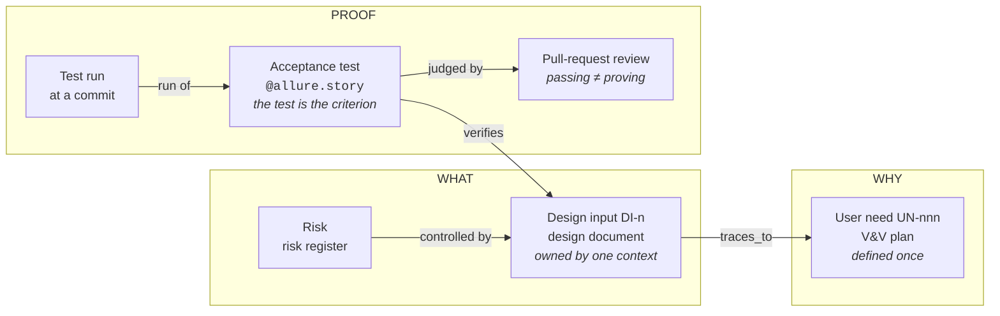
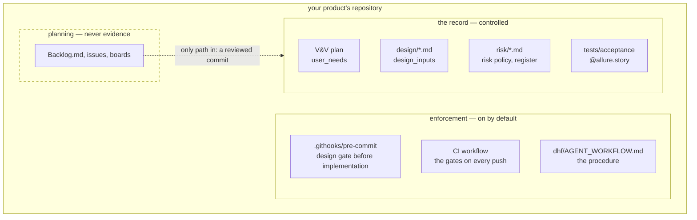

# How RDM works

## One idea

**The record is the only thing anyone writes.** Everything else — gate
verdicts, the graph, the rendered documents, the traceability matrix, the
release evidence bundle — is derived from it by a tool, and none of it is ever
edited by hand or fed back in.

The record is Markdown frontmatter and tests in git. It changes only through
a pull request that someone other than the author reviews; the merge is the
approval. That holds for people and for agents alike: an agent that wants to
change the record edits the Markdown and the tests and opens a pull request,
the same as a person.

| Written (the record) | Derived (by RDM) |
| --- | --- |
| user needs, in the V&V plan | gate verdicts (design gate, release gate, gap analysis) |
| design inputs, in one design document per bounded context | the RDF graph, its SHACL validation, the agent server's answers |
| the risk policy and risk register | the traceability matrix and verification data |
| checklists, and `[[KEY]]` references in documents | rendered regulatory documents (PDF / DOCX) |
| acceptance tests tagged `@allure.story("DI-n")` | the evidence bundle kept with a release |
| — | test results (Allure), recorded by running the tests |
| — | approval and change history, recorded by git and the forge |

The two rows without a written side are facts a tool records: what ran and
what passed, and who changed what, when. RDM reads them; nobody writes them.

## The evidence chain

A change is complete when every link exists, is current, and is checked by a
machine — not when the code works:



A user need is **met** when it is validated, and every design input that
traces to it is verified by a passing tagged test, at the commit being
released, reviewed by someone other than its author.

## A change, start to finish

```mermaid
sequenceDiagram
    participant A as Author<br>(person or agent)
    participant G as Gates<br>(machine)
    participant R as Reviewer<br>(not the author)
    A->>G: rdm story new-input
    G-->>A: DI id + failing stub test + checklist
    A->>G: commit the design documents first
    G-->>A: design gate passes (that commit is the approval)
    A->>A: implement; replace the stub with real assertions
    A->>G: push, open a pull request
    G-->>A: CI: design gate → acceptance tests → verify → release gate
    A->>R: request review
    alt a test does not prove its clause
        R-->>A: request changes
        A->>R: strengthen the test, push again
    end
    R->>G: approve and merge — the approval record
```

The full procedure, with the decision of whether a change needs a design
input at all, is [Changing the record](agent-workflow.md).

## A record-first repository



`rdm adopt` lays down the record skeleton and the enforcement without
touching existing files ([existing repository](quickstart-existing-repo.md)).
Planning tools stay outside the record: [Plan vs. record](plan-vs-record.md).

## What RDM depends on

1. a git repository;
2. a design history file (`dhf/`) with the V&V plan and the design documents;
3. Allure results from running the acceptance tests.

Nothing about how the work was planned, which tracker is used, or who (or
what) wrote the change.

## Where the code lives

| Part | Modules |
| --- | --- |
| Record — read it | `rdm/record/` — design and V&V frontmatter (`sdd.py`), Allure results (`allure.py`), verification (`verify.py`), the risk register (`risk.py`), release evidence (`bundle.py`, `dmr.py`), usability evidence (`persona.py`, `validation.py`) |
| Record — scaffold it | `rdm/init.py`, `rdm/adopt.py`, `rdm/gates/new_input.py`; `rdm/pytest_plugin.py` labels each test run from the record |
| Gates | `rdm/gates/design_gate.py` (design and release gates), `rdm/gaps.py` (gap analysis), `rdm/gates/mutation.py` (the reviewer's probe) |
| Graph | `rdm/graph/` — projection (`project.py`, `allure.py`, `checklists.py`), vocabulary and gate shapes (`ontology.ttl`, `shapes.ttl`), SHACL validation, Graph Explorer file, the MCP server (`agent.py`) |
| Documents | `rdm/render.py`, `rdm/md_extensions/`, `rdm/init_files/` |

RDM's own architecture document assigns each bounded context to one of these
parts ([`dhf/documents/architecture.md`](https://github.com/scope-impact/rdm/blob/main/dhf/documents/architecture.md)).
