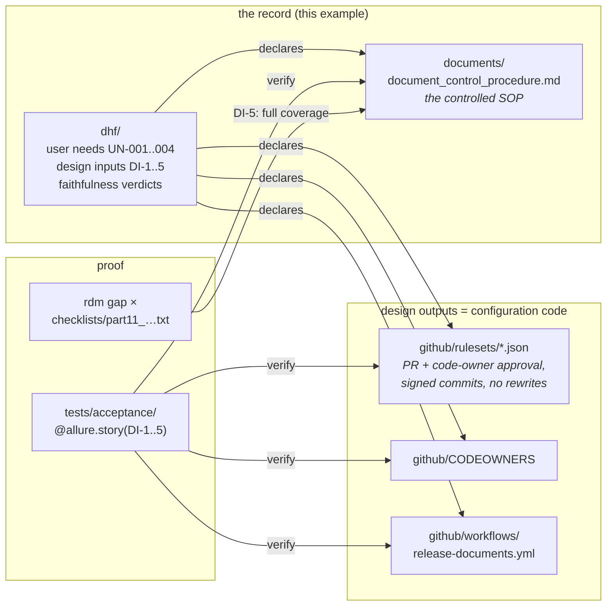

# Example: git as the document control system (GitHub as service provider)

A complete, working RDM record-first project whose "product" is the document
control system itself: **git provides the record mechanics** (identity,
history, immutability, signatures) and **GitHub provides the service**
(reviews, rulesets, releases, access control). The controls are configuration
code, the procedure is a controlled document, and every claim is verified by a
tagged acceptance test — including 21 CFR Part 11 coverage proven by gap
analysis.



## What each piece is

| Path | Role |
|---|---|
| `documents/document_control_procedure.md` | the controlled SOP: how draft → review → approval (e-signature) → release → retention works on git/GitHub, with each 21 CFR Part 11 control cited inline (`[[P11:…]]`) |
| `checklists/part11_document_control.txt` | the audited Part 11 subset (§11.10 a–k, §11.50, §11.70, §11.100) |
| `github/rulesets/controlled-documents.json` | branch ruleset: ≥1 independent code-owner approval, verified commit signatures, required status checks, no force-push/deletion — *import under Repo → Settings → Rules* |
| `github/CODEOWNERS` | routes controlled paths to the quality team (the authorized signers) |
| `github/workflows/release-documents.yml` | tag-triggered release: renders PDF copies + attaches a `git archive` electronic set (§11.10(b)/(c)) |
| `dhf/` | the record: user needs, design inputs DI-1..5, design review, faithfulness verdicts, matrix template |
| `tests/acceptance/` | the acceptance criteria — they inspect the *real* configuration and render the *real* SOP |

> `github/` is deliberately not `.github/` so this example's workflow doesn't
> run in the RDM repository — copy its contents to `.github/` when using this
> for real. Apply the ruleset either via the UI (Repo → Settings → Rules →
> Import) or with the provided script (requires `gh` + `jq` and admin access):
>
> ```bash
> ./setup.sh owner/repo            # create or update the ruleset from the JSON
> ./setup.sh --check owner/repo    # audit: live settings vs the checked-in JSON
> ```
>
> `--check` exits non-zero on drift — run it on a schedule as the
> "configuration has not drifted" audit (§11.10(a) leans on it). Repository
> rulesets require a public repo or a paid plan on private ones.

## The Part 11 mapping in one table

| Part 11 control | git/GitHub mechanism | Verified by |
|---|---|---|
| 11.10(a) validation | controls are code; this test suite is the executed validation | DI-1..5 tests |
| 11.10(b) accurate copies | rendered PDFs + `git archive` at the release tag | DI-3 |
| 11.10(c) retention/retrieval | protected tags, full-history clones, mirror | DI-3, SOP |
| 11.10(d)/(g) access/authority | org membership, 2FA, CODEOWNERS-gated approval | DI-1 |
| 11.10(e) audit trail | SHA-chained, time-stamped commits; non-fast-forward + no deletion | DI-1 |
| 11.10(f) sequencing | ruleset: PR required, checks green, stale reviews dismissed | DI-1 |
| 11.50 signature manifestation | PR review records name, UTC time, meaning (APPROVED) | SOP + gap |
| 11.70 signature–record linking | review bound to the content-addressed commit SHA | DI-1, SOP |
| 11.100 signature uniqueness | one account per person, SSO + 2FA, never reassigned | SOP + gap |
| *coverage of all of the above in the SOP* | `rdm gap` must report zero missing items | **DI-5** |

## Run it

From this directory:

```bash
rdm story design-gate --dhf dhf                 # record present, complete, approved
pytest tests/acceptance --alluredir=dhf/allure-results
rdm story verify --dhf dhf --allure-results dhf/allure-results -o dhf/data/verification.yml
rdm story faithfulness --dhf dhf                # independent verdicts current
rdm story release-gate --dhf dhf --allure-results dhf/allure-results
rdm gap checklists/part11_document_control.txt documents/document_control_procedure.md
rdm render documents/document_control_procedure.md config.yml data/history.yml
```

(From the RDM repository root, prefix with `uv run` and the example path:
`uv run rdm story release-gate --dhf examples/github-document-control/dhf
--allure-results examples/github-document-control/dhf/allure-results`, and run
pytest as `uv run pytest examples/github-document-control/tests/acceptance`.)

## Caveats

Illustrative, not legal or regulatory advice: the applicable-controls scoping,
supplier qualification of GitHub, training records, and the summative Part 11
assessment remain the adopting organization's responsibility. Sections handled
outside this procedure (open-system controls §11.30, password lifecycle
§11.300) belong in the organization's security SOPs.
