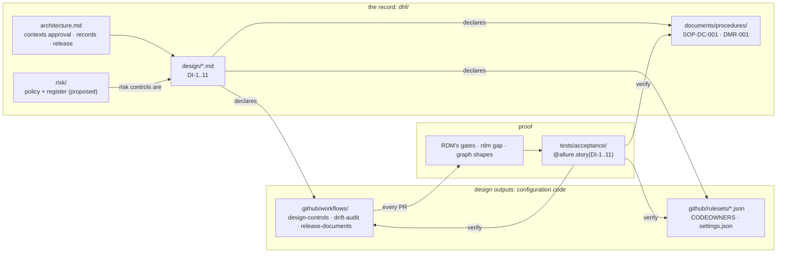

# Example: git as the document control system (GitHub as service provider)

A complete RDM project whose product is a document control system: **git keeps
the record** (identity, history, immutability, signatures) and **GitHub
provides the service** (reviews, rulesets, releases, access control). The
controls are configuration code, the procedure is a controlled document, every
design input is verified by a tagged acceptance test, and 21 CFR Part 11
coverage is proven by gap analysis. Every pull request runs RDM's reusable
gates, and a release is published only when its commit is verified.

It is laid out as `rdm init` and `rdm adopt` lay a project out, and it uses
every part of RDM: see [RDM in this example](#rdm-in-this-example).


```mermaid
flowchart LR
    subgraph record["the record: dhf/"]
        ARCH["architecture.md<br>contexts approval · records · release"]
        DI["design/*.md<br>DI-1..11"]
        RISK["risk/<br>policy + register (proposed)"]
        SOP["documents/procedures/<br>SOP-DC-001 · DMR-001"]
    end
    subgraph outputs["design outputs: configuration code"]
        RULES[".github/rulesets/*.json<br>CODEOWNERS · settings.json"]
        CI[".github/workflows/<br>design-controls · drift-audit · release-documents"]
    end
    subgraph proof["proof"]
        TESTS["tests/acceptance/<br>@allure.story(DI-1..11)"]
        GATES["RDM's gates · rdm gap · graph shapes"]
    end
    ARCH --> DI
    RISK -->|risk controls are| DI
    DI -->|declares| RULES & CI & SOP
    TESTS -->|verify| RULES & CI & SOP
    CI -->|every PR| GATES
    GATES --> TESTS
```

## What each piece is

| Path | Role |
|---|---|
| `dhf/documents/architecture.md` | the system and its three bounded contexts: `approval`, `records`, `release` |
| `dhf/documents/design/<context>.md` | each context's design inputs (DI-1..11), with `realises` where it implements part of another's |
| `dhf/documents/risk/` | the risk acceptability policy and the risk register: six risks, three of them STRIDE threats linked to the safety risk; each risk control a design input. Both **proposed** |
| `dhf/documents/verification_and_validation_plan.md` | the user needs UN-001..005 and how each is verified and validated |
| `dhf/documents/design_review.md` | Design Reviews 1–3 |
| `dhf/documents/traceability_matrix.md` | generated from a test run: never edited |
| `dhf/documents/procedures/` | the controlled documents: the SOP (SOP-DC-001), with each Part 11 control cited inline (`[[P11:…]]`), and the device master record index (DMR-001) |
| `dhf/data/` | what the documents render from: revision history, the DMR index data (generated by `rdm story dmr`), definitions |
| `dhf/validation/` | one summative validation record per user need, **pending** until the quality owner's review |
| `dhf/shapes/document_control.ttl` | this system's own graph rules: every procedure has a revision, every SOP cites a Part 11 clause |
| `dhf/Makefile`, `config.yml`, `template.typ`, `pandoc_*.yml` | rendering every document to PDF/DOCX (`make pdfs`), as `rdm init` lays it down |
| `checklists/part11_document_control.txt` | the audited Part 11 subset (§11.10 a–k, §11.50, §11.70, §11.100) |
| `.github/rulesets/controlled-documents.json` | branch ruleset: an independent code-owner approval, signed commits, the two required checks, no force-push or deletion |
| `.github/settings.json`, `setup.sh` | merge commits only, so the reviewed SHA is the one in history; `setup.sh` applies the ruleset and settings, and `--check` audits them |
| `.github/workflows/design-controls.yml` | every pull request: RDM's reusable gates pinned to `v2.0.0-alpha` (check `design-controls / gates`), and the gap analysis with this system's graph rules (check `record-checks`) |
| `.github/workflows/drift-audit.yml` | daily: `setup.sh --check`, failing on any difference from the checked-in configuration |
| `.github/workflows/release-documents.yml` | on a `doc-*` tag: the tests and the release gate, the evidence bundle with its verification report, every document as PDF, a `git archive` of the set, and the device history record, all attached to the GitHub Release |
| `tests/acceptance/` | one test file per context; each test reads the *real* configuration and renders the *real* documents, in named verification steps that attach what they checked |
| `.githooks/`, `scripts/agent-bootstrap.sh`, `.claude/settings.json`, `dhf/AGENT_WORKFLOW.md` | what `rdm adopt` lays down: the pre-commit design gate, a session bootstrap, and the procedure every change follows |
| `.mcp.json` | the record as a read-only MCP server for agents (`rdm graph mcp`) |
| `pytest.ini`, `.gitignore` | make this directory pytest's root, so runs are labelled from this `dhf/`; keep results, copies and the graph store out of the worktree, so a run is of a clean commit |

`.github/` in this subdirectory is inert: GitHub reads workflows, CODEOWNERS and
rulesets only at a repository's root. Copy this directory's contents to the
root of a repository to use it. Apply the ruleset and settings with `setup.sh`
(requires `gh` + `jq` and admin access), and give the drift audit a
`DRIFT_AUDIT_TOKEN` secret that can read the repository's administration
settings:

```bash
./setup.sh owner/repo            # create or update the ruleset, apply the settings
./setup.sh --check owner/repo    # audit: live configuration vs the checked-in JSON
```

Repository rulesets require a public repository or a paid plan on private ones.

## The Part 11 mapping in one table

| Part 11 control | git/GitHub mechanism | Verified by |
|---|---|---|
| 11.10(a) validation | controls are code; this test suite is the executed validation, on every change | DI-1..11, DI-9 |
| 11.10(b) accurate copies | rendered PDFs + `git archive` at the release tag, from a verified commit | DI-3, DI-10 |
| 11.10(c) retention/retrieval | protected tags, full-history clones, mirror | DI-3, SOP |
| 11.10(d)/(g) access/authority | org membership, 2FA, CODEOWNERS-gated approval | DI-1 |
| 11.10(e) audit trail | SHA-chained, time-stamped commits; non-fast-forward + no deletion; daily drift audit | DI-1, DI-11 |
| 11.10(f) sequencing | ruleset: PR required, the required checks green, stale reviews dismissed | DI-1, DI-9 |
| 11.50 signature manifestation | PR review records name, UTC time, meaning (APPROVED) | SOP + gap |
| 11.70 signature–record linking | review bound to the content-addressed commit SHA; merge commits only | DI-1, DI-6 |
| 11.100 signature uniqueness | one account per person, SSO + 2FA, never reassigned | SOP + gap; RISK-DC-006 |
| *coverage of all of the above in the SOP* | `rdm gap` reports zero missing items; the graph rule finds an SOP citing no clause | **DI-5** |

## RDM in this example

| RDM | Where |
|---|---|
| user needs, design inputs, bounded contexts, `realises`, the architecture | `dhf/documents/` |
| `rdm story new-input` | DI-11 was scaffolded with it: `rdm story new-input --dhf dhf --context approval --traces-to UN-002,UN-004 --text "…"` |
| risk policy and register, STRIDE threats, `linked`, residual acceptance, proposals | `dhf/documents/risk/` |
| summative validation records | `dhf/validation/` |
| tests tagged `@allure.story`, `output` labels, verification steps, `rdm.pytest_plugin` | `tests/acceptance/` |
| the design gate (pre-commit and CI), verify, the release gate | `.githooks/`, `design-controls.yml`, `release-documents.yml` |
| RDM's reusable gates, pinned | `design-controls.yml` |
| `rdm gap` with a checklist file | `record-checks`, DI-5 |
| `rdm render`, the vocabulary and audit-note extensions, `make pdfs`, the PDF action | `dhf/Makefile`, `dhf/config.yml`, `release-documents.yml` |
| `rdm story dmr` | `dhf/data/dmr.yml`, DI-7 |
| the evidence bundle and the verification report | `release-documents.yml`, DI-10 |
| the graph: `validate` with a checklist and your own shapes, `query`, `trace`, the MCP server, Graph Explorer | `record-checks`, `dhf/shapes/`, `.mcp.json`, below |
| `rdm story mutation-probe` | below |
| `rdm adopt` (agent workflow, hooks, session bootstrap) | `.githooks/`, `scripts/`, `.claude/`, `dhf/AGENT_WORKFLOW.md` |

Not used, and why: `rdm story persona` needs a deployed web UI to drive (the
V&V plan says how it would apply to UN-001); `rdm collect` and `rdm translate`
feed the older `rdm init` templates, which this example does not use.

## Run it

From this directory, with
`pip install "rdm[graph,report] @ git+https://github.com/scope-impact/rdm" pytest allure-pytest`:

```bash
rdm story design-gate --dhf dhf                 # record present, complete, approved
pytest tests/acceptance --clean-alluredir --alluredir=dhf/allure-results
rdm story verify --dhf dhf --allure-results dhf/allure-results -o dhf/data/verification.yml
rdm story release-gate --dhf dhf --allure-results dhf/allure-results
rdm gap checklists/part11_document_control.txt dhf/documents/procedures/document_control_procedure.md
rdm graph validate --dhf dhf --allure-results dhf/allure-results \
  --checklist checklists/part11_document_control.txt --shapes dhf/shapes/document_control.ttl
rdm story evidence-bundle --dhf dhf --allure-results dhf/allure-results -o release-evidence
```

Explore the record:

```bash
rdm story trace DI-11 --dhf dhf --allure-results dhf/allure-results
rdm story dmr -o dhf/data/dmr.yml dhf/documents/procedures        # regenerate the DMR index data
rdm graph query --dhf dhf "SELECT ?doc ?revision WHERE { ?doc <https://github.com/scope-impact/rdm/ns#revision> ?revision }"
rdm graph explorer-file --dhf dhf --allure-results dhf/allure-results -o record.json   # load in AWS Graph Explorer
rdm story mutation-probe --file .github/settings.json \
  --find '"allow_squash_merge": false' --replace '"allow_squash_merge": true' --test test_merge_behavior
```

An agent connected to `.mcp.json` can `trace` a risk (`RISK-DC-002`: its
rating, residual decision, linked safety risk and controls), `query` the graph
and `validate` it, and change nothing.

Render the documents with Pandoc and Typst installed (`cd dhf && make pdfs`), or
in RDM's image: `docker run --rm -v "$PWD:/project" -w /project/dhf --entrypoint make ghcr.io/scope-impact/rdm pdfs`.
The copies land in `dhf/release/`. RDM reads every Markdown file under `dhf/`,
so run `make clean` before the gates; the release workflow builds the evidence
bundle before it renders.

RDM's own CI runs this example's gates on every change to RDM.

## Caveats

Illustrative, not legal or regulatory advice: the applicable-controls scoping,
supplier qualification of GitHub, training records, and the summative Part 11
assessment remain the adopting organization's responsibility. The risk policy,
the risk ratings and the validation records are proposals or pending for the
same reason: they are the quality owner's to approve. Sections handled outside
this procedure (open-system controls §11.30, password lifecycle §11.300)
belong in the organization's security SOPs.
