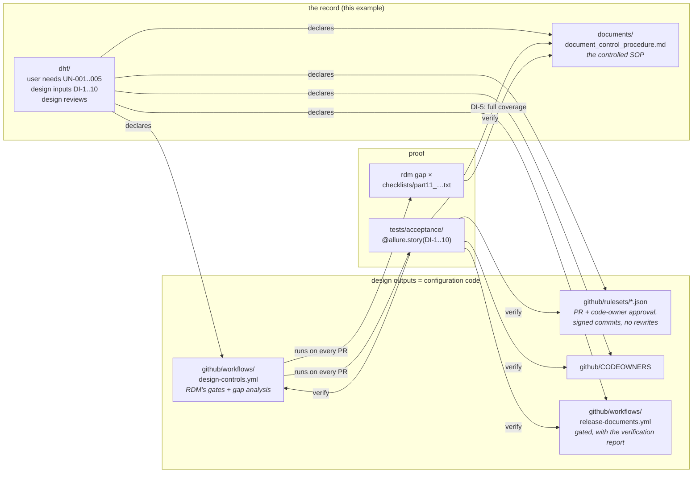

# Example: git as the document control system (GitHub as service provider)

A complete, working RDM record-first project whose "product" is the document
control system itself: **git provides the record mechanics** (identity,
history, immutability, signatures) and **GitHub provides the service**
(reviews, rulesets, releases, access control). The controls are configuration
code, the procedure is a controlled document, and every design input is
verified by a tagged acceptance test, including 21 CFR Part 11 coverage proven
by gap analysis. Every pull request runs RDM's reusable gates, pinned to a
released RDM, and a release is published only when its commit is verified.


```mermaid
flowchart LR
    subgraph record["the record (this example)"]
        SOP["documents/<br>document_control_procedure.md<br><i>the controlled SOP</i>"]
        DHF["dhf/<br>user needs UN-001..005<br>design inputs DI-1..10<br>design reviews"]
    end
    subgraph outputs["design outputs = configuration code"]
        RULES["github/rulesets/*.json<br><i>PR + code-owner approval,<br>signed commits, no rewrites</i>"]
        OWNERS["github/CODEOWNERS"]
        CI["github/workflows/<br>design-controls.yml<br><i>RDM's gates + gap analysis</i>"]
        REL["github/workflows/<br>release-documents.yml<br><i>gated, with the verification report</i>"]
    end
    subgraph proof["proof"]
        TESTS["tests/acceptance/<br>@allure.story(DI-1..10)"]
        GAP["rdm gap ×<br>checklists/part11_…txt"]
    end
    DHF -->|declares| RULES & OWNERS & CI & REL & SOP
    TESTS -->|verify| RULES & OWNERS & CI & REL & SOP
    CI -->|runs on every PR| TESTS & GAP
    GAP -->|DI-5: full coverage| SOP
```

## What each piece is

| Path | Role |
|---|---|
| `documents/document_control_procedure.md` | the controlled SOP: how draft → review → approval (e-signature) → release → retention works on git/GitHub, with each 21 CFR Part 11 control cited inline (`[[P11:…]]`) |
| `checklists/part11_document_control.txt` | the audited Part 11 subset (§11.10 a–k, §11.50, §11.70, §11.100) |
| `github/rulesets/controlled-documents.json` | branch ruleset: ≥1 independent code-owner approval, verified commit signatures, the two required checks below, no force-push/deletion — *import under Repo → Settings → Rules* |
| `github/settings.json` | merge commits only, so the reviewed SHA is the one in history |
| `github/workflows/design-controls.yml` | on every pull request: RDM's reusable gates pinned to `v1.2.0` (check `design-controls / gates`) and the Part 11 gap analysis (check `part11-gap-analysis`) |
| `github/CODEOWNERS` | routes controlled paths to the quality team (the authorized signers) |
| `github/workflows/release-documents.yml` | tag-triggered release: runs the tests and the release gate at the tag, then attaches PDF copies, a `git archive` electronic set (§11.10(b)/(c)), the verification report and the device history record |
| `dhf/` | the record: user needs UN-001..005, design inputs DI-1..10, design reviews, matrix template |
| `tests/acceptance/` | the tests that verify the design inputs: they inspect the *real* configuration and render the *real* SOP, in named verification steps that attach what they checked; `conftest.py` enables RDM's pytest plugin |
| `pytest.ini`, `.gitignore` | make this directory pytest's root, so runs are labelled from this `dhf/`; keep results and release copies out of the worktree, so a run is of a clean commit |

> `github/` is deliberately not `.github/` so this example's workflows don't
> run in the RDM repository — copy its contents to `.github/` when using this
> for real. Apply the ruleset either via the UI (Repo → Settings → Rules →
> Import) or with the provided script (requires `gh` + `jq` and admin access):
>
> ```bash
> ./setup.sh owner/repo            # create or update the ruleset from the JSON
> ./setup.sh --check owner/repo    # audit: live settings vs the checked-in JSON
> ```
>
> `--check` exits non-zero on drift — run it on a schedule as the
> "configuration has not drifted" audit (§11.10(a) leans on it). Repository
> rulesets require a public repo or a paid plan on private ones.

## The Part 11 mapping in one table

| Part 11 control | git/GitHub mechanism | Verified by |
|---|---|---|
| 11.10(a) validation | controls are code; this test suite is the executed validation, on every change | DI-1..10 tests, DI-9 |
| 11.10(b) accurate copies | rendered PDFs + `git archive` at the release tag, from a verified commit | DI-3, DI-10 |
| 11.10(c) retention/retrieval | protected tags, full-history clones, mirror | DI-3, SOP |
| 11.10(d)/(g) access/authority | org membership, 2FA, CODEOWNERS-gated approval | DI-1 |
| 11.10(e) audit trail | SHA-chained, time-stamped commits; non-fast-forward + no deletion | DI-1 |
| 11.10(f) sequencing | ruleset: PR required, the design controls and the gap analysis green, stale reviews dismissed | DI-1, DI-9 |
| 11.50 signature manifestation | PR review records name, UTC time, meaning (APPROVED) | SOP + gap |
| 11.70 signature–record linking | review bound to the content-addressed commit SHA | DI-1, SOP |
| 11.100 signature uniqueness | one account per person, SSO + 2FA, never reassigned | SOP + gap |
| *coverage of all of the above in the SOP* | `rdm gap` must report zero missing items | **DI-5** |

## Run it

From this directory, with `pip install "rdm[graph,report] @ git+https://github.com/scope-impact/rdm" pytest allure-pytest`:

```bash
rdm story design-gate --dhf dhf                 # record present, complete, approved
pytest tests/acceptance --clean-alluredir --alluredir=dhf/allure-results
rdm story verify --dhf dhf --allure-results dhf/allure-results -o dhf/data/verification.yml
rdm story release-gate --dhf dhf --allure-results dhf/allure-results
rdm graph validate --dhf dhf --allure-results dhf/allure-results
rdm gap checklists/part11_document_control.txt documents/document_control_procedure.md
rdm story evidence-report --dhf dhf --allure-results dhf/allure-results -o verification-report.pdf
rdm render documents/document_control_procedure.md config.yml data/history.yml
```

(From the RDM repository root, prefix with `uv run` and the example path:
`uv run rdm story release-gate --dhf examples/github-document-control/dhf
--allure-results examples/github-document-control/dhf/allure-results`, and run
pytest as `uv run pytest examples/github-document-control/tests/acceptance`.)

## Caveats

Illustrative, not legal or regulatory advice: the applicable-controls scoping,
supplier qualification of GitHub, training records, and the summative Part 11
assessment remain the adopting organization's responsibility. Sections handled
outside this procedure (open-system controls §11.30, password lifecycle
§11.300) belong in the organization's security SOPs.
