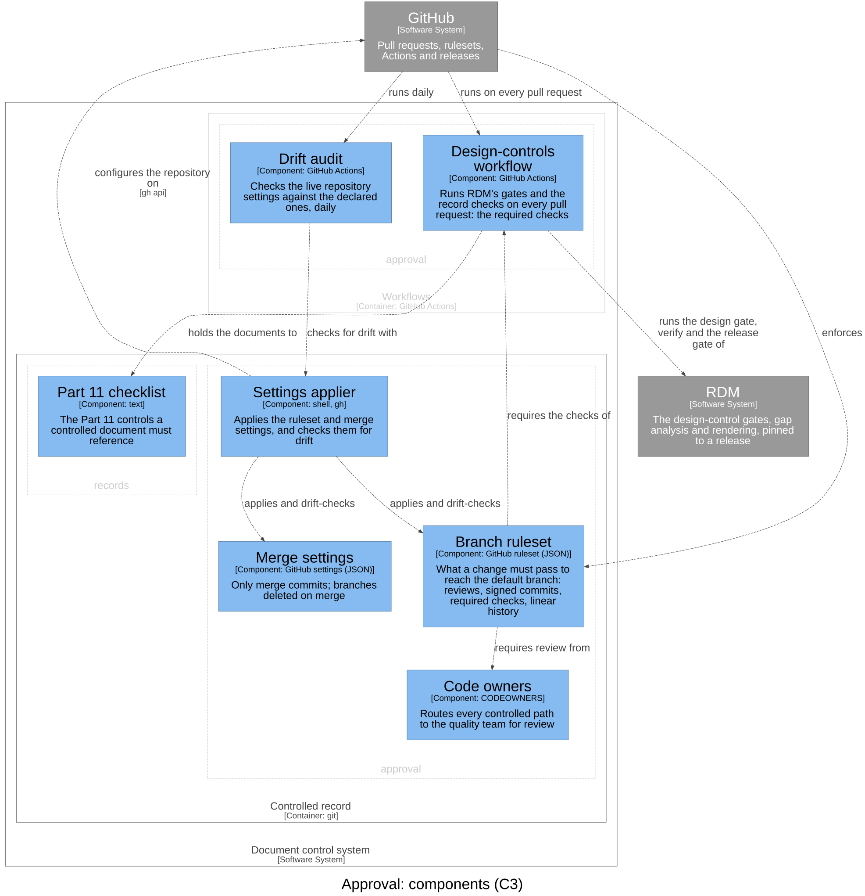

# Approval — Software Design

## Purpose

The approval path: what a change must pass before it reaches the default
branch — a pull request, a code owner's approval, signed commits, the required
checks, a history that cannot be rewritten — and the audit that keeps the
live repository matching what is declared. Every control is configuration
applied to the service provider (GitHub).

## Design Outputs

The design outputs are this context's architecture, in the C4 model of the
architecture workspace (`rdm c4 draw`): its components, what each is
responsible for, and how they relate. The workspace maps each component to
what implements it.

| Component | Responsibility | Meets |
|-----------|----------------|-------|
| Branch ruleset | What a change must pass to reach the default branch | DI-1, DI-9 |
| Code owners | Routes every controlled path to the quality team for review | DI-1 |
| Merge settings | Only merge commits, so the reviewed SHA is the one kept; branches deleted on merge | DI-6 |
| Settings applier | Applies the ruleset and merge settings to the repository, and checks them for drift | DI-6, DI-11 |
| Design-controls workflow | Runs RDM's gates and the record checks on every pull request: the required checks | DI-9 |
| Drift audit | Compares the live settings with the declared ones daily, and fails on a difference | DI-11 |

GitHub enforces the branch ruleset, which requires review from the code
owners and the checks of the design-controls workflow. The settings applier
applies the ruleset and the merge settings and, run by the drift audit,
checks them. The design-controls workflow runs RDM's design gate, verify and
release gate, and holds the procedure to the Part 11 checklist: this
context's part of `records`' DI-5.

## Dependencies

Depends on GitHub (the service that enforces the configuration) and RDM (the
gates the required checks run). `release` verifies a release with the same
gates as the design-controls workflow.
