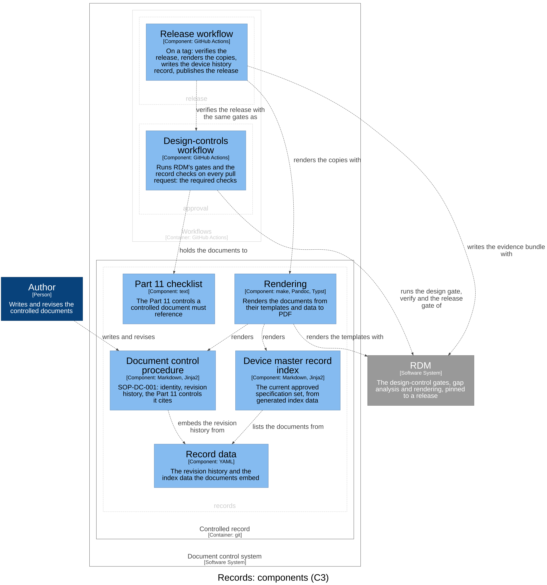

# Controlled records — Software Design

## Purpose

The controlled documents themselves: their identity and revision, their
revision history generated from data, the procedure's coverage of the Part 11
document controls, and the device master record that indexes the current
approved set.

## Design Outputs

The design outputs are this context's architecture, in the C4 model of the
architecture workspace (`rdm c4 draw`): its components, what each is
responsible for, and how they relate. The workspace maps each component to
what implements it.

| Component | Responsibility | Meets |
|-----------|----------------|-------|
| Document control procedure | SOP-DC-001: identity, revision history, the Part 11 controls it cites | DI-2, DI-4, DI-5 |
| Device master record index | The current approved specification set, from generated index data | DI-2, DI-7 |
| Record data | The revision history and the index data the documents embed | DI-4, DI-7 |
| Part 11 checklist | The Part 11 controls a controlled document must reference | DI-5 |
| Rendering | Renders the documents from their templates and data to PDF | DI-4 |

The author writes the procedure, which embeds its revision history from the
record data; the device master record index lists the documents from the
index data, generated from their own frontmatter. Rendering renders both with
RDM, and the release workflow renders the copies with it: this context's
part of `release`'s DI-3. The approval path holds the procedure to the Part
11 checklist (`approval` realises DI-5).

## Dependencies

Depends on RDM (rendering, gap analysis, the index data). `approval` and
`release` depend on it: the first holds its documents to the checklist, the
second releases them.
