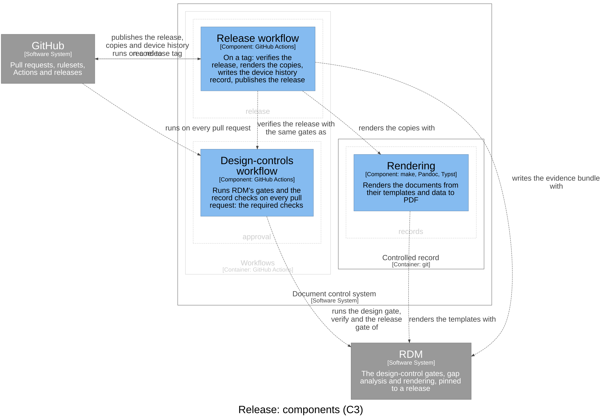

# Release — Software Design

## Purpose

A release: the human-readable copies and the electronic archive of the
document set, the device history record of who released what and when, and
the verification evidence of the released commit — published only when that
commit is verified.

## Design Outputs

The design outputs are this context's architecture, in the C4 model of the
architecture workspace (`rdm c4 draw`): its components, what each is
responsible for, and how they relate. The workspace maps each component to
what implements it.

| Component | Responsibility | Meets |
|-----------|----------------|-------|
| Release workflow | On a tag: verifies the release, renders the copies, writes the device history record, publishes the release | DI-3, DI-8, DI-10 |

GitHub runs the release workflow on a release tag. It verifies the commit
with the same gates as the design-controls workflow and refuses to publish
when the release gate fails; renders the copies with `records`' rendering
(which realises part of DI-3); writes the evidence bundle with RDM; and
publishes the copies, the archive, the device history record and the
evidence to the GitHub release.

## Dependencies

Depends on `records` (the documents and their rendering), `approval` (the
gates), GitHub and RDM. Nothing depends on it.
